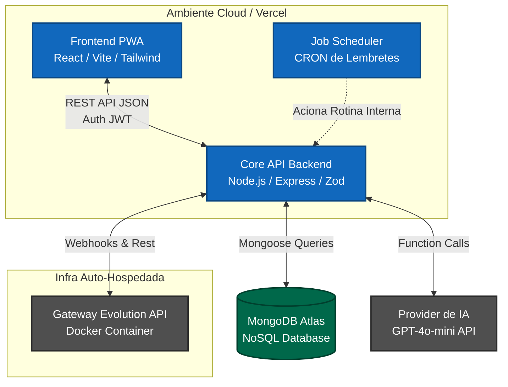
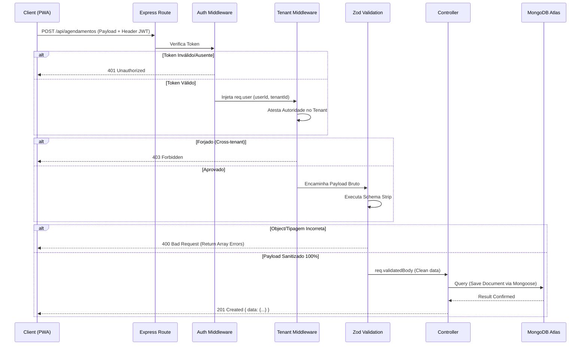

# Diagramas de Arquitetura — Laura SaaS Agenda

Este documento contém a representação visual (C4 Models e Sequência) definidos no High-Level Design (HLD) e no Feature Design Doc (FDD).

## 1. Diagrama de Contexto (Nível 1 - Visão Global)
Representação macro de como os atores interagem com a plataforma SaaS e os serviços externos que compõem a esteira.

```mermaid
graph TD
    %% Estilos
    classDef usuario fill:#1f3b4d,stroke:#fff,stroke-width:2px,color:#fff;
    classDef sistema fill:#1168bd,stroke:#fff,stroke-width:2px,color:#fff;
    classDef externo fill:#999,stroke:#fff,stroke-width:2px,color:#fff;

    %% Atores
    Prof[Profissional de Saúde/Estética]:::usuario
    Cli[Cliente da Clínica]:::usuario

    %% Core
    Sys[Laura SaaS Agenda \nMulti-tenant]:::sistema

    %% Externos
    WPP[WhatsApp]:::externo
    OpenAI[OpenAI / GPT-4o-mini]:::externo
    Push[Servidor Web Push]:::externo

    %% Ligações
    Prof -->|Gere agenda e fluxo pelo PWA| Sys
    Cli -->|Comunica e agenda| WPP
    WPP -->|Dispara Webhooks| Sys
    Sys -->|Envia mensagens/lembretes| WPP
    Sys -->|Interpreta intenção de\nagendamento (NLP)| OpenAI
    Sys -->|Gera avisos| Push
    Push -->|Notificação silenciosa| Prof
```

---

## 2. Diagrama de Container (Nível 2 - Topologia)
Visão interna dos blocos de software (onde rodam) e integrações. Mostra a separação entre Cloud Serverless e a infraestrutura externa.



---

## 3. Diagrama de Sequência e Barreiras (Fluxo do FDD)
Demonstração técnica da triagem pre-controller (Invariantes em pipeline) garantindo o Isolamento de Tenant e o barramento por Payload Sujo explicitado no FDD da API.


