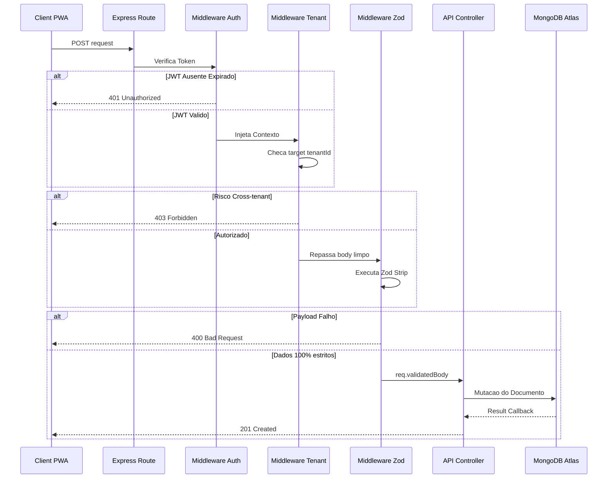
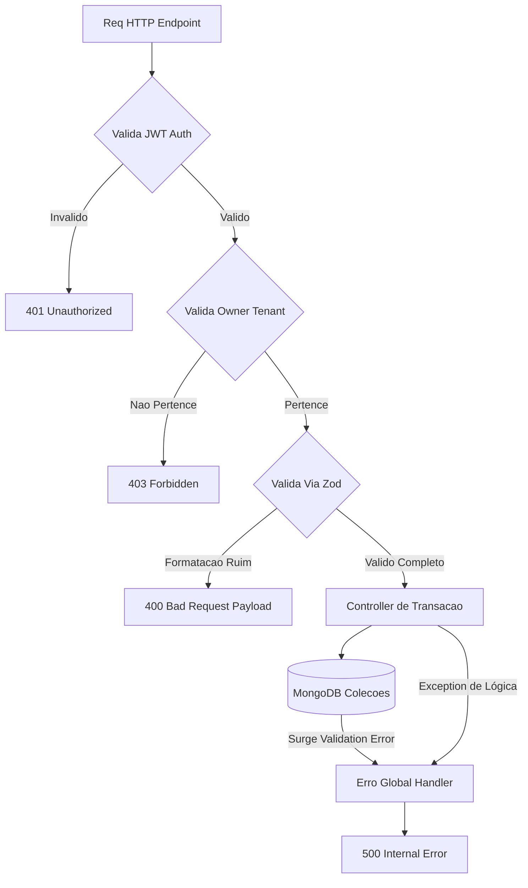
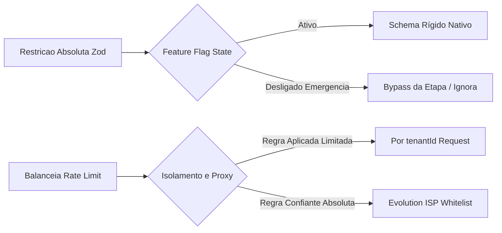
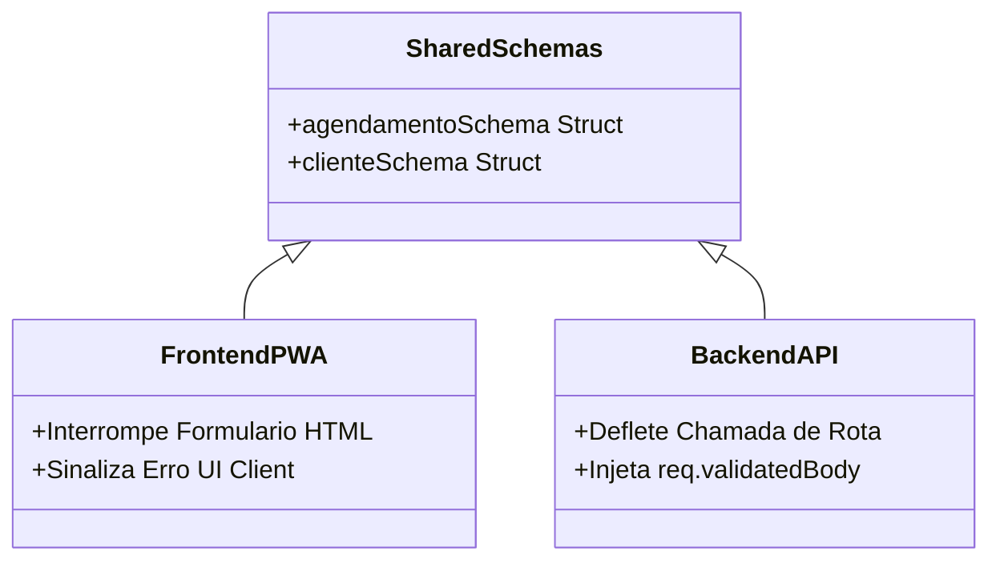

# Diagramas Mermaid - Sistema de Rotas da API

## Visão Geral
Sistema de rotas da API com isolamento rigoroso de acesso via `tenantId` em arquitetura multi-tenant. Incorpora validação estrita contida pre-runtime baseada no Zod e deflexões defensivas orientadas a proteger as lógicas dos controllers e estabilidade das operações nativas do MongoDB.

## Elementos Identificados

### Fluxos externos
- App Frontend PWA
- Endpoints REST Transacionais

### Processos internos
- Middleware de Autenticação (verificação nativa de JWT)
- Middleware de Autorização (restrição base cross-tenant)
- Middleware de Validação Zod (retirada de fields sujos)
- Error Handler Global Central
- Controllers de Domínio (Agendamentos, Pacotes, Clientes)

### Variações de comportamento
- Feature Flag para barramento em Zod (Plano B mitigador)
- Limitações de Rate Limiting moldadas por permissões de rede (CGNAT / Whitelist)

### Contratos públicos
- Pasta fonte agnóstica de Schemas `/shared/schemas`
- Respostas tabuladas em Padrões JSON de Erro

## Diagramas

### Fluxo Principal e Validação Estrita
Este diagrama sequencial explora em detalhe a linha férrea das barreiras que atuam antes do domínio transacional. Fundamental para o raciocínio dos QAs visualizarem em que momento as interceptações `401`, `403` e `400` defletem do fluxo de persistência BD.

**Notas**:
- Nenhuma validação depende de dados mascarados presentes ou declarados ativamente pelo 'Body' da chamada.
- O campo vital `tenantId` provém do server-side via injeção.

---

### Roteamento de Erros e Exceções
Abordagem comportamental top-down traçando o fim de vida de requisições incompletas. Este diagrama serve como gabarito ao acionar instrumentação visual do Sentry na leitura de quedas na fila lógica.

**Notas**:
- O `Error Global Handler` esconde as faturas técnicas da nuvem transformando rastreios críticos em `500` simplificado.
- Somente a camada `Zod` retorna array detalhado na interface transacional expondo os dados incorretos da chamada.

---

### Mitigações de Riscos Arquiteturais
Flutograma modelador de como as decisões técnicas engolem resposabilidades com relação as adversidades limitantes por ISP da web (como blocos de CGNAT comuns em 4G). Útil na consulta do suporte / onboarding de contas.

**Notas**:
- `tenantId Request Rate Limit` blinda que dezenas de marcações num café de rede única colidam com o limite padrão pelo Express baseando-se por IP publico.

---

### Sincronia Contratual Partilhada
Ilustração referencial de onde as chaves base pre-formam blocos de confiança atrelados simultaneamente. Aborda o "Risco-03" relatado documentando a fonte da verdade da tipagem.

**Notas**:
- Padrão arquitetural voltado inteiramente ao impedimento do erro silenciado visual e falha lógica de backend (`400 Bad Request` disparada atoa entre o PWA e Server desatualizados).
