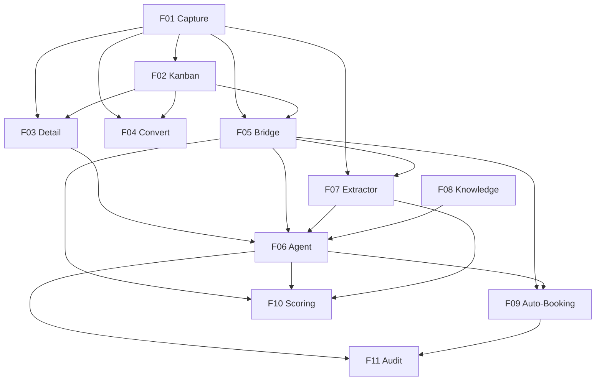

# Marcai — CRM Leads & Conversational AI Service

## 1. Executive Summary

Marcai is a multi-tenant SaaS for independent health and aesthetics professionals (estheticians, physiotherapists, nutritionists, personal trainers) who run their booking, follow-up and financial control over personal WhatsApp. It replaces ad-hoc WhatsApp chats with a managed CRM funnel, a conversational AI assistant that captures and qualifies new leads, an appointment system with automated reminders, and a unified financial view — all accessible from a mobile-first PWA. The core value is *fewer no-shows + more bookings + zero manual chasing*, delivered without forcing the professional to change the channel her clients already use.

The product is built around three deliberately non-overlapping message-handling layers and two distinct conversational lifecycles, productized as three pricing tiers.

### 1.1 Message Routing Matrix

Every inbound WhatsApp message is routed to exactly one handler based on the table below. Layers do not overlap, which keeps token cost low and protects the deterministic flows from AI regressions.

| Inbound message type | Handler |
|---|---|
| Reminder 24h / 1h / 30min before an appointment | BullMQ scheduled jobs |
| `SIM` / `NÃO` reply to a pending appointment confirmation | Legacy Node handler |
| Inbound from a phone with no Lead and no Client record | Python AI agent (`ia-service`) |
| Inbound from an existing Client booking a new appointment | Python AI agent (`ia-service`) |
| Inbound from an existing Client asking to reschedule / cancel | Python AI agent (`ia-service`) |
| Birthday greeting (future, Phase 5) | BullMQ scheduled jobs |

### 1.2 Reminder Pipeline Principle

Every Appointment persisted in MongoDB triggers the BullMQ reminder pipeline (24h / 1h / 30min) regardless of who created it — the professional in the dashboard, the AI agent via its `create_appointment` tool, or a future automation. The `Appointment.criadoPorIA` flag is **UI metadata only** (Kanban badge). This guarantees: (a) AI and manual flows coexist without duplication; (b) clients receive the same UX irrespective of origin; (c) if `ia-service` is down, the dashboard and reminders keep working — AI is an *additional* path, never a critical dependency.

### 1.3 Conversation Lifecycles

The AI agent serves two distinct lifecycles, sharing the same LangChain runtime but using different tools and prompts:

- **Lead lifecycle** — unknown phone → onboarding → qualification → booking → conversion to Client
- **Client lifecycle** — known phone → new booking / reschedule / cancel against the existing Client record

This PRD covers the **Lead lifecycle only**. The Client lifecycle reuses the same runtime but is bound to a different prompt and tool set; it is documented in a separate SDD when activated (see Section 7).

### 1.4 Pricing Tiers

Each feature in Section 6 declares the minimum tier that includes it.

| Tier | Includes |
|---|---|
| **Básico** | Manual dashboard, appointments, reminders (BullMQ), `SIM/NÃO` confirmations (legacy). No AI. |
| **Pro** | Básico + conversational AI for both lifecycles (Lead + Client). |
| **Elite** | Pro + analytics, multi-instance Evolution, automated birthday outreach (Phase 5 features as they ship). |

---

## 2. Problem and Opportunity

### The Problem

**Leads die silently in the WhatsApp inbox**
- Independent professionals receive new contact messages but can't respond promptly because they're mid-session or off-hours
- An estimated 30–50% of new leads disengage within the first hour without any reply
- No record of who came in, what they asked, or why they left

**Manual qualification is exhausting and inconsistent**
- Each new lead requires 5–15 back-and-forth messages to capture name, urgency, and concrete intent
- Without a CRM, the professional re-asks the same questions every time
- Lost leads have no documented reason — patterns are invisible

**Booking lives in a separate channel and a separate brain**
- After qualification, the professional manually checks an agenda and proposes slots over WhatsApp
- Common race: two leads ask for the same slot, neither knows yet
- Each lead waits minutes or hours for slot confirmation

**No visibility into pipeline state**
- The professional doesn't know how many leads are in conversation, qualified-but-unbooked, or about-to-be-lost
- No funnel metrics, no conversion rates, no early-warning signs of disengagement

**A naive "plug in GPT" approach is economically unviable**
- Auto-responding to every WhatsApp message burns tokens on confirmations, birthday noise, and reminders
- No mechanism to scope the AI to genuinely new leads vs known clients vs system flows
- Risk: monthly LLM bill exceeds Marcai subscription revenue

### The Opportunity

Marcai's CRM-Leads module + `ia-service` Python solves these problems with a deterministic routing layer (Section 1.1 Matrix), a stateful Kanban funnel, a per-tenant LangChain agent that captures intel and books atomically, and a per-tenant markdown knowledge base that keeps the LLM small, cheap, and clinic-specific.

- Lead capture happens whether or not the professional is online → F01
- A 6-stage Kanban with quota enforcement keeps the funnel honest → F02
- The conversational agent + extractor handle qualification + booking in a single turn when possible → F06, F07, F09
- Atomic booking with reminder pipeline integration means AI bookings participate in the same UX as manual bookings → F09 + Section 1.2
- Per-tenant markdown keeps prompts small and clinic-accurate → F08
- Routing matrix (Section 1.1) ensures the LLM is only called on genuine new-lead conversation — predictable token cost

---

## 3. Target Audience

**The Independent Health/Aesthetics Professional** (primary user — owns the dashboard)
- Esthetician, physiotherapist, nutritionist, personal trainer, or similar; solo or 1–2 person practice
- Manages 20–50 active clients; books mostly via personal WhatsApp on a phone
- Limited time for administrative work; values automation that "just works" without configuration
- Pricing-sensitive — Marcai must demonstrably save more time than its monthly fee

**The Prospective Lead** (primary recipient — owns the inbound side of the conversation)
- A potential client discovering the professional via Instagram, referral, or local search
- First contact is a WhatsApp message ("Olá, quero saber preço da drenagem")
- Expectation: a human-like response within minutes; abandons quickly if ignored or treated like a form
- Often has unstated objections (price, time, distance) that surface only with the right conversational nudge

**The Returning Existing Client** (acknowledged in routing but mostly out of v1 scope)
- Already in the professional's `Cliente` collection from a previous booking
- May reach out later to reschedule, book a new session, or ask a question
- Section 1.1 routing matrix recognises this persona, but the Client lifecycle implementation is out of scope (Section 7)

**Behavioral Profile (across all three)**
- All communicate primarily by WhatsApp; none read web dashboards as a primary channel
- All expect Portuguese (PT-PT) conversation, accents and all
- All distrust generic chatbots — the AI must feel like it knows the specific clinic (this is why F08 per-tenant knowledge is foundational)

---

## 4. Objectives

**Eliminate lead silence**
Every inbound WhatsApp from a new contact receives a contextual response within seconds, even when the professional is unavailable.
- *Metric*: % of leads receiving the first AI response within 30 seconds → **target ≥ 95%**, measured weekly across all Pro tenants

**Automate qualification at scale**
Leads progress through `novo → em_conversa → qualificado` without manual intervention when their conversation signals intent.
- *Metric*: % of leads in `em_conversa` that reach `qualificado` automatically (no manual stage move) → **target ≥ 25%** initial, measured monthly. *To be revised after 3 months of pilot data.*

**Convert qualified leads into bookings without human handoff**
When a lead accepts a proposed slot, the appointment is created atomically and reminders are scheduled.
- *Metric*: % of qualified leads with at least one AI-created `Agendamento` → **target ≥ 35%** initial, measured monthly. *To be revised after 3 months of pilot data.*

**Keep LLM cost predictable per tenant**
Routing matrix (Section 1.1) + 30-minute history window + per-tenant knowledge base ensure tokens are spent only on genuine new-lead conversation.
- *Metric*: average LLM cost per lead end-to-end (capture → qualification → booking or loss) → **target < €0.05**, measured monthly per active Pro tenant

**Maintain funnel responsiveness**
Leads do not linger in `novo` waiting for the first AI turn (system bottleneck signal).
- *Metric*: average elapsed time between Lead creation and first stage transition (`novo → em_conversa | perdido`) → **target < 30 s p95**, measured weekly. Requires observability over LLM latency + Evolution send.

---

## 5. User Stories

### F01. Lead Capture via WhatsApp Webhook
- As a lead, I want my WhatsApp message to reach the clinic even when nobody is at the dashboard so I am not ignored
- As the system, I want to validate the Evolution webhook token so unauthorized payloads cannot create Leads
- As the system, I want to resolve the target tenant deterministically (`instanceName` first, phone fallback within 90 days) so Leads land in the correct clinic's DB
- As the system, I want to reject ambiguous phone matches across tenants so I never leak data between clinics
- As a professional on Básico, I want `maxLeads` enforced server-side so I see when to upgrade instead of accumulating unbillable contacts
- As a professional on a maxed plan, I want the sender notified with a fallback message and me notified via Web Push so blocked Leads are not silent

### F02. Lead Pipeline Kanban
- As a professional, I want a 6-column Kanban (`novo, em_conversa, qualificado, agendado, convertido, perdido`) so I see my funnel at a glance
- As a professional, I want to drag cards between columns so I can move Leads without filling forms
- As a professional, I want to filter by `status / origem / urgencia` and search by name/phone/email so I can focus on a slice
- As a professional, I want a mandatory reason when moving to `perdido` so I can review patterns later
- As a professional, I want closing Leads (`convertido`/`perdido`) to free up `maxLeads` quota immediately so I am not blocked unfairly
- As a professional, I want a reopened Lead to lose its "lost by limit" badge so its visual state matches the new stage
- As a professional, I want concurrent DnD operations queued client-side so I never see inconsistent local state

### F03. Lead Detail & Conversation Thread
- As a professional, I want the full thread plus editable fields so I have context and can correct data in one place
- As a professional, I want AI replies visually distinguished from manual replies so I trust the transparency
- As a professional, I want to send a manual reply from the platform so I don't switch apps
- As a professional, I want to pause AI on a delicate Lead indefinitely so the agent doesn't interrupt
- As a professional, I want the pause toggle disabled for terminal Leads (`convertido`, `perdido`) so it's clear when reactivation is meaningless

### F04. Lead → Cliente Conversion
- As a professional, I want a single button to turn a qualified Lead into a Cliente so I don't re-enter data
- As the system, I want the conversion atomic so I never end up with a Cliente without the Lead transition
- As the system, I want post-conversion inbounds routed to the Client lifecycle so the agent treats the contact correctly
- As a professional, I want to be warned when the Cliente phone already exists so I don't create a duplicate
- As a professional, I want `Cliente.origemConversao` populated so I can review how the client arrived

### F05. Internal API Bridge (Node ↔ Python)
- As the system, I want a private authenticated channel (`X-Service-Token`) for Python so internal mutations are not on public routes
- As the system, I want fail-closed authentication so a missing env never accidentally grants access
- As the system, I want defense-in-depth `maxLeads` check on internal create so Python cannot bypass the plan limit
- As the system, I want auto-promotion logic embedded in the qualification endpoint so both write paths (extractor + agent) converge consistently
- As the system, I want documented read-only Mongo access for slot lookups so latency-sensitive reads don't pay an HTTP round-trip

### F06. Conversational Agent (LangChain)
- As a lead, I want a natural conversation that adapts to my style so I don't feel like I'm filling a form
- As a lead, I want the agent to greet me appropriately by time of day so the interaction feels human
- As the system, I want pre-agent intel extraction (F07) to complete before the agent reasons so each turn starts from accurate context
- As the system, I want to retry the LLM once on empty content so transient Gemini quirks don't degrade UX
- As the system, I want defensive auto-stage transitions when reply text confirms a booking so stage matches reality
- As a professional, I want the agent to step aside when I pause it so my manual reply isn't drowned out
- As the system, I want a 4-step graceful degradation ladder so leads always receive at least a polite greeting

### F07. Lead Intel Extractor
- As the system, I want structured-output extraction before the agent so intel is captured even when the agent forgets to call tools
- As the system, I want `score_delta` clamped to `[-30,+30]` so a single message cannot dominate the score
- As the system, I want `intent='desistir'` to move the Lead to `perdido` immediately so the funnel reflects reality
- As the system, I want extractor failures to be non-fatal so the conversation continues without intel updates
- As the system, I want `objection_type` captured so the agent can apply the matching strategy

### F08. Tenant Knowledge Base
- As a tenant operator, I want clinic voice/services/policies in markdown files I can edit like documentation
- As a tenant operator, I want to override only the files I customize and inherit the rest from `_default`
- As the agent, I want to look up a specific service by name so I can answer detail questions
- As the agent, I want today's date in the system prompt so I can resolve relative dates
- As the system, I want a token-budget warning when always-injected content exceeds 8KB so cost drift is detectable

### F09. Auto-Booking via Agent Tool
- As a lead, I want the agent to offer me specific available slots so I can pick one immediately
- As a lead, I want clear confirmation when my slot is booked so I know it is done
- As a lead, I want to be told plainly when my chosen slot was just taken so I can pick another
- As the system, I want slot conflict detection to be transactional so parallel bookings never double-book (GAP-01)
- As the system, I want AI-created appointments to trigger the same reminder pipeline as manual ones so UX is consistent
- As a professional, I want appointments confirmed by the agent marked as "AI-created, pending review" so I know to verify

### F10. Auto-Qualification & Cumulative Scoring
- As the system, I want to accumulate `score_delta` over turns so qualification reflects the full conversation
- As the system, I want auto-promotion to `qualificado` when score crosses 60 so the professional sees ready Leads immediately
- As the system, I want auto-promotion to skip already-advanced or terminal Leads so I don't regress flows
- As the system, I want reopened Leads (`perdido → em_conversa`) to be eligible for re-qualification
- As the system, I want `motivoInteresse` and `objetivos` replaced (not accumulated) per turn so the agent's current understanding always wins

### F11. IA Audit Trail & UI Badge
- As a professional, I want a 🤖 badge next to "Agendamentos" so I know when AI-created bookings are pending review
- As a professional, I want the badge to decrement only when I actually open the detail panel so the count reflects engagement
- As a professional, I want AI messages in the thread and AI-active Leads in the Kanban visually distinguished so the system is transparent
- As the system, I want acknowledgement idempotent so simultaneous tabs cannot move the timestamp

---

## 6. Functionalities

### F01. Lead Capture via WhatsApp Webhook

**Tier:** Básico

**Consumes:**
- Inbound Evolution API webhook payload `(instance, data: {key, message, pushName, messageTimestamp})` (external input — not produced by another PRD feature)
- Tenant configuration `tenant.limits.maxLeads`, `tenant.limits.leadsAtivo`, `tenant.whatsapp.instanceName` (external — platform configuration)

**Provides:**
- Lead record `(tenantId, phone, status, origin='whatsapp', urgency='baixa', lastInteraction, qualification.score=0)` (used by F02, F03, F05, F06)
- Inbound message reception event with `(tenantId, leadId, messageId, text, timestamp, instanceName)` (used by F05, F06)

**Capabilities:**
- Receives webhook payloads from Evolution API at `POST /webhook/evolution`, authenticated by `x-api-token` header (never query string)
- Resolves the target tenant by Evolution `instanceName` first, with a phone-based fallback scan across recent appointments **within a 90-day window**
- If the fallback phone scan matches more than one tenant, the request is **rejected** (not first-match) with an `ambiguous_phone_match` warn log; no Lead is created (prevents cross-tenant data leakage)
- Phone normalization: digits only, accepts 9–15 digits, rejects shorter/longer payloads
- Creates a new Lead when no lead exists for `(tenantId, phone)` — telephone is unique per tenant via compound index `{tenantId, phone}`
- Updates `lastInteraction` to current Lisbon time on every inbound message (existing Leads not recreated)
- **Plan-limit policy** — when `activeLeads >= tenant.limits.maxLeads`, the inbound is still accepted but the new Lead is created with `status='perdido'`, `lost.reason='limite_plano'`, `lost.at=now`; no AI processing is triggered; the sender receives one configured WhatsApp fallback message; the professional receives a Web Push notification ("Lead bloqueado por limite de plano — considere upgrade"); the card is rendered in the Kanban "Perdido" column with a distinct visual tag (lock icon + amber border) to differentiate from normal lost leads
- Honors per-tenant feature toggle `tenant.limits.leadsAtivo` — when `false`, falls back to the legacy webhook flow and does not create Lead records
- Optional Lead fields with size caps: `name` (≤100 chars), `interest` (≤200), `notes` (≤1000)
- Idempotent on message replay: same Evolution `messageId` does not create duplicate Leads
- Field defaults on creation: `status='novo'`, `origin='whatsapp'`, `urgency='baixa'`, `iaActive=true`, `qualification.score=0`
- **Real-time delivery decision (v1):** new Leads appear in F02 Kanban via polling every 10 seconds; SSE/WebSocket is out of scope for v1 (deliberate trade-off — see Section 7)

**Experience:**
1. Evolution API delivers the inbound WhatsApp message via webhook with `x-api-token` header and JSON body
2. Server validates the token; on failure returns `401` and stops
3. Tenant is resolved by `instanceName` (primary) or by phone+recent-appointment scan within the 90-day window (fallback). If the fallback yields more than one tenant, the request is rejected. If no tenant resolves, the webhook returns `200` silently (avoids leaking tenant existence) and logs a warning
4. Server responds `200` to Evolution within `<500ms` and continues processing asynchronously to avoid retries
5. Phone is normalized (strip non-digits) and validated for length
6. Plan-limit check: count Leads in active stages (`novo|em_conversa|qualificado|agendado`) for the tenant. If `>= maxLeads`, branch to the plan-limit policy described in Capabilities
7. Otherwise, if no Lead exists for `(tenantId, phone)`, a new Lead is created with defaults; if one exists, only `lastInteraction` is updated
8. If `tenant.limits.leadsAtivo === true` AND `IA_SERVICE_ENABLED`, the message is forwarded to F05 (Internal API Bridge) for delegation to the Python agent; otherwise the legacy IA flow is used
9. On Lead creation, the new record appears in the F02 Kanban "Novo" column on the next 10-second polling tick
10. The professional sees Lead arrivals through the F02 board; no system-visible reply is sent to the sender at this stage — any reply is produced by F06

**Error Handling:**
- **Missing or invalid `x-api-token`** → `401 { success: false, error: 'Webhook não autorizado' }`; no Lead created; event logged at warn level
- **`maxLeads` plan limit reached** → Lead persisted as `status='perdido'` with `lost.reason='limite_plano'`; sender receives one configured WhatsApp message; professional receives a Web Push alert; no AI processing; event logged at info level
- **Phone normalization fails (less than 9 digits)** → `200` to Evolution, no Lead created, event logged at warn level with raw payload
- **Ambiguous phone match across tenants** → `200` to Evolution silently, no Lead created, `ambiguous_phone_match` logged at warn level with offending tenant IDs
- **Tenant cannot be resolved (unknown `instanceName` and no fallback match)** → `200` to Evolution silently, event logged at error level; never returns `404` (does not reveal tenant existence)
- **Database write failure (Mongo down, transient)** → Evolution receives `200` (avoid retry storm), the message is enqueued for retry, and a Sentry error is captured

---

### F02. Lead Pipeline Kanban (6 stages)

**Tier:** Básico

**Consumes:**
- Lead record `(name, phone, status, urgency, lastInteraction, qualification.score, lost.reason)` (from F01)

**Provides:**
- Stage transition mutations on Lead `(status, lastInteraction, lost)` (used by F03, F05, F10)
- Lead filtered/paginated reads with current Kanban state (used by F03)

**Capabilities:**
- Six fixed pipeline stages in left-to-right order: `novo`, `em_conversa`, `qualificado`, `agendado`, `convertido`, `perdido`. Customisation per tenant is deliberately out of scope.
- Stages that count toward `tenant.limits.maxLeads`: `novo`, `em_conversa`, `qualificado`, `agendado`. Cards in `convertido` and `perdido` do not consume the limit (incentivises closing leads instead of accumulating).
- **Quota liberation (real-time):** transitions to `convertido` or `perdido` free up the `maxLeads` quota immediately. The next inbound that would otherwise be rejected by F01's plan-limit policy is accepted normally. The "limite atingido" Web Push is silenced once quota frees up.
- Allowed stage transitions (enforced server-side):
  - `novo` → `em_conversa | qualificado | perdido`
  - `em_conversa` → `novo | qualificado | agendado | perdido`
  - `qualificado` → `em_conversa | agendado | perdido`
  - `agendado` → `em_conversa | qualificado | perdido`
  - `perdido` → `em_conversa | qualificado` (reopens a lost lead)
  - `convertido` → none (terminal)
- `convertido` is only reachable via the dedicated endpoint `POST /api/leads/:id/convert` (F04), never via Kanban drag-and-drop.
- `perdido` transitions require a non-empty `motivo` string (server returns `400 motivo_required` otherwise).
- **Reopening a lost lead** (`perdido → em_conversa | qualificado`) clears `Lead.lost.reason` and `Lead.lost.at` server-side. Without this, the "lock icon + amber border" tag (inherited from F01's `limite_plano` policy) would persist into other columns.
- Role override: actors with `role` in `{admin, superadmin}` may bypass the transitions matrix (e.g. force `novo` → `agendado`) — except they still cannot reach `convertido` from this endpoint.
- Internal calls from `ia-service` (`isInternalCall=true`) follow the strict transitions matrix regardless of caller — the AI has no admin override.
- Kanban list endpoint `GET /api/leads` is paginated (default 20, max 100), sorted by `ultimaInteracao DESC, createdAt DESC`.
- Server-side filters: `status`, `origem` (`whatsapp|manual|import|outro`), `urgencia` (`baixa|media|alta`), full-text `q` (matches `name`, `phone`, `email` case-insensitive).
- Real-time delivery: the Kanban polls `GET /api/leads` every **10 seconds** while the page is active. Server-Sent Events / WebSockets are explicitly out of scope for v1.
- Visual badge for Leads created with `lost.reason='limite_plano'` (inherited from F01): lock icon + amber border in the `perdido` column.
- Visual badge for Leads currently being handled by AI (`iaActive=true` and `status` in `{novo, em_conversa, qualificado}`): small robot indicator on the card.
- Card displays: name (or "Sem nome"), masked phone, urgency icon, score `0–100`, relative time since `lastInteraction`.

**Experience:**
1. The professional navigates to `/leads`; the frontend issues `GET /api/leads` with the current filters
2. Six columns render with cards sorted by `lastInteraction DESC`; each card shows the fields above
3. A polling timer refreshes the list every 10 s while the route is mounted
4. The professional drags a card to another column; the frontend issues `PATCH /api/leads/:id/stage` with the destination
5. If the destination is `perdido`, the UI opens a modal requiring `motivo` before submission
6. If the destination is `convertido`, the drag is rejected client-side with a tooltip: "Use o botão Converter em Cliente" (the action lives on the card, not on the column)
7. The server validates the transition; on success returns the updated Lead and the card optimistically settles in the new column. **Concurrent drag operations from the same user are queued client-side**: a second DnD before the first reconciles is held until the first response arrives, not applied in cascade
8. Filters (`status`, `origem`, `urgencia`) and search (`q`) refine the visible cards without leaving the page
9. Selecting a card opens F03 (Lead Detail) in a side panel or dedicated route

**Error Handling:**
- **Invalid stage transition** → `400 { code: 'invalid_transition' }`; the drag is reverted with an inline toast naming the rule
- **`perdido` without `motivo`** → `400 { code: 'motivo_required' }`; the modal re-opens with the field highlighted
- **DnD to `convertido`** → `400 { code: 'restricted_stage' }`; UI surfaces the tooltip and points to the convert action
- **Lead not found (deleted concurrently or cross-tenant)** → `404`; the card is removed on next polling tick with a non-blocking toast
- **Network or 5xx during DnD** → optimistic move is kept locally; reconciliation on the next polling tick decides whether to revert; user sees a generic toast

---

### F03. Lead Detail & Conversation Thread

**Tier:** Básico (the pause-AI toggle is only meaningful in Pro+, but the panel renders in Básico — the toggle is a no-op when no agent is running)

**Consumes:**
- Lead record `(name, phone, email, interest, urgency, notes, qualification.score, lastInteraction, iaActive)` (from F01)
- Lead stage and lost metadata `(status, lost.reason, lost.at)` (from F02)

**Provides:**
- Manual outbound messages persisted as `Mensagem(origem='laura', direcao='saida', geradoPorIA=false)` (used by F06 — the agent reads recent history including manual replies to avoid stepping on them)
- Lead field updates `(name, email, interest, urgency, notes)` (used by F02 for card rendering and by F10 to seed the qualification record)
- Pause-AI flag mutations on `Lead.iaActive` (used by F06 — when `false`, the agent returns early and produces no reply)
- **`Conversa` record lazily created on the first manual reply** (used by F06 to persist subsequent AI messages on the same thread without re-creating the conversation)

**Capabilities:**
- `GET /api/leads/:id` returns `{lead, conversa, messages}` where `messages` is the latest 50 entries in chronological order (oldest first)
- **Message origin flag** — manual replies sent via `POST /api/leads/:id/reply` persist with `Mensagem.geradoPorIA=false`; F06 persists AI replies with `Mensagem.geradoPorIA=true`. The UI bubble icon reads this field — no manual reply shows the robot icon
- Conversation thread display: bubble UI with origin `cliente` (left, grey) vs `laura` (right, indigo); each bubble shows time and the AI/manual icon
- Editable Lead fields (`PUT /api/leads/:id`): `name` (≤100), `email`, `interest` (≤200), `urgency` (`baixa|media|alta`), `notes` (≤1000). The phone is read-only after creation
- Manual reply (`POST /api/leads/:id/reply`): body `{mensagem, pausarIa?: boolean}`. The server resolves the tenant's `whatsapp.instanceName`, calls Evolution API, persists a `Mensagem(origem='laura', direcao='saida', geradoPorIA=false)`, ensures a `Conversa` exists (creates lazily if missing), updates `lead.lastInteraction`, and optionally sets `lead.iaActive=false` when `pausarIa=true`
- Pause-AI toggle (`POST /api/leads/:id/pause-ai` with `{iaAtiva: boolean}`): a single switch on the detail panel that flips `Lead.iaActive`. **Pause is indefinite** — setting `false` blocks downstream AI processing in F06 until the professional manually re-enables it. There is no auto-reactivation timer (predictability beats convenience for delicate cases)
- **Toggle disabled in terminal stages** — the AI switch is disabled when `Lead.status` is `convertido` (lead is no longer a lead) or `perdido` (tooltip: "Reabrir o lead para reactivar IA"). Only Leads in active stages can have their AI toggled
- Score display: a `0–100` progress bar reflecting `lead.qualification.score`; tooltip shows the breakdown captured by F07 (`motivoInteresse`, `objetivos[]`)
- Lost banner: when `status='perdido'`, the detail panel shows a dismissible banner with `lost.reason` and `lost.at` (formatted in Lisbon time); special copy when `lost.reason='limite_plano'`
- Detail panel is read-only when the Lead is `status='convertido'` — the only available action is a link to the corresponding Client record (F04)

**Experience:**
1. The professional clicks a card in F02; the route transitions to `/leads/:id` (or a side panel mounts) and `GET /api/leads/:id` is issued
2. The header renders: name (or "Sem nome"), masked phone, urgency, score bar, status pill, origin badge, and relative `lastInteraction`
3. The conversation thread renders messages in chronological order with WhatsApp-style bubbles; an icon distinguishes AI replies from manual replies based on `Mensagem.geradoPorIA`
4. Below the thread, a reply composer offers a textarea, a "Pausar IA ao enviar" checkbox, and an "Enviar" button
5. The right (or bottom) panel exposes editable fields — changes are saved on blur via `PUT /api/leads/:id` with optimistic UI; validation errors are rendered inline under each field
6. A switch labeled "IA activa neste lead" toggles `Lead.iaActive` via `POST /api/leads/:id/pause-ai`; the new state is reflected immediately and persists across reloads; the switch is disabled in terminal stages with a tooltip
7. When the professional sends a manual reply, the message appears in the thread, is delivered to the client through Evolution, and the `lastInteraction` timestamp updates on the card in F02 (next polling tick)
8. When the Lead is `status='perdido'`, a banner explains the reason; when `lost.reason='limite_plano'`, the banner includes an upsell hint
9. When the Lead is `status='convertido'`, the panel becomes read-only and shows a link "Ver Cliente" pointing at the Client record (F04)

**Error Handling:**
- **Lead not found / cross-tenant (404)** → toast "Lead não encontrado", redirect back to F02
- **Evolution API send failure (502)** → toast with the underlying message; the outbound `Mensagem` is **not persisted**; the textarea retains the draft so the professional can retry
- **Duplicate phone on PUT (409)** → inline error under the phone field (only triggers if a future capability re-enables phone editing)
- **Validation error on PUT (400)** → inline error under the offending field; other field edits are not lost
- **Pause-AI toggle write failure (5xx)** → the switch reverts to its previous position with a toast; downstream behaviour in F06 keeps the last successfully persisted value

---

### F04. Lead → Cliente Conversion

**Tier:** Básico

**Consumes:**
- Lead record `(name, phone, email, notes, qualification.score, iaActive)` (from F01)
- Lead pipeline state `(status)` (from F02 — only Leads not in `convertido` or `perdido` are convertible)

**Provides:**
- Cliente record `(tenantId, name, phone, email, notes, active=true, origemConversao, iaActive)` and the `Lead.cliente` back-reference (used by F03 to render the "Ver Cliente" link when `status='convertido'`)
- Terminal stage transition `status='convertido'` on the Lead (used by F02 to render the Lead in the `convertido` column as read-only)
- **Phone identity unification and lifecycle handover** — the Client now owns the phone number for routing purposes. Subsequent inbound messages from the same phone are routed to the **Client lifecycle** (F06). The Lead's `Conversa` is preserved as historical record; new messages are appended to a fresh `Conversa` linked to the Cliente (used by F06 on the next inbound)
- **Conversion provenance** — `Cliente.origemConversao = {leadId, dataConversao, scoreNaConversao}` captured at creation. Enables the professional to trace how each Client arrived and unlocks future analytics (Phase 5)

**Capabilities:**
- Endpoint `POST /api/leads/:id/convert` with optional body `{nome, email, observacoes}` (overrides applied on top of Lead's current values)
- Enforces plan limit via `checkLimit('maxClientes')` middleware before any write; on excess returns `403` with an upgrade hint
- Requires a non-empty name (either `Lead.name` or `overrides.nome`); otherwise returns `400 { code: 'lead_missing_name' }`
- Atomic Mongoose transaction: creates the Cliente, sets `Lead.cliente`, sets `Lead.status='convertido'`, updates `Lead.lastInteraction`; rolls back fully on any failure
- **`Cliente.origemConversao` population** — at creation, the conversion handler captures `{leadId, dataConversao=now, scoreNaConversao=Lead.qualification.score}` and stores it on the new Cliente. The triple is immutable after creation
- **`iaActive` propagation** — F04 reads `Lead.iaActive` and propagates it to `Cliente.iaActive` at creation. If the professional had paused AI on the Lead (delicate case), that pause carries forward to the Client lifecycle and remains until manually reactivated
- Idempotent: if `Lead.status='convertido'` AND `Lead.cliente` resolves to an existing Cliente, returns `200` with the existing record (no duplicate creation)
- Phone uniqueness on Cliente is enforced server-side; if a Cliente with the same phone already exists for the tenant, returns `409 { code: 'cliente_telefone_duplicado' }` and the Lead is not transitioned
- Conversation history is preserved: `Lead.conversa` and the underlying `Mensagem` documents stay intact after conversion — they remain readable in F03 even when the Lead is terminal
- Conversion is one-way; this PRD does not include an "un-convert" capability (Section 7)
- The Lead card in F02 moves to the `convertido` column on the next polling tick

**Experience:**
1. In the F03 detail panel, a primary button "Converter em Cliente" is rendered. It is enabled when `Lead.status NOT IN {convertido, perdido}` and disabled (with tooltip) otherwise
2. Clicking the button:
   - If `Lead.name` is present and non-empty, opens a confirmation dialog: "Converter [nome] em cliente?" with optional fields `email` and `observacoes` pre-filled from the Lead
   - If `Lead.name` is missing, opens the same dialog with the `nome` field empty and required
3. On confirm, the frontend issues `POST /api/leads/:id/convert` with `{nome, email, observacoes}` (only fields the professional overrode are sent)
4. Backend runs `checkLimit('maxClientes')`; on excess responds `403`
5. Backend opens a Mongo session, runs the transaction (Cliente create with `origemConversao` + `iaActive` from Lead; Lead update), returns `200 { cliente, lead }`
6. On success: a toast "Cliente criado" appears; the F03 panel re-renders as read-only with a "Ver Cliente" link to the Client record
7. On `409 cliente_telefone_duplicado`: the dialog stays open with an inline error explaining that a Cliente with this phone already exists; offers a secondary action "Abrir cliente existente"

**Error Handling:**
- **`maxClientes` plan limit reached (403)** → dialog stays open, inline error with upgrade CTA; no write performed
- **Missing name (400 `lead_missing_name`)** → dialog re-opens with the `nome` field highlighted; conversion blocked until provided
- **Duplicate phone on Cliente (409 `cliente_telefone_duplicado`)** → dialog shows the link to the existing Cliente; Lead remains in its current stage
- **Mongo transaction abort (5xx)** → dialog surfaces a generic error with retry; no partial state is committed
- **Already converted (idempotent path)** → `200` with existing Cliente; the dialog closes silently and the panel transitions to read-only without a duplicate toast

---

### F05. Internal API Bridge (Node ↔ Python)

**Tier:** Pro (without this bridge, the AI tier is non-functional; Básico tenants do not exercise these endpoints)

**Consumes:**
- Lead record `(id, phone, name, status, lastInteraction)` (from F01)
- Pipeline state and transition rules `(ALLOWED_TRANSITIONS, status)` (from F02)

**Provides:**
- Authenticated HTTP channel (`/api/internal/*`, `X-Service-Token`) for the Python `ia-service` to read and mutate tenant state without exposing public JWT-protected routes (used by F06, F07, F09, F10)
- Endpoint to fetch the latest N conversation messages oldest-first (used by F06 to seed LangChain memory)
- Endpoint to persist Lead intelligence fields with defense-in-depth auto-promotion to `qualificado` when `score >= 60` and the Lead is still in `novo` or `em_conversa` (used by F10)
- Endpoint to apply Lead stage transitions under the strict transitions matrix — no admin override even when called by `ia-service` (used by F02's matrix, consumed by F07/F10)
- Endpoint to create an atomic Appointment with slot conflict detection and reminder pipeline trigger (used by F09)
- Endpoint to persist `Mensagem` records and lazily create the `Conversa` (used by F06 every time the agent emits or receives a turn)
- A health probe (`GET /health` on the Python side, mirrored by `checkHealth` on the Node client)

**Capabilities:**
- Base path: `/api/internal/*` mounted on the Node app outside the versioned `/api/v1` surface (private contract — no dual-mount, no `Deprecation` header)
- Authentication: `X-Service-Token` header compared against `process.env.INTERNAL_SERVICE_TOKEN` in constant time; if the env is not set, every request is rejected (fail-closed)
- All failures return `401 { success: false, error: 'Não autenticado' }` without disclosing whether the token was missing, malformed, or invalid
- On success, `req.isServiceCall=true` is set so downstream services apply the strict transitions matrix
- **v1 scope limitation** — this bridge surfaces endpoints for the **Lead lifecycle exclusively**. Client-lifecycle endpoints (`/api/internal/clientes/*` for reschedule/cancel) are out of scope for v1 and will be designed in a dedicated SDD when the Client lifecycle is activated (Section 1.3, Section 7)
- Endpoint catalogue:
  - `POST /api/internal/leads` `{tenantId, telefone, nome?, email?, origem?, conversaId?}` → idempotent create by `(tenantId, telefone)`; defense-in-depth `maxLeads` check returns `403 { code: 'lead_limit_reached' }`
  - `PATCH /api/internal/leads/:id/stage` `{tenantId, stage, motivo?}` → strict transitions matrix; `motivo` required for `perdido`
  - `PATCH /api/internal/leads/:id/qualificacao` `{tenantId, score?, motivoInteresse?, objetivos?, urgencia?, interesse?, observacoes?, nome?}` → partial update with score clamped to `[0,100]`; auto-promote to `qualificado` when `score >= 60` and current status is `novo` or `em_conversa`
  - `GET /api/internal/leads/:id/messages?tenantId=&limit=` → oldest-first list, default 10, max 50, returns `[]` if the Lead has no `Conversa`
  - `POST /api/internal/leads/:id/agendamento` `{tenantId, dataHoraISO, tipo?}` → creates `Agendamento` with `tipo` defaulting to `Avaliacao` and `criadoPorIA=true`; refuses with `409 { code: 'slot_taken' }` if any non-cancelled appointment falls within a 60-minute window centred on `dataHora`; on success, dispatches the reminder pipeline (Section 1.2) regardless of origin
  - `POST /api/internal/mensagens` `{tenantId, conversaId?, telefone, mensagem, origem, direcao?}` → persists `Mensagem`, lazily creates a `Conversa` when missing
- **Slot conflict window — 60 minutes, hardcoded in v1.** Documented as a conscious decision; Phase 5 will read `Tenant.config.consultaDuracaoMinutos`. Inherited by F09 as a system-wide invariant for now
- Plan validation runs on every mutating endpoint: returns `403 { code: 'plan_inactive' }` if `tenant.plano.status NOT IN {ativo, trial}` and `403 { code: 'leads_inactive' }` if `tenant.limits.leadsAtivo === false`
- Tenant DB resolution (DB-per-tenant per ADR-001/002) happens inside each handler via `getTenantDB(tenantId)` + `getModels(db)`
- **Read-only direct Mongo exception** — Python has read-only direct MongoDB access via `mongo_reader.py` for slot-availability queries (used by the `get_available_slots` tool). All **writes** go through this bridge; the read-only direct access is a deliberate exception for latency, scoped to non-mutating availability lookups
- Node client side (`src/utils/iaServiceClient.js`): `POST /process-lead` with payload `{tenant_id, instance_name, telefone, mensagem, message_id, timestamp, cliente_id, lead_id}`; timeout 20 s; **one retry after 1 s by design** — aggressive retry chains are incompatible with the synchronous webhook turn budget (Evolution API would time out the original webhook). Persistent failures degrade to manual handling in F03
- Configuration: when `IA_SERVICE_URL` is not set, the Node client returns `null` and `webhookController` falls back to the legacy AI flow — Section 1.2 guarantee preserved

**Experience (system-to-system flow):**
1. The Node webhook (F01) receives an inbound; after enriching with `tenantId` + `leadId`, it calls `iaServiceClient.processLead(...)` over HTTP
2. The Python agent loads context: `GET /api/internal/leads/:id/messages?tenantId=&limit=10` to seed memory
3. As the agent works, it calls `PATCH /qualificacao` to record `score` / `nome` / `interesse` (multiple times during a conversation), and `PATCH /stage` when criteria are clearly met
4. When the lead picks a slot, the agent calls `POST /:id/agendamento` to materialise the booking atomically; the reminder pipeline takes over from there
5. Every agent turn (inbound + outbound) is persisted via `POST /mensagens` so F03 can render the full thread
6. If any internal call fails with `5xx`, the Python client retries once; persistent failures bubble up and the conversation degrades gracefully

**Error Handling:**
- **Missing or invalid `X-Service-Token` (401)** → no body details; logged at warn level with the offending route
- **Missing `INTERNAL_SERVICE_TOKEN` env** → fail-closed; every call returns `401`; logged once per process start
- **Plan inactive or leads disabled (403)** → Python logs and stops emitting tool calls for this tenant; conversation is not answered
- **Lead not found / tenant not resolved (404)** → Python aborts the turn; no retry
- **Slot conflict on appointment (409 `slot_taken`)** → Python reformulates and asks the lead for another slot
- **Phone duplicate on lead creation (409)** → idempotent path returns the existing Lead with `200 alreadyExisted=true`
- **Mongo transient failure (5xx)** → single retry after 1 s; persistent failures leave the inbound pending in F03
- **`ia-service` unreachable from Node** → Node falls back to the legacy flow; no Lead state changes are attempted

---

### F06. Conversational Agent (LangChain)

**Tier:** Pro

**Note on lifecycle scope:** In v1 this feature implements only the **Lead lifecycle** (Section 1.3). The Client lifecycle reuses the same LangChain runtime but is bound to a different prompt and tool set; out of scope for this PRD (separate SDD).

**Consumes:**
- Per-tenant knowledge base markdown `(voz.md, catalogo.md, servicos.md, politicas.md)` rendered into the system prompt (from F08)
- All internal bridge endpoints — fetch history, persist messages, mutate Lead, create Appointment (from F05)
- Structured intel JSON `(intent, interesse, urgencia, observacoes, nome, score_delta, perdido_motivo)` applied to Lead before the agent reasons (from F07)
- Inbound message + recent conversation history `(Mensagem.text, origem, direcao, data)` (from F01 / F05.GET messages)
- Lead-level AI pause flag `Lead.iaActive` (from F03 — when `false`, agent early-returns)
- `Conversa` record lazily created by F03 on first manual reply (from F03 — used to persist subsequent AI messages on the same thread)

**Provides:**
- Outbound AI replies persisted as `Mensagem(origem='laura', direcao='saida', geradoPorIA=true)` and delivered via Evolution API (used by F03 for thread rendering)
- Tool-emitted side effects: stage transitions (used by F02), qualification updates (used by F10), atomic appointment creation requests (used by F09)
- Structured telemetry `(source: 'agent'|'greeting_fallback', chars, retries, intel_applied)` for observability

**Capabilities:**
- LangChain `create_agent` runtime: model + closure-bound tools + system prompt per `(tenant_id, lead_id)`
- LLM provider switchable via env `LLM_PROVIDER`: `openai` → `gpt-4o-mini`; `gemini` (default) → `gemini-2.5-flash`. Both at `temperature=0`, `timeout=20 s`
- Six closure-bound tools per `(tenant, lead)`:
  - `find_servico(query)` — read-only catalogue search backed by F08
  - `get_available_slots(date_range, service?)` — read-only direct Mongo via the F05 exception clause (no write)
  - `update_lead_info({nome?, interesse?, urgencia?, observacoes?})` → F05 `PATCH /qualificacao`
  - `qualify_lead({score, motivo_interesse, objetivos})` → F05 `PATCH /qualificacao`
  - `move_lead_stage(stage, motivo?)` → F05 `PATCH /stage` (strict transitions matrix)
  - `create_appointment(dataHoraISO, tipo?)` → F05 `POST /:id/agendamento` (atomic, slot-checked)
- Conversation history: last 8 turns filtered by a **30-minute cutoff**
- **Pre-agent intel pipeline runs synchronously to completion before the agent is invoked.** The agent always sees the Lead state already updated by F07 (no parallel execution). This avoids stale-context decisions where the agent might re-evaluate based on `Lead.score=0` while F07 was concurrently raising it to 60
- **Conflict resolution F07 vs agent** — when both F07 and the agent's `update_lead_info` tool write to the same Lead field within the same turn, **the agent's write wins** (it ran later with full reasoning context). For richer values (e.g., `nome='Maria'` from F07 vs `nome='Maria Silva'` from agent), the agent's value persists. This is intentional: the agent has the conversational context F07 lacks
- Empty-content retry: when the model returns an empty assistant message after a tool call (Gemini Flash quirk), the agent is invoked a second time on the same input; if still empty, falls back to greeting
- Auto-book defense-in-depth: a regex (`(marc|agend|confirm)\w* ... HH:MM`) scans the final reply; on match, `move_lead_stage` to `agendado` is invoked even if the LLM omitted the explicit tool call
- Pause-AI semantics: when `Lead.iaActive === false`, the orchestrator returns immediately without persisting any outbound message, without invoking the LLM, and without mutating Lead state; the inbound is still persisted by F05
- **"Qualifying turn" — precise definition for `novo → em_conversa` auto-transition.** The auto-transition fires on the first inbound message that produces a successful agent reply (a turn that reached step 8 — Evolution delivery — without falling through the graceful degradation ladder to a greeting). Failed turns (LLM unreachable, pause-AI active, plan inactive) do not advance the stage; the Lead remains `novo` until a real agent interaction completes
- Graceful degradation ladder:
  1. `OPENAI_API_KEY` missing while `LLM_PROVIDER='openai'` → period-of-day greeting (`manha` 06–11 / `tarde` 12–18 / `noite` 19–05) ; logged once per boot
  2. LLM call raises (timeout, API error) → greeting fallback, error logged
  3. Agent returns empty content twice → greeting fallback
  4. F05 unreachable from Python → agent still attempts to reply; tool calls log warnings; mutations are lost for that turn (no silent drift)
- All structured logging via `structlog` with `tenant_id`, `telefone`, `lead_id`, `source`, `chars`, `retries` fields

**Experience (system flow, no direct UX):**
1. F01's webhook hands the inbound to F05 which forwards `POST /process-lead` to the Python orchestrator
2. Orchestrator resolves the Lead (creates idempotently if missing) and persists the inbound message via F05 `POST /mensagens`
3. **F07's intel extractor runs synchronously to completion**, applying extracted fields through F05 `PATCH /qualificacao` and (when intent='desistir') `PATCH /stage` → `perdido`
4. Only after F07 fully completes does the orchestrator build the messages array (history filtered to 30-min window, oldest first), instantiate the agent bound to `(tenant_id, lead_id)`, and invoke it
5. The agent may call tools zero or more times, each round-tripping through F05; tool errors are returned to the agent as error strings, allowing it to recover within the same turn
6. Empty-content retry runs if needed; otherwise the final reply text is produced
7. Auto-book regex check: on match, defensively moves stage to `agendado` if not already there
8. Reply is delivered to the lead through `evolution_client.send_message(...)` using the tenant's `instanceName`
9. Outbound message is persisted via F05 `POST /mensagens` with `geradoPorIA=true`
10. If the Lead was `novo` and intel did not already promote it, the orchestrator moves it to `em_conversa` — **only when this turn reached step 8 successfully** (the qualifying-turn definition above)
11. The orchestrator returns telemetry `{source, chars, retries, intel_applied}` to the Node caller

**Error Handling:**
- **LLM provider key missing or invalid** → period-of-day greeting; warn log once per boot
- **LLM timeout (>20 s) or transient API error** → greeting fallback; conversation can resume on next inbound; error captured in Sentry
- **Tool call to F05 returns 4xx/5xx** → tool returns an error string to the agent; the agent typically apologises and asks the lead for clarification
- **Slot conflict (409 from `create_appointment`)** → agent reformulates and offers alternative slots; auto-book regex does **not** fire
- **`Lead.iaActive === false`** → orchestrator returns immediately; inbound is persisted; no reply delivered; no Lead state mutation
- **Evolution API delivery failure** → outbound `Mensagem` is **not persisted** (avoids ghost replies); inbound stays pending; retry on next inbound
- **Plan inactive or leads disabled (403 from F05)** → orchestrator early-returns; logged; no reply produced

---

### F07. Lead Intel Extractor (structured output)

**Tier:** Pro

**Consumes:**
- Same windowed conversation history that F06 uses (last 8 turns, 30-minute cutoff) plus the current inbound message (from F01 + F05)
- LLM provider configuration (env `LLM_PROVIDER`, shared with F06)

**Provides:**
- Structured `LeadIntel` JSON applied to the Lead before F06 invokes the agent — `(nome, interesse, urgencia, observacoes, intent, score_delta, perdido_motivo, objection_type)` (used by F06's orchestrator, F09 indirectly via score-based qualification, F10 for cumulative score)
- Pre-agent stage signal: when `intent='desistir'`, an immediate stage transition to `perdido` with `motivo` taken from `perdido_motivo` (used by F02)
- Pre-agent stage signal: when the Lead is currently `novo` and any intel field is captured, the orchestrator advances it to `em_conversa` (used by F02)
- `objection_type` classification (`preco | tempo | distancia | duvida_servico | outra_clinica | geral`) made available in the agent's system prompt assembly so F06 can pick the matching objection-handling strategy (used by F06)
- Cumulative score input via `score_delta` clamped to `[-30, +30]` per turn (used by F10)

**Capabilities:**
- Uses LangChain `with_structured_output(LeadIntel)` to force the model into a strict Pydantic schema
- LLM choice mirrors F06's `LLM_PROVIDER`:
  - `openai` → `gpt-4o-mini` at `temperature=0.3`, `timeout=15 s`
  - `gemini` → `gemini-2.5-flash` at `temperature=0`, `timeout=15 s`
- **Provider-specific temperature rationale (empirical decision, not design preference):** `gpt-4o-mini` at `temperature=0` over-classifies inbound messages as `intent='outra'` (too rigid); `0.3` produces meaningful intent variation. Gemini 2.5 Flash at `temperature=0` already produces sufficient variation without raising temperature
- 15 s timeout is deliberately tighter than F06's 20 s — the extractor cannot consume the full turn budget
- Estimated cost per turn: ~$0.0003 on `gpt-4o-mini` (≈800 tokens)
- Schema fields (every field optional except `intent`):
  - `nome` — only filled when the lead explicitly introduced themselves
  - `interesse` — short summary of the lead's stated goal (≤200 chars)
  - `urgencia` — `baixa | media | alta`
  - `observacoes` — concrete clinical/contextual fact
  - `intent` (required) — one of: `primeira_msg, descrever_problema, pergunta_preco, duvida_servico, pedir_agendamento, escolher_slot, hesitacao, desistir, agradecer_encerrar, outra`
  - `score_delta` — integer in `[-30, +30]` (heuristic: `+30` symptoms+goals, `+25` clear urgency, `+20` accepted evaluation, `+15` technical question, `+10` specific slot, `0` greeting, `-15` repeated hesitation, `-25` "no budget", `-30` explicit withdrawal)
  - `perdido_motivo` — short reason; only populated when `intent='desistir'`
  - `objection_type` — only populated when the lead hesitates or shows evasion
- **`perdido_motivo` fallback** — when `intent='desistir'` but the extractor returned `perdido_motivo=null` or empty, F06 sends `motivo='sem_motivo_especificado'` on the `PATCH /stage` call (never empty string or null — the Kanban must always render a legible reason)
- Empty history short-circuits: returns `None` without invoking the LLM
- Runs **synchronously to completion** before F06 invokes the conversational agent
- Failures are non-fatal: any exception returns `None`; F06 continues without intel application

**Experience (system flow inside one turn):**
1. F06's orchestrator persists the inbound message via F05, then calls `extract_intel(messages)`
2. The extractor LLM is invoked with `EXTRACTOR_SYSTEM_PROMPT` + payload; Pydantic parses the response into a `LeadIntel` instance
3. The orchestrator applies the extracted intel through F05:
   - If any of `nome | interesse | urgencia | observacoes` is set → `PATCH /qualificacao` (partial)
   - If `score_delta != 0` → read current score, clamp, write new score via `PATCH /qualificacao`
   - If `intent='desistir'` → `PATCH /stage` to `perdido` with `motivo` from `perdido_motivo` or `'sem_motivo_especificado'`
   - If Lead is currently `novo` → `PATCH /stage` to `em_conversa`
4. Only after all of the above completes does F06 instantiate the LangChain agent

**Error Handling:**
- **LLM timeout (>15 s)** → returns `None`; orchestrator logs `intel_extraction_skipped`; agent still runs
- **Pydantic parse failure** → returns `None`; logged; non-fatal
- **F05 apply failure on any sub-write** → orchestrator logs the specific failure; other sub-writes still attempted
- **LLM provider key missing** → caught; returns `None`
- **Empty messages list** → returns `None` immediately; no LLM call

---

### F08. Tenant Knowledge Base

**Tier:** Pro

**Consumes:**
- Tenant identifier `tenantId` (resolved upstream by F01/F05)
- Filesystem path `ia-service/src/ia_service/prompts/tenants/<tenantId>/` and the default fallback at `prompts/tenants/_default/`

**Provides:**
- Rendered system prompt for the conversational agent — `voz + catalogo + politicas + today` injected into `system_lead_agent.md` template (used by F06 on every invocation)
- On-demand service section lookup `find_servico(tenant_id, query)` (used by F06's `find_servico` tool)
- Current Lisbon-time date string in PT-PT (`"Quinta-feira, 8 de Maio de 2026 (ISO: 2026-05-08)"`) freshly computed on every prompt render (used by F06 for relative-date reasoning)

**Capabilities:**
- Five markdown files per tenant, kept under version control (git is the single source of truth in v1):
  - `voz.md` — persona, tone of voice (always injected)
  - `catalogo.md` — high-level service catalogue (always injected)
  - `politicas.md` — clinic policies (always injected)
  - `servicos.md` — detailed description per service, one H2 section per service (on-demand)
  - `faqs.md` — FAQ entries, one H2 section per question (on-demand; not yet bound to a tool — see Section 7)
- **File-level fallback** (not directory-level): when `prompts/tenants/<tenantId>/<file>.md` is absent, the loader falls back to `prompts/tenants/_default/<file>.md`. A tenant can override only some files; the rest are picked from `_default`
- Template: `prompts/system_lead_agent.md` with placeholders `{{voz}}`, `{{catalogo}}`, `{{politicas}}`, `{{today}}`
- Caching: all file reads are `@lru_cache(maxsize=128)` per `(tenant_id, file)`
- `{{today}}` is the only **uncached** placeholder — recomputed on every render so the agent always reasons over the current Lisbon date
- Section search uses normalized matching (accents stripped, lowercased): (1) exact H2 match, (2) all-query-words appear in H2 (≥2-word queries), (3) substring fallback
- **Restart-based reload as conscious decision** — markdown edits require a service restart because `@lru_cache` is bound to process lifetime. Restart on Render takes ~30–60 s during which Node falls back to the legacy flow (Section 1.2). Deliberate for v1 — content changes are rare and editorial workflow goes through PR review. Hot-reload (SIGHUP-based cache invalidation or file mtime check) is reserved for Phase 5 when an in-app prompt editor is added
- **Token-budget observability** — on first access per tenant per process, the loader emits a `warn` log with the total byte size of always-injected files (`voz + catalogo + politicas`). Files exceeding **8 KB total** log an explicit warning naming the tenant. Hard enforcement remains out of scope for v1, but this gives early signal of token-cost drift before the LLM bill reflects it
- Empty or missing always-injected file → placeholder is replaced with empty string; the agent operates with less context but does not crash

**Experience (operator + system flow):**
1. **Onboarding** — a new tenant gets `prompts/tenants/<tenantId>/` created in the repository, typically by copying `_default/` and editing the five files
2. **Per turn (F06 path)** — F06's `render_system_prompt(tenant_id)` reads cached files, substitutes placeholders, computes a fresh `{{today}}`, returns the assembled string to LangChain
3. **Tool path** — during reasoning, the agent calls the `find_servico` tool which delegates to `find_servico(tenant_id, query)`; the matching H2 section (or `None`) is returned
4. **Update flow** — tenant operator opens a PR editing the markdown; on merge + deploy, the service restarts and the new content takes effect on the next inbound message
5. **Failure mode for missing tenant directory** — every file falls back to `_default/`; the conversation continues with generic Marcai content (logged at info on first access per tenant per process)

**Error Handling:**
- **Tenant directory missing entirely** → all five files fall back to `_default/`; no exception; logged at info level once per tenant per process
- **Specific file missing in tenant dir** → falls back to `_default/<file>`; transparent
- **File missing in both tenant dir and `_default/`** → returns empty string; logged at warn level
- **File read error (permissions, IO)** → caught; returns empty string; logged at error level
- **Template file `system_lead_agent.md` missing** → raises at first call; deployment-time misconfiguration; fails fast
- **Search returns no match** → returns `None`; agent typically asks a clarifying question

---

### F09. Auto-Booking via Agent Tool

**Tier:** Pro

**Consumes:**
- Lead identity `(tenant_id, lead_id)` closure-bound when the tool is built (from F01 / F05)
- Read-only Mongo access for slot availability lookups via `mongo_reader` (from F05's documented exception clause)
- Atomic appointment creation endpoint `POST /api/internal/leads/:id/agendamento` (from F05)
- Tenant timezone constant `Europe/Lisbon`
- `{{today}}` injected into the system prompt (from F08)

**Provides:**
- `Agendamento` record `(tenantId, lead: {name, phone, email}, dataHora, status='Agendado', tipo='Avaliacao', criadoPorIA=true)` (used by Section 1.2 reminder pipeline, F11 for the UI badge, F02 for the `agendado` stage transition)
- Stage signal feeding F06's auto-book regex (used by F02)
- Conversational slot proposals (formatted day-by-day output) for F06's reasoning

**Capabilities:**
- Two LangChain tools exposed to F06's agent:
  - **`create_appointment(data, hora)`** — args `data: str` (`YYYY-MM-DD`), `hora: str` (`HH:MM`); combines them into a Europe/Lisbon datetime, converts to UTC ISO, calls F05 `POST /:id/agendamento`
  - **`get_available_slots(dia=None, dias_a_frente=14)`** — `dias_a_frente` clamped to maximum 30; reads Mongo directly through `mongo_reader.find_available_slots`
- **`tipo` restricted to `Avaliacao` in v1.** Other types (`Sessao`, `Retorno`, pacote sessions) require manual scheduling because they depend on Client lifecycle integration and Pacote module coupling, both out of scope for this PRD (see Section 7)
- **Lead does NOT auto-convert to Cliente after appointment creation.** The Lead remains in stage `agendado` until the professional manually triggers conversion via F04 after the consultation. This preserves the human gating between "showed up" and "became a paying customer"
- **Day-by-day proposal strategy** — `get_available_slots` returns slots for exactly one day per call (the next day with availability when `dia=None`, or the specified day otherwise)
- When the requested day has no slots, the tool nudges the agent toward the next day with availability (`"Não há slots livres no dia X. O próximo dia com vagas é Y."`)
- **Atomic conflict detection — current implementation has a known gap (GAP-01, see Section 7.1).** Slot conflict detection must be transactional: either (a) Mongo unique compound index on `(tenantId, dataHora, status: { $ne: 'Cancelado' })` with insert-or-fail semantics, or (b) explicit Mongo transaction wrapping the check + insert. Parallel `create_appointment` calls for the same slot must result in deterministic `409` to one caller, never both succeeding. **This must be resolved before production activation.**
- F05 refuses the booking with `409 slot_taken` if any non-cancelled appointment overlaps the 60-minute window centred on `dataHora`. The tool surfaces the conflict back to the agent as a structured error string instructing it to call `get_available_slots` again
- **Asymmetric slot window — IA vs manual booking (conscious decision).** The AI uses a conservative 60-minute window to avoid over-booking when reasoning over imperfect natural language. Manual scheduling in the dashboard may allow tighter windows because the professional has full context. In Phase 5, both paths read from `Tenant.config.consultaDuracaoMinutos` and the asymmetry resolves automatically
- **Appointment defaults** — `tipo='Avaliacao'`, `status='Agendado'`, `criadoPorIA=true`, `observacoes='Marcação criada automaticamente pelo agent IA — confirmar com cliente.'`
- **Reminder pipeline participation** — per Section 1.2, every `Agendamento` triggers BullMQ reminders (24h / 1h / 30min) regardless of origin
- **Past-date guard** — F05 rejects any `dataHora < now` with `400`; the tool surfaces this as an error and the agent re-reads `{{today}}`
- **Belt-and-suspenders stage transition** — after the tool returns success, F06's auto-book regex independently moves the Lead to `agendado` if not already there
- **No silent failure** — every failure path returns a human-readable error string to the agent (never raises into the agent's reasoning loop)

**Experience (agent + system flow within one turn):**
1. Lead expresses booking intent ("quero marcar para terça-feira")
2. Agent calls `get_available_slots(dia='2026-05-12')` (date resolved against `{{today}}`)
3. Tool reads Mongo directly, returns a formatted single-day list (or suggests the closest day with availability)
4. Agent proposes the slots conversationally
5. Lead accepts a specific slot ("11:00 dá-me jeito")
6. Agent calls `create_appointment(data='2026-05-12', hora='11:00')`
7. Tool composes the Europe/Lisbon datetime, converts to UTC ISO, calls F05 `POST /:id/agendamento`
8. F05 runs the atomic slot check + creates the `Agendamento` with `criadoPorIA=true` + dispatches the reminder pipeline (Section 1.2)
9. Tool returns success string to the agent
10. Agent crafts a natural confirmation message; F06's auto-book regex fires and defensively transitions the Lead to `agendado`
11. The professional sees the new appointment with the IA badge (F11) on the next polling tick
12. **Lead remains in `agendado` — does not auto-convert.** Reminders flow through BullMQ at 24h / 1h / 30min

**Error Handling:**
- **Slot conflict (`409 slot_taken` from F05)** → tool returns instructional error; agent re-proposes alternatives in the same turn
- **Past date (`400 dataHora no passado`)** → tool returns error; agent re-reads `{{today}}` and proposes a future slot
- **Lead not found (`404` from F05)** → tool returns generic error; agent says `"vou passar à recepcionista"`
- **F05 unreachable (timeout, network)** → tool catches the error; no `Agendamento` is created
- **No slots in the next 30 days** → `get_available_slots` returns a fallback message; agent collects the preference for human follow-up
- **Specific requested day has no slots** → tool returns the next available day suggestion
- **Plan inactive / leads disabled (`403` from F05)** → tool surfaces error; agent silently degrades

---

### F10. Auto-Qualification & Cumulative Scoring

**Tier:** Pro

**Consumes:**
- `score_delta` and intel fields produced by the structured-output extractor on every turn (from F07)
- Explicit `qualify_lead({score, motivo_interesse, objetivos})` tool calls emitted by the agent (from F06)
- Read-only direct Mongo access to fetch `Lead.qualificacao.score` for accumulation (from F05 exception clause)
- Score-aware `PATCH /api/internal/leads/:id/qualificacao` endpoint that performs both the score write and the conditional auto-promotion (from F05)

**Provides:**
- Cumulative `Lead.qualificacao.score` in `[0, 100]` (used by F02 card display, F03 score bar)
- `Lead.qualificacao.motivoInteresse` and `Lead.qualificacao.objetivos[]` free-text companions to the score (used by F03)
- Automatic stage transition `novo|em_conversa → qualificado` when `score >= 60` (used by F02)
- Defensive convergence point: both F07's implicit per-turn delta and F06's explicit `qualify_lead` tool funnel through the same endpoint and use the same auto-promotion rule (used by F02, F06, F07)

**Capabilities:**
- Score domain: integer in `[0, 100]` with server-side clamping on every write
- Per-turn `score_delta` domain: integer in `[-30, +30]` (enforced by F07's Pydantic schema)
- Accumulation algorithm: `new_score = clamp(current_score + score_delta, 0, 100)`. `current_score` is read directly from Mongo (F05 exception clause)
- Auto-promotion rule (executed inside F05 `PATCH /qualificacao`): when `new_score >= 60` AND `Lead.status IN {novo, em_conversa}`, the handler invokes `transitionStage(toStage='qualificado', isInternalCall=true)`. Other statuses are left alone
- Two write paths converge on the same endpoint and the same rule (F07 implicit + F06 explicit); both are idempotent
- **Reopened leads are eligible for auto-promotion** — when a Lead transitions `perdido → em_conversa` and subsequent turns push the score across 60, the auto-promotion fires normally. The threshold check evaluates current status only, not history. A re-engaging lead that crosses the threshold qualifies normally
- **`motivoInteresse` and `objetivos` are REPLACED per write, not accumulated.** F05 `PATCH /qualificacao` overwrites `motivoInteresse` (string) and `objetivos[]` (array) with the payload values; the agent is expected to send its full current understanding on each call. Idempotent: same payload twice has no effect
- Auto-promotion-refused logging: when `transitionStage` rejects the promotion (e.g. Lead just moved to `agendado` via another path), F05 logs `qualificacao auto-promote refused` at warn level and returns the updated `Lead` with the new score but the unchanged stage
- **No score decay over time in v1** — hesitation manifests as a negative delta on the next turn, but pure inactivity does not auto-reduce the score (Phase 5)
- Score does not auto-demote: once a Lead is `qualificado`, a subsequent negative delta lowers the score but does not transition the Lead backwards
- `urgencia` is captured by F07 but is **not** a component of `score`
- Defence-in-depth ordering: F07 runs first, then the agent may overwrite via `qualify_lead`; the agent's value wins (consistent with F06's conflict-resolution rule)

**Experience (system flow inside one turn):**
1. F06's orchestrator persists the inbound and invokes F07
2. F07 returns `LeadIntel` with `score_delta`
3. Orchestrator reads `current_score` directly from Mongo, computes `new_score = clamp(current_score + delta, 0, 100)`
4. Orchestrator calls F05 `PATCH /api/internal/leads/:id/qualificacao` with `{score: new_score, motivo_interesse, objetivos}`
5. F05 saves the new score and evaluates the auto-promotion rule
6. F05 returns the updated Lead with both the new score and the (possibly new) status
7. The agent may then call `qualify_lead` explicitly during reasoning; the endpoint runs the same rule again — idempotent if the score did not change
8. On the next F02 polling tick, the Lead card moves to the `qualificado` column with the updated score bar

**Error Handling:**
- **F07 returns `None`** → no score update; orchestrator logs; agent still runs
- **`score_delta` out of `[-30, +30]`** → Pydantic schema rejects; F07 returns `None`
- **F05 `PATCH /qualificacao` fails (5xx)** → orchestrator logs; agent still runs; score retried on next inbound turn
- **Auto-promotion refused** → F05 logs warn; score write still succeeds; stage remains unchanged
- **Race conditions clarified:**
  - **Within-turn race (F07 vs agent)** — structurally prevented by F06's synchronous execution order (F07 completes before the agent invokes). Not a concern in v1
  - **Cross-turn race (two inbound messages arriving in rapid succession)** — *resolved (GAP-02)*. F07's `score_delta` path now uses the F05 endpoint's `scoreDelta` mode, which performs read+compute+clamp+write+auto-promotion atomically via a single MongoDB aggregation pipeline update. Two parallel orchestrator runs produce a deterministic final score equal to the sum of their deltas (clamped per operation to `[0, 100]`)
- **Score exceeds threshold but Lead is in a non-promotable status (`agendado`, `convertido`, `perdido`)** → score is updated, no stage transition is attempted

---

### F11. IA Audit Trail & UI Badge

**Tier:** Pro

**Consumes:**
- `Agendamento` records created by F09 with `criadoPorIA=true` (from F09)
- `Mensagem` records persisted by F06 with `geradoPorIA=true` (from F06)
- `Lead.iaActive` flag for the Kanban card indicator (from F03)

**Provides:**
- Sidebar badge count (`🤖 N`) visible in every authenticated route
- Acknowledgement timestamp `Agendamento.iaAckEm` recording when the professional first inspected an AI-created appointment
- Per-message origin flag rendered in F03's conversation thread (consumed by F03)
- Per-card AI indicator on the F02 Kanban (consumed by F02)

**Capabilities:**
- Schema additions:
  - `Agendamento.criadoPorIA: Boolean` (default `false`; set `true` by F09)
  - `Agendamento.iaAckEm: Date | null` (set when the professional acknowledges the AI-created appointment)
  - `Mensagem.geradoPorIA: Boolean` (default `false`; set `true` by F06)
- Endpoints (mounted on the public, JWT-protected `/api/v1/agendamentos` surface):
  - `GET /api/agendamentos/ia-pendentes` → returns `{ count }` where `count = countDocuments({ tenantId, criadoPorIA: true, iaAckEm: null, status NOT IN ['Cancelado Pelo Cliente', 'Cancelado Pelo Salão', 'Concluido'] })`
  - `POST /api/agendamentos/:id/ack-ia` → sets `iaAckEm = now` (Lisbon), idempotent (`findOneAndUpdate` with `iaAckEm: null` filter ensures first write wins)
- Sidebar badge UI:
  - Polls `GET /api/agendamentos/ia-pendentes` every **30 seconds** while authenticated
  - Renders `🤖 N` in `indigo-500` next to the "Agendamentos" nav item when `N > 0`; hidden when `N = 0`
  - Polling pauses when the browser tab is hidden and resumes on focus
- Acknowledgement is triggered by **opening the appointment detail panel** — not by clicking the Agendamentos nav item
- All `criadoPorIA` / `geradoPorIA` flags are denormalised metadata for fast rendering — they do not encode authorization

**Experience (professional perspective):**
1. The professional logs into the dashboard; the sidebar renders "Agendamentos" with no badge initially
2. A lead converses with the agent (F06), accepts a slot, F09 creates an `Agendamento` with `criadoPorIA=true`
3. Within 30 seconds, the polling tick fetches `count=1`; the sidebar renders `🤖 1`
4. The professional clicks "Agendamentos" → list page renders; new appointment has a small robot icon
5. The professional opens the detail panel; the frontend issues `POST /api/agendamentos/:id/ack-ia`
6. On the next polling tick, the badge decreases to `0` and hides
7. In F03's conversation thread, AI-generated replies display the robot icon; manual replies do not
8. In F02's Kanban, cards for Leads with `iaActive=true` in active stages show a robot indicator

**Error Handling:**
- **`GET /ia-pendentes` returns 5xx** → badge keeps last known value; no toast; next tick reconciles
- **`POST /:id/ack-ia` returns 404** → toast "Agendamento não encontrado"
- **`POST /:id/ack-ia` returns 5xx** → toast generic; `iaAckEm` not set; retry by reopening
- **Race between two professionals acknowledging simultaneously** → `findOneAndUpdate` with `iaAckEm: null` filter ensures the first write wins; second call returns the already-acked record

---

## 7. Out of Scope

This section lists features deliberately out of v1's scope. Some are planned for Phase 5; others may never ship.

**Phase 5 features (planned, not in this version)**
- Birthday automated outreach (BullMQ greeting on the client's birthday) — Section 1.2 pipeline extension
- Notifications inbox (unified pending-notifications drawer in the dashboard)
- Multi-instance Evolution per tenant (one tenant with multiple WhatsApp numbers)
- AI-driven cancellation/no-show recovery flows (proactive outreach when a client cancels/no-shows)
- Analytics dashboards on Lead/AI performance (funnel metrics, agent quality reports, time-based score decay)
- `find_faq` LangChain tool — function exists in F08 but is not yet bound as an agent tool; reserved for Phase 5 when FAQ corpus per tenant matures
- In-app prompt editor — markdown edits currently require PR + service restart
- Onboarding CLI scaffold for `prompts/tenants/<newTenantId>/`
- Hot-reload of tenant knowledge markdown (SIGHUP / file mtime based)

**Explicitly out of scope (separate SDD or never)**
- **Client lifecycle endpoints** (`/api/internal/clientes/*` for reschedule/cancel by existing Clients via AI) — referenced by Section 1.3; requires a dedicated SDD when activated
- **AI-created appointments of type `Sessao` / `Retorno` / pacote sessions** — F09 restricts `tipo` to `Avaliacao` because other types depend on Client lifecycle + Pacote module integration
- **Tighter slot conflict window than 60 min** — both AI and manual paths use 60 min in v1; Phase 5 reads `Tenant.config.consultaDuracaoMinutos` and resolves the asymmetry
- **Lead un-conversion** (reverting `convertido → qualificado`) — would require deleting the Cliente and reopening the Lead; admin-only, deemed too risky for product UI
- **Score decay over time** — leads do not auto-decrease score by inactivity; only explicit negative deltas reduce it
- **Stage customization per tenant** — the 6 pipeline stages are fixed Marcai-wide

### 7.1 Known Architectural Gaps (Resolve Before Production Activation)

These are limitations of the **current implementation** of v1 features, not scope decisions. They are tracked here for visibility and must be resolved before scaling beyond pilot tenants. Each is cross-referenced from the feature where it manifests technically.

**GAP-01 — Slot Conflict Atomicity** *(manifested in F09)* — ✅ **RESOLVED (2026-05-14)**
- **Original severity:** High — *was blocking for production activation*
- **Original problem:** `POST /api/internal/leads/:id/agendamento` performed a `findOne` for conflicting appointments followed by a separate `create`. Two parallel `create_appointment` invocations targeting the same slot could both pass the check and both succeed, double-booking the slot
- **Resolution applied:** partial unique compound index on `Agendamento` `(tenantId, dataHora)` filtered by a derived `ocupaSlot=true` field. MongoDB partial filters do not support `$nin`/`$in`/`$ne`, so `ocupaSlot` is computed from `status` in `pre('save')`, `pre('findOneAndUpdate')`, `pre('updateOne')` and `pre('updateMany')` hooks (cancelled statuses → `false`, all others → `true`). The unique index now atomically rejects duplicates with `E11000`; the F09 handler (`leadInternalRoutes.js`) and the manual handler (`agendamentoController.js`) catch `E11000` and return `409 slot_taken`. Migration script `scripts/maintenance/backfill-agendamento-ocupa-slot.js` backfills `ocupaSlot` and audits pre-existing duplicates before the index promotes
- **Files touched:** `src/models/Agendamento.js`, `src/modules/leads/leadInternalRoutes.js`, `src/modules/agendamento/agendamentoController.js`, `scripts/maintenance/backfill-agendamento-ocupa-slot.js`, `tests/agendamento-slot-atomicity.test.js` (5 new tests including a `Promise.all` race that previously double-booked, now produces exactly one success and one `E11000`)
- **Limits of this fix:** the index catches exact-`dataHora` collisions, which is the realistic race for F09 (the agent proposes from a discrete slot grid). The existing 60-minute window check in both handlers remains as best-effort UX for the much rarer manual-booking overlap case
- **Pre-production deploy checklist:**
  1. Run `node scripts/maintenance/backfill-agendamento-ocupa-slot.js` (dry-run) against production
  2. If duplicates reported, resolve manually (cancel/delete the newer record) before deploying the new schema
  3. Run with `--apply` to backfill `ocupaSlot` on existing documents
  4. Deploy the schema change; Mongoose auto-creates the partial unique index on next connection

**GAP-02 — Cross-Turn Race on Score Accumulation** *(manifested in F10)* — ✅ **RESOLVED (2026-05-14)**
- **Original severity:** Low — *was acceptable as a known limitation in pilot*
- **Original problem:** When two inbound messages from the same lead arrived in rapid succession, two parallel orchestrator runs read `current_score` independently before either wrote back. Last write wins; one `score_delta` was silently lost
- **Resolution applied:** the original plan (per-Lead webhook serialization via BullMQ) was discarded because Redis is not in production (memory `project_redis_not_in_use.md`). Instead, the accumulation was made atomic at the database layer using a **MongoDB aggregation pipeline update** (`$add` + `$min` + `$max`) inside a single `findOneAndUpdate`. The F05 endpoint `PATCH /api/internal/leads/:id/qualificacao` now accepts two mutually exclusive modes: `score` (absolute, set semantics — used by the agent's `qualify_lead` tool) and `scoreDelta` (relative, atomic accumulation — used by the F07 extractor on every turn). The `scoreDelta` mode performs read+compute+clamp+write+auto-promotion-check in a single MongoDB command, so two parallel orchestrator runs produce a deterministic final score (sum of deltas clamped to `[0, 100]`)
- **Files touched:** `src/modules/leads/leadInternalRoutes.js` (endpoint dual-mode), `ia-service/src/ia_service/services/marcai_client.py` (new `apply_score_delta` function), `ia-service/src/ia_service/services/lead_orchestrator.py` (replaced read-then-write with atomic delta call; removed obsolete `_get_current_score`), `tests/lead-score-delta-atomicity.test.js` (11 new tests including 3 critical `Promise.all` races that previously lost deltas)
- **Limits of this fix:** clamp `[0, 100]` is applied per individual delta, not on the algebraic sum. When parallel deltas push the score against either bound, the final result depends on operation order (e.g. `95 + 10 + 10 - 10` can land at 90 or 100 depending on MongoDB's scheduling). This is acceptable: a score saturated at 100 with negative deltas in flight is a degenerate case in practice, and the score is always within bounds (never corrupted). Documented as the 11th test in the suite
- **Benefit beyond GAP fix:** removes one HTTP round-trip per turn from Python to Node (the read-then-write is now a single PATCH with delta), and removes one direct Mongo read from Python (`_get_current_score`)
- **No deploy migration required:** schema unchanged; behaviour is opt-in via the new `scoreDelta` payload field; existing `score` absolute calls continue to work identically

---

## 8. Dependency Graph

### Part 1 — Dependency Table

| # | Feature | Priority | Dependencies |
|---|---------|----------|--------------|
| F01 | Lead Capture via WhatsApp Webhook | 1 | None |
| F08 | Tenant Knowledge Base | 1 | None |
| F02 | Lead Pipeline Kanban | 1 | F01 |
| F03 | Lead Detail & Conversation Thread | 1 | F01, F02 |
| F04 | Lead → Cliente Conversion | 1 | F01, F02 |
| F05 | Internal API Bridge | 1 | F01, F02 |
| F07 | Lead Intel Extractor | 2 | F01, F05 |
| F06 | Conversational Agent | 1 | F03, F05, F07, F08 |
| F09 | Auto-Booking via Agent Tool | 1 | F05, F06 |
| F10 | Auto-Qualification & Scoring | 2 | F05, F06, F07 |
| F11 | IA Audit Trail & UI Badge | 2 | F06, F09 |

### Part 3 — Execution Waves

Features within the same wave can be built in parallel. A wave starts only after every feature in earlier waves is complete.

- **Wave 1**: F01, F08
- **Wave 2**: F02
- **Wave 3**: F03, F04, F05
- **Wave 4**: F07
- **Wave 5**: F06
- **Wave 6**: F09, F10
- **Wave 7**: F11

### Part 4 — Priority Legend

- **1** = Essential — product does not work without it
- **2** = Important — significant value addition
- **3** = Desirable — incremental improvement

### Part 5 — Mermaid Diagram

---

## 9. Acceptance Criteria

### F01
- Webhook with valid `x-api-token` from known `instanceName` creates Lead with `status='novo'`, response in <500 ms
- Invalid `x-api-token` returns `401`; no Lead persisted
- Same phone twice within 1 minute → exactly 1 Lead, `lastInteraction` updated on both turns
- Tenant at `maxLeads`: Lead created with `status='perdido'`, `lost.reason='limite_plano'`; sender receives configured fallback; professional receives Web Push
- Phone matching multiple tenants (ambiguous within 90-day window): no Lead created, `ambiguous_phone_match` logged, `200` returned
- Phone <9 digits: `200` returned, no Lead persisted, warn logged

### F02
- DnD `novo → em_conversa` returns `200`, card moves on next polling tick
- DnD to `perdido` without `motivo`: `400 motivo_required`, no transition
- DnD to `convertido`: `400 restricted_stage`, tooltip points to convert button
- Reopened Lead: `lost.reason` and `lost.at` cleared; lock icon disappears
- New Lead visible in Kanban within 10 s (polling cadence)
- Closing a Lead frees a `maxLeads` slot: subsequent inbound that would be rejected by F01 now succeeds without manual action
- Two rapid sequential drags from same user: queued client-side; server sees them in order; final state consistent

### F03
- `GET /api/leads/:id` returns lead + conversa + last 50 messages, oldest-first
- Manual reply persists `Mensagem` with `geradoPorIA=false`, sends via Evolution, updates `lastInteraction`
- Manual reply with `pausarIa=true` sets `iaAtiva=false`
- AI replies in thread render with robot icon (`Mensagem.geradoPorIA=true`); manual replies do not
- `iaAtiva` toggle disabled when status is `convertido` or `perdido`; tooltip shows
- Pause is indefinite: `iaAtiva=false` does not auto-revert by timer
- Evolution failure on reply: `502`; no `Mensagem` persisted; draft preserved

### F04
- Valid `POST /:id/convert` creates Cliente, sets `Lead.cliente`, `Lead.status='convertido'`, all in one Mongo transaction
- `Cliente.origemConversao = {leadId, dataConversao, scoreNaConversao}` populated correctly
- `Lead.iaAtiva=false` propagates to `Cliente.iaAtiva=false`
- Conversion without name: `400 lead_missing_name`
- `maxClientes` reached: `403`; no Cliente created
- Duplicate Cliente phone: `409 cliente_telefone_duplicado`; Lead unchanged
- Idempotent: second `/convert` call returns existing Cliente, no duplication
- Post-conversion: next inbound from same phone routes to Client lifecycle (verified by F06 behaviour)
- `Lead.conversa` preserved after conversion; new messages appended to a fresh `Conversa` linked to the Cliente

### F05
- Missing `X-Service-Token`: `401` without body details
- Tenant with `plano.status='cancelado'`: `403 plan_inactive`
- Tenant with `limits.leadsAtivo=false`: `403 leads_inactive`
- `PATCH /qualificacao` with `score=65` on `em_conversa` Lead: score saved + auto-promotion to `qualificado` in same response
- `PATCH /qualificacao` with `score=65` on `agendado` Lead: score saved, status unchanged
- `POST /:id/agendamento` with overlapping 60-min slot: `409 slot_taken`, no Agendamento persisted
- `POST /:id/agendamento` with past `dataHora`: `400`
- Node client retries once after 1 s on 5xx; persistent failure leaves inbound for manual handling
- `ia-service` unreachable from Node: legacy flow takes over; no internal calls attempted

### F06
- Inbound to `iaAtiva=true` Lead: reply delivered via Evolution within 25 s p95
- Inbound to `iaAtiva=false` Lead: orchestrator early-returns; inbound persisted; no Evolution send
- LLM timeout (>20 s): greeting fallback delivered
- Empty content twice: greeting fallback; warn logged
- `LLM_PROVIDER=openai` + `OPENAI_API_KEY` missing: greeting on every turn; warned once per boot
- F07 completes synchronously before agent invocation (verified by integration test timing)
- Agent's `update_lead_info` after F07 in same turn: agent's value persisted (later wins)
- Auto-book regex match: stage transitions to `agendado` even when `move_lead_stage` not called
- Reply persisted as `Mensagem(geradoPorIA=true)`, robot icon visible in F03
- Qualifying turn: Lead `novo → em_conversa` fires only when turn reached Evolution delivery without falling to greeting fallback

### F07
- `extract_intel` returns valid `LeadIntel` with intent populated on real conversations
- `extract_intel` returns `None` on any failure (timeout, parse error, missing key)
- `score_delta` always in `[-30, +30]`
- `intent='desistir'` triggers F06 to `PATCH /stage` to `perdido` with `motivo=perdido_motivo` or `'sem_motivo_especificado'`
- Empty messages list: returns `None` without LLM call
- OpenAI at `temperature=0.3` produces non-`outra` intent variation (empirical verification)

### F08
- `render_system_prompt` substitutes all four placeholders (`{{voz}}`, `{{catalogo}}`, `{{politicas}}`, `{{today}}`)
- `{{today}}` reflects current Lisbon weekday in PT-PT
- `find_servico` matches with accent variation and multi-word queries
- Tenant directory missing: all five files fall back to `_default`; logged at info on first access
- Always-injected total >8 KB per tenant: warn logged on first access with tenant ID
- After markdown edit + service restart: new content visible on next agent invocation
- Hot-reload not supported in v1: edit without restart has no effect

### F09
- `create_appointment` on free slot: Agendamento created with `criadoPorIA=true`, `tipo='Avaliacao'`, reminder pipeline scheduled
- `create_appointment` on taken slot: `409`, tool returns instructional error, agent re-proposes
- `create_appointment` on past date: `400`, tool surfaces error, agent re-reads `{{today}}`
- `get_available_slots(dia=None)`: returns next available day's slots, single-day output
- `get_available_slots(dia='YYYY-MM-DD')` with no slots: returns next-available-day suggestion
- AI booking does NOT auto-convert Lead to Cliente; Lead remains in `agendado`
- Two parallel `create_appointment` for same slot: exactly one succeeds (`201`), the other receives `409 slot_taken`. Atomicity enforced by partial unique index on `Agendamento (tenantId, dataHora) where ocupaSlot=true` — see GAP-01 resolution in Section 7.1
- `tipo` parameter values outside `'Avaliacao'` are out of scope in v1

### F10
- Score 0 + delta +30 → score=30, no promotion
- Score 30 + delta +30 → score=60, promotion fires (if status in `novo|em_conversa`)
- Score 60 + delta +20 → score=80, idempotent (no double-promotion)
- Score 95 + delta +30 → score=100 (clamped)
- Score 5 + delta -30 → score=0 (clamped)
- Score reaches 65 on `agendado` Lead: score saved, status unchanged
- Reopened Lead (`perdido → em_conversa`) crossing 60: promotion fires
- `motivoInteresse`/`objetivos` replaced per write, not accumulated (same payload twice has no effect)
- Within-turn race (F07 + agent): structurally serialised; no concurrency issue
- Cross-turn race (two parallel inbounds): exactly N parallel `scoreDelta` calls produce a final score equal to the sum of the deltas (clamped per operation). Atomicity enforced by MongoDB aggregation pipeline update — see GAP-02 resolution in Section 7.1

### F11
- AI booking persists `criadoPorIA=true`
- `GET /api/agendamentos/ia-pendentes` returns correct count (excludes cancelled/done)
- Sidebar badge updates within 30 s of AI booking
- Opening AI appointment detail triggers `POST /:id/ack-ia`; `iaAckEm=now` persisted
- Idempotent ack: second call preserves original timestamp
- AI message in thread shows robot icon; manual reply does not
- Polling pauses when tab hidden; resumes on focus

### Cross-Feature Integration

Derived from Consumes declarations in Section 6 — each criterion validates a bridge actually carries the data it claims to.

- **F02 ↔ F01**: A Lead created via F01 webhook appears in F02's `Novo` column within 10 s (polling tick)
- **F03 ↔ F01, F02**:
  - Opening F03 for a Lead created by F01 shows the correct phone, name, status
  - A stage transition in F02 is reflected in F03's status pill within 10 s
- **F04 ↔ F01, F02**:
  - F04 conversion uses the latest `name/email/notes` stored on the Lead document
  - F04 refuses conversion for `convertido` / `perdido` Leads (F02 state respected)
  - After F04 conversion, a subsequent inbound from the same phone is routed by F06 to the Client lifecycle (not the Lead lifecycle)
  - `Cliente.origemConversao` correctly carries `leadId`, `dataConversao`, `scoreNaConversao`
- **F05 ↔ F01, F02**:
  - `PATCH /qualificacao` on a Lead created via F01 successfully writes the score
  - `PATCH /stage` from an internal call respects F02's strict transitions matrix (no admin override)
- **F06 ↔ F03, F05, F07, F08**:
  - F06 honors F03's `iaActive=false`: orchestrator early-returns, no LLM call
  - F06 fetches conversation history via F05 `GET /messages` and applies tool outputs via F05 endpoints
  - F07's `LeadIntel` is fully applied to the Lead before the agent's first LLM call in the same turn
  - F08's `voz + catalogo + politicas + today` appear verbatim inside the agent's system prompt at runtime
  - `Conversa` lazily created by F03 on first manual reply is reused by F06 to persist AI messages on the same thread
- **F07 ↔ F01, F05**:
  - F07 reads the same windowed history F06 uses (last 8 turns, 30-min cutoff)
  - F07's `score_delta` reaches `Lead.qualificacao.score` via F05 `PATCH /qualificacao` (correct cumulative arithmetic)
- **F09 ↔ F05, F06**:
  - `create_appointment` tool invocation from F06 results in F05 `POST /:id/agendamento` (verified by log correlation `lead_id` + `messageId`)
  - Successful F09 booking dispatches the BullMQ reminder pipeline (Section 1.2) identically to a manual booking
  - F09 success leaves the Lead in `agendado` (no auto-conversion to Cliente)
- **F10 ↔ F05, F06, F07**:
  - Score reaching 60 via F07 accumulation triggers F05 auto-promotion to `qualificado`
  - Score reaching 60 via F06 `qualify_lead` tool triggers the same F05 auto-promotion
  - Both paths result in the Lead card moving in F02's Kanban within one polling tick
- **F11 ↔ F06, F09**:
  - Every F09 booking increments F11's `/ia-pendentes` count within 30 s
  - Every F06 outbound reply is persisted as `Mensagem.geradoPorIA=true` and rendered with the robot icon in F03
  - Acknowledgement via F11 (opening the detail panel) decrements the badge count on the next polling tick
