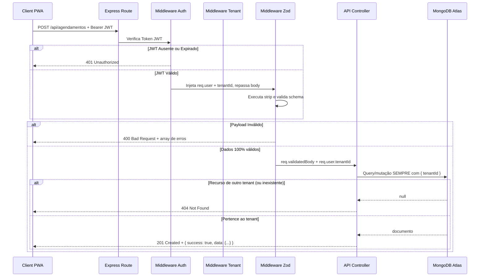
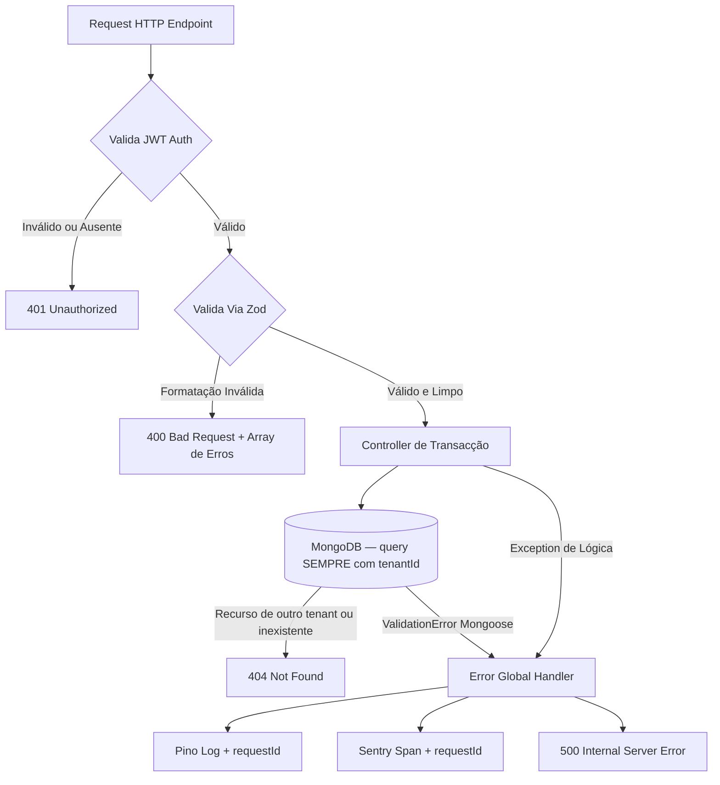
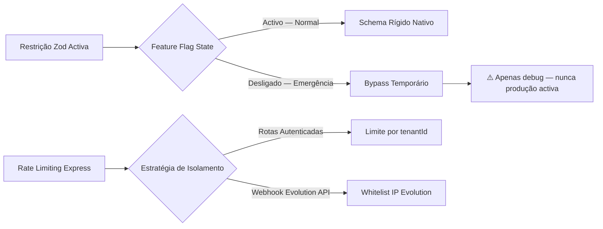
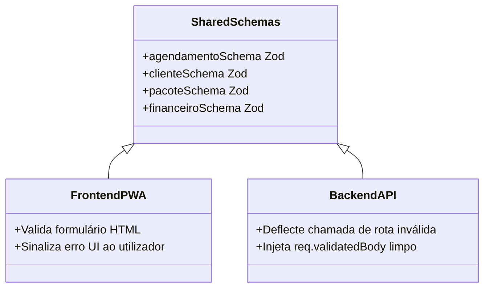

# Diagramas Mermaid — Sistema de Rotas da API
**FDD — Laura SaaS Agenda**

> **Versão:** 1.0  
> **Autor:** André dos Reis  
> **Contexto:** Diagramas técnicos do FDD de Rotas Transacionais Isoladas  
> **Stack:** Node.js + Express + MongoDB + Zod + JWT (multi-tenant)

---

## Visão Geral

Sistema de rotas da API com isolamento rigoroso de acesso via `tenantId` em arquitectura multi-tenant. Incorpora validação estrita pré-runtime baseada no Zod e deflexões defensivas orientadas a proteger as lógicas dos controllers e estabilidade das operações nativas do MongoDB.

### Elementos do Sistema

**Fluxos externos**
- App Frontend PWA
- Endpoints REST Transacionais (Agendamentos, Clientes, Pacotes, Financeiro)

**Processos internos**
- Middleware de Autenticação — verificação de JWT, injecta `req.user` (`_id`, `tenantId`, `role`)
- Middleware de Autorização (`authorize`) — RBAC por `role`/plano (403); **não** filtra por tenant
- Middleware de Validação Zod — strip e limpeza de fields inválidos
- Isolamento multi-tenant — garantido na camada de query dos controllers (`{ tenantId }`), não num middleware
- Error Handler Global Central — oculta stack traces, propaga `requestId`
- Controllers de Domínio — Agendamentos, Pacotes, Clientes, Financeiro

**Contratos públicos**
- Schemas Zod — no backend (`src/`) e no frontend (`laura-saas-frontend/src/schemas`); cada lado valida com o seu
- Respostas padronizadas em JSON: `{ success: true, data }` / `{ success: false, error }`

---

## Diagrama 1 — Fluxo Principal e Validação Estrita

Diagrama sequencial que explora a linha de barreiras que actuam antes do domínio transacional. Fundamental para QAs visualizarem em que momento as interceptações `401`, `404` (acesso cross-tenant) e `400` deflectem do fluxo de persistência no MongoDB.

**Notas técnicas:**
- O `tenantId` provém exclusivamente do JWT server-side — nunca do body da chamada
- O isolamento cross-tenant **não** é um middleware dedicado: cada query do controller inclui `{ tenantId }`. Acesso a recurso de outro tenant devolve **`404`, nunca `403`** — não se revela que o recurso existe
- O Zod executa `strip()` removendo campos não declarados no schema antes de passar ao controller
- O controller recebe apenas `req.validatedBody` — nunca `req.body` directamente

---

## Diagrama 2 — Roteamento de Erros e Excepções

Fluxo top-down traçando o fim de vida de requisições incompletas ou com falha. Serve como gabarito para instrumentação visual do Sentry na leitura de quedas na cadeia lógica.

**Notas técnicas:**
- O `Error Global Handler` oculta stack traces em produção — o cliente recebe apenas `500` simplificado
- O `requestId` propaga-se do handler para o Pino e Sentry simultaneamente — permite rastrear o erro exacto nos logs
- Apenas a camada Zod retorna array detalhado de erros expondo os campos incorrectos da chamada
- `ValidationError` do Mongoose em produção indica falha no Zod — nunca deve ocorrer se CA-05 estiver a passar

---

## Diagrama 3 — Mitigações de Riscos Arquitecturais

Fluxograma modelador de como as decisões técnicas tratam adversidades de rede (CGNAT) e gestão de emergência da validação Zod.

**Notas técnicas:**
- O bypass do Zod via Feature Flag é restrito a ambientes de debug — nunca deve ser activado em produção activa
- Rate limiting por `tenantId` é mais preciso que por IP em arquitectura multi-tenant — evita falsos positivos por CGNAT
- IPs da Evolution API devem estar em whitelist explícita para não serem bloqueados pelo rate limiter

---

## Diagrama 4 — Sincronia Contratual Partilhada (PROPOSTA)

> ⚠️ **Estado: proposta, não implementada.** Hoje os schemas Zod estão duplicados — backend em `src/` e frontend em `laura-saas-frontend/src/schemas`. O diagrama abaixo descreve o estado-alvo do RISCO-03 (pasta partilhada), ainda por implementar.

Diagrama de classes que documenta a fonte única de verdade pretendida para os schemas Zod. Endereça o RISCO-03 — schemas desincronizados entre frontend e backend.

**Notas técnicas (estado-alvo):**
- Ambos frontend e backend importariam os schemas de uma pasta partilhada (ainda inexistente)
- Uma alteração num schema propaga automaticamente nos dois lados
- Elimina a classe de bugs onde o PWA envia payload válido para o frontend mas inválido para o backend
- Testes de contrato devem comparar schemas de ambos os lados como critério de aceite

---

## Sumário dos Códigos HTTP por Camada

| Camada | Código | Condição |
|--------|--------|----------|
| Middleware Auth | `401` | JWT ausente, expirado ou inválido |
| Middleware Auth (`authorize`) | `403` | Sem permissão por role ou plano — **nunca** por tenant |
| Middleware Zod | `400` | Payload malformado ou campos inválidos |
| Controller | `201` | Recurso criado com sucesso |
| Controller | `200` | Operação realizada com sucesso |
| Controller (query c/ `tenantId`) | `404` | Recurso inexistente **ou de outro tenant** (não se revela existência) |
| Error Handler | `500` | Erro interno — stack trace ocultado |

---

*Diagramas gerados com base no FDD de Rotas Transacionais da Laura SaaS Agenda.*  
*Colocar em `/docs/diagramas-rotas-api.md` no repositório.*
