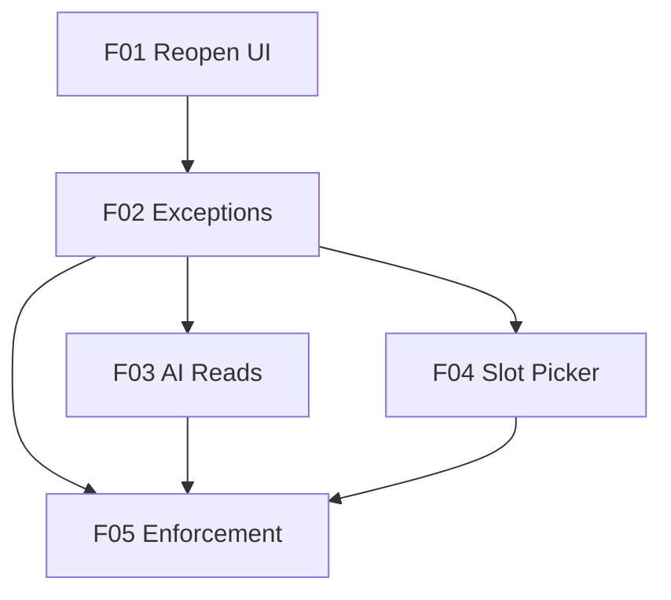

# Marcai — Unified Availability (Panel + AI)

## 1. Executive Summary

Marcai's "availability" (the hours a clinic accepts bookings) currently lives in two disconnected places: the `Schedule` model (MongoDB), edited by a functional but **orphaned** `Disponibilidade` page that nothing reads; and `agent_business_rules.py`, a **hardcoded** Python module in the `ia-service` that the AI actually uses when proposing times. Changing the hours the AI offers means editing Python and rebuilding the service, and the two sources can silently diverge — the AI may propose a slot the panel would reject.

This product makes the `Schedule` model the **single source of truth** for availability, edited once in the panel and read by **every consumer**: manual booking in the panel and the AI over WhatsApp. The core value is **self-service, live coherence** — the clinic owner sets the weekly hours and per-date exceptions in the panel (no code, no deploy), and both the panel and the AI honor exactly the same availability.

At a high level, delivered in waves: reopen the availability UI (F01); add per-date exceptions and a free-text note to `Schedule` (F02); have the AI read availability through a single backend internal endpoint that computes slots with the existing `getAvailableSlots` (F03 — the key win); offer slot-picking in manual booking (F04); and, last, optionally enforce availability on booking creation with an explicit override (F05). The availability UI is a PWA used on phones, so mobile responsiveness is a first-class requirement.

## 2. Problem and Opportunity

### The Problem

**Two disconnected sources of availability**
- `Schedule` (Mongo + `Disponibilidade` page + `/schedules` API) is **inert** — it has a working UI but nothing reads it.
- `agent_business_rules.py` (`RULES_PER_TENANT` + `DATE_OVERRIDES_PER_TENANT`) is **hardcoded** and is what the AI uses.

**No self-service for the hours the AI offers**
- Changing the AI's offered hours requires editing Python and rebuilding the `ia-service` — no autonomy for the clinic.
- Per-date changes (holidays, a closed afternoon) are code edits, not data.

**Risk of incoherence (AI vs panel)**
- The AI can propose a time the panel would book outside hours, or vice-versa, because the two sources can diverge.

**The availability UI is misleading and not mobile-friendly**
- The `Disponibilidade` page implies it configures something, but it has no effect today; its link is commented out in the navbar.
- The weekly grid (8 columns × 24 rows) is hard to use on a phone, yet the product is a PWA used on phones.

### The Opportunity

- **One source, many readers:** `Schedule` becomes the single source; the panel and the AI read the same thing → solves the two-sources problem and the incoherence risk.
- **Self-service and live:** schedule/exception changes apply with no code or rebuild → solves the no-self-service problem.
- **Reuse existing calculators:** `getAvailableSlots` already computes slots; the work is unifying the data source, not rewriting the math.
- **Mobile-first reopen:** the availability page becomes usable on a phone and clearly separates the base weekly schedule from per-date exceptions.

## 3. Target Audience

**Clinic Owner / Professional (e.g. Laura)**
- Defines the weekly working hours and per-date exceptions for her own bookings.
- Needs to change hours herself, instantly, without developer help.
- Uses the app mostly on a phone (PWA).

**Clinic Staff (reception)**
- Books appointments manually and benefits from a slot picker that reflects real availability.

**The AI (system)**
- Reads availability to propose only real, coherent slots to clients over WhatsApp.

## 4. Objectives

**Make availability self-service**
- Metric: 100% of weekly-hours and per-date-exception changes are made in the panel (zero Python edits / `ia-service` rebuilds) once F03 ships.

**Guarantee AI↔panel coherence**
- Metric: the AI and the panel resolve availability from the same source; 0 cases where the AI proposes a slot the backend's `getAvailableSlots` marks unavailable (verified by the shared endpoint).

**Make the availability UI usable on mobile**
- Metric: the `Disponibilidade` page is operable on a 375px-wide viewport (day-by-day view), verified via a Playwright CLI flow.

**Keep the rollout non-destructive**
- Metric: each feature ships isolated value and is reversible; enforcement (F05) is off until the UI, AI and backend all read the same source.

## 5. User Stories

### F01. Reopen Availability UI
- As the clinic owner, I want the Disponibilidade page reachable from the navbar so that I can open my availability.
- As the clinic owner, I want to **manually create and edit my base weekly availability** (each weekday's start/end and pause) so that the schedule reflects exactly when I work. This is where I define my own hours, by hand.
- As the clinic owner on my phone, I want the availability page to be usable on a small screen so that I can create/edit hours without a desktop.
- As the clinic owner, I want a clear separation between my recurring "base schedule" and one-off "date exceptions" so that I am not misled into changing every week when I meant one day.

### F02. Date Exceptions & Note on Schedule
- As the clinic owner, I want to close a specific date or add extra hours on a specific date so that holidays and special days are respected.
- As the clinic owner, I want to write a free-text **observação** on a base-schedule day or a date exception (e.g. "fechado: férias", "horário especial Natal") so that the reason I set those hours stays recorded.
- As the system, I want per-date exceptions stored on `Schedule` so that they replace the hardcoded `DATE_OVERRIDES_PER_TENANT`.

### F03. AI Reads Availability from Schedule
- As the system, I want a single backend internal endpoint that returns available slots computed from `Schedule` (base + exceptions) so that the AI and the panel share one calculation.
- As the system, I want the AI's `find_available_slots` to call that endpoint instead of `agent_business_rules.py` so that panel changes flow to the AI live.
- As the system, I want a one-off migration that seeds each tenant's `Schedule` from the current hardcoded rules so that switching the AI over does not regress behavior.

### F04. Slot Picking in Manual Booking
- As clinic staff, I want to pick from available slots when creating an appointment so that I don't type a free date/time that conflicts with the schedule.
- As clinic staff, I want occupied and out-of-hours times visually distinguished so that I choose a valid slot quickly.

### F05. Backend Availability Enforcement (optional)
- As the system, I want booking creation to reject times outside availability so that the schedule is honored.
- As an admin, I want an explicit override to force a fit (encaixe) outside hours so that real operational exceptions are still possible.

## 6. Functionalities

### F01. Reopen Availability UI

**Capabilities:**
- **Manual creation/editing of the base weekly schedule (the core of this feature):** the clinic owner/admin defines, by hand, each weekday's working hours (start/end + pause) through the Disponibilidade page. This is the single place where availability is authored manually.
- Re-enable the commented Disponibilidade link in `Navbar.jsx` so the page (`Disponibilidade.tsx`) is reachable. The existing `/schedules` API (`getSchedules`, `updateSchedule`) and `getAvailableSlots` are reused unchanged — F01 makes them usable, it does not rewrite them.
- **Mobile responsiveness (first-class):** on small viewports (≤640px) the weekly grid switches to a **day-by-day view** (accordion/list) instead of the 8×24 grid; touch targets are usable on a 375px screen.
- **Clarity base vs exception:** the page visually labels the recurring **"Horário base"** (repeats every week) distinctly from **"Excepções desta data"** (the per-date layer added in F02), so editing a weekday no longer looks like editing a single date.
- Empty state: when no hours are configured, show a "Define o teu horário" CTA; "copiar para os outros dias / dias úteis" quick action.

**Experience:**
- Owner opens the navbar → "Disponibilidade" → sets weekly hours (per-day start/end + pause). On a phone, a day-by-day view; on desktop, the existing grid. No enforcement yet — this only configures data.

### F02. Date Exceptions & Note on Schedule

**Provides:**
- Schedule availability — base weekly hours + per-date exceptions (close/extra hours) + note (used by F03, F04, F05)

**Capabilities:**
- Extend the `Schedule` model with a **per-date exceptions** layer: a date, a type (`fechado` / `horas-extra` / `horario-especial`), optional start/end for special hours, and a free-text **`observacao`** note (max 280 chars). A base-schedule day also gains an optional `observacao`.
- UI to add/edit/remove exceptions for a specific date (e.g., close 2026-12-25; open extra hours 2026-12-20 14:00–18:00), shown in the "Excepções desta data" area separate from the base schedule.
- Exceptions take precedence over the base schedule for that date. This replaces `DATE_OVERRIDES_PER_TENANT`.
- Mobile-responsive exception editor; the note is shown wherever the exception appears.

**Experience:**
- Owner picks a date → "Fechar este dia" / "Horas extra" → optionally writes a note ("fechado: férias") → saves. The exception appears in the date layer with its note. The base weekly schedule is untouched.

**Error Handling:**
- Invalid date or start ≥ end on a special-hours exception → 400 with the offending field.
- Note over 280 chars → 400.
- Cross-tenant write (exception on another tenant's schedule) → 404.

### F03. AI Reads Availability from Schedule

**Consumes:**
- Schedule availability — base weekly hours + per-date exceptions + note (from F02)

**Capabilities:**
- New **backend internal endpoint** `GET /api/internal/disponibilidade` (authenticated by `X-Service-Token`, the existing internal-route pattern), parameters: tenant + date/range + service duration. It returns the available slots computed by the existing **`getAvailableSlots`** (base schedule + F02 exceptions + existing bookings + pause). **Single slot calculation** lives in the backend.
- The `ia-service` `find_available_slots` is rewired to **call this endpoint** instead of `agent_business_rules.py`; the hardcoded `RULES_PER_TENANT` / `DATE_OVERRIDES_PER_TENANT` are removed as a source once migration is done.
- **One-off migration:** a script seeds each tenant's `Schedule` (base + exceptions) from the current hardcoded values, so the AI's behavior does not regress at switch-over. Idempotent and reversible (dry-run first).

**Experience:**
- The AI, when proposing times over WhatsApp, calls the endpoint and offers exactly the slots the panel would — changes the owner makes in the panel are reflected live, with no `ia-service` rebuild.

**Error Handling:**
- Missing/invalid `X-Service-Token` → 401 (internal-route guard).
- Backend unreachable / endpoint error → the AI degrades gracefully (fallback message: asks the client to wait / proposes contacting the clinic) rather than inventing slots.
- Tenant with no `Schedule` configured → endpoint returns an empty slot set with a clear flag (not an error), so the AI does not propose random times.

### F04. Slot Picking in Manual Booking

**Consumes:**
- Schedule availability — available slots for a date (from F02 via `getAvailableSlots`)

**Capabilities:**
- Wire `CriarAgendamento` / `QuickAppointmentModal` to `getAvailableSlots`: replace the free date/time input with a **slot picker** for the chosen date and service duration.
- Occupied, out-of-hours, and pause times are visually distinguished; an authorized user may still force a fit (no hard block here — enforcement is F05).
- Mobile-responsive slot picker.

**Experience:**
- Staff selects a date and service → sees available slots → picks one → confirms. The previously dead `dataSelecionada` picking path is made functional.

### F05. Backend Availability Enforcement (optional)

**Consumes:**
- Schedule availability — base + exceptions (from F02)

**Capabilities:**
- Reactivate the commented validation in `createAgendamento`: reject a booking whose time falls outside the resolved availability (base + exceptions − bookings).
- **Explicit override:** an admin can pass an override flag to force an `encaixe` outside hours; the override is recorded (who/why) for traceability.
- Ships only after F03 and F04 — i.e., after the UI, the AI and the backend all read the same source.

**Experience:**
- A normal out-of-hours booking is rejected with a clear message; an admin with override creates the fit anyway.

**Error Handling:**
- Out-of-hours booking without override → 400 with the availability reason.
- Override by a non-admin role → 403.
- Booking on a `fechado` exception date without override → 400.

## 7. Out of Scope

**Multi-professional availability**
- `Schedule` is per-tenant (assumes one professional). Per-professional schedules require extending the model — not in this version.

**Rewriting the slot calculation**
- `getAvailableSlots` is reused as-is; this product unifies the data source, it does not re-implement slot math.

**AI conversational changes beyond availability**
- Only `find_available_slots`' data source changes; the rest of the agent's behavior is unchanged.

**Online client self-booking**
- Clients do not pick slots directly here; booking is via the AI (WhatsApp) or staff (panel).

## 8. Dependency Graph

**Part 1: Dependency Table**

| # | Feature | Priority | Dependencies |
|---|---------|----------|--------------|
| F01 | Reopen Availability UI | 1 | None |
| F02 | Date Exceptions & Note on Schedule | 1 | F01 |
| F03 | AI Reads Availability from Schedule | 1 | F02 |
| F04 | Slot Picking in Manual Booking | 2 | F02 |
| F05 | Backend Availability Enforcement | 3 | F02, F03, F04 |

**Part 3: Execution Waves**

Features within the same wave can be built in parallel. A wave starts only after every feature in earlier waves is complete.

- **Wave 1**: F01
- **Wave 2**: F02
- **Wave 3**: F03, F04
- **Wave 4**: F05

**Part 4: Priority Legend**

### Priority levels
- **1** = Essential — product does not work without it
- **2** = Important — significant value addition
- **3** = Desirable — incremental improvement

**Part 5: Mermaid Diagram**

## 9. Acceptance Criteria

### F01. Reopen Availability UI
- The Disponibilidade link is active in the navbar and the page loads for owner/admin.
- On a 375px-wide viewport the page is operable (day-by-day view, usable touch targets) — verified via a **Playwright CLI** flow (open page → edit a day → save on mobile viewport).
- The page visually separates "Horário base" from "Excepções desta data".
- An empty schedule shows the "Define o teu horário" CTA.

### F02. Date Exceptions & Note on Schedule
- Adding a `fechado` exception for a date makes that date unavailable; adding `horas-extra` opens the extra window; both can carry an `observacao` note that is persisted and displayed.
- An exception takes precedence over the base weekly schedule for its date.
- start ≥ end on special hours → 400; note > 280 chars → 400; cross-tenant write → 404.
- A **Playwright CLI** flow creates a closed-day exception with a note and sees it reflected in the UI (incl. mobile viewport).

### F03. AI Reads Availability from Schedule
- `GET /api/internal/disponibilidade` returns the same slots `getAvailableSlots` produces for the tenant/date (base + exceptions + bookings); without a valid `X-Service-Token` → 401.
- The `ia-service` `find_available_slots` returns slots sourced from the endpoint; `agent_business_rules.py` is no longer the source.
- The one-off migration seeds `Schedule` from the current hardcoded rules (dry-run then apply, idempotent); after migration the AI proposes the same availability as before for an unchanged schedule.
- A tenant with no `Schedule` yields an empty-but-flagged slot set (not an error), and the AI does not invent times.

### F04. Slot Picking in Manual Booking
- `CriarAgendamento` shows available slots for the selected date/service from `getAvailableSlots`; picking one creates the booking at that time.
- Occupied/out-of-hours/pause times are visually distinguished.
- A **Playwright CLI** flow books an appointment by picking a slot (incl. mobile viewport).

### F05. Backend Availability Enforcement
- A booking outside availability without override → 400 with the reason; with an admin override → created and the override recorded.
- A booking on a `fechado` date without override → 400; override by a non-admin → 403.

### Cross-Feature Integration
- F03's endpoint and the AI reflect the base schedule (F01) and the per-date exceptions + notes from F02 (closing a date in the panel makes the AI stop offering that date).
- F04's slot picker reflects the F02 exceptions (a `fechado` date offers no slots; `horas-extra` offers the extra window).
- F05 enforces exactly the availability defined by F02 (and aligned with F03/F04 readers); an out-of-hours time the slot picker (F04) hid is the same time enforcement rejects.
