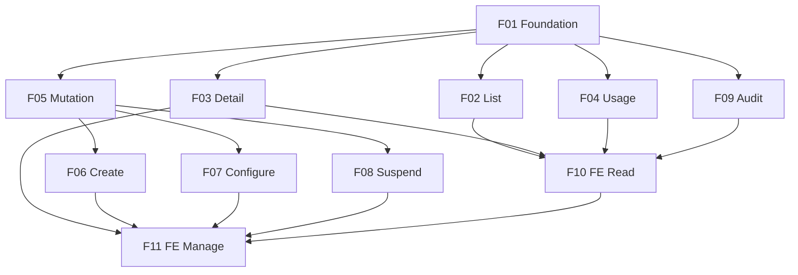

# Marcai Super-Admin Panel

## 1. Executive Summary

The Marcai Super-Admin Panel is the single, sanctioned control plane through which the Marcai operator manages every tenant of the multi-tenant SaaS from one place — listing all clinics/salons, inspecting their plan, limits, usage and audit trail, and performing privileged management actions (create, configure, suspend, reactivate) that today require manual database edits or maintenance scripts.

It is built for the **Marcai operator (super-admin)** only — the commercial owner running the platform — not for tenant staff. Its core value is turning dispersed, error-prone, unaudited operations into a single, safe, fully-audited surface, so onboarding a new paying client or changing a plan becomes a deliberate, traceable action instead of a hand-edited document.

Architecturally the panel is the **only** place in the system where the multi-tenant isolation boundary is crossed on purpose. Tenant data lives in per-tenant databases (`tenant_<id>`) on a shared Atlas cluster; the control plane (`Tenant`, `User`, `UserSubscription`, `AuditLog`) lives in the shared `laura-saas` database. The panel reaches across tenants under reinforced guards: a dedicated `requireSuperadmin` gate (returns 404 to everyone else), an append-only audit log of every action, a read-only database credential for cross-tenant reads, and a transactional mutation helper that writes the audit entry atomically with each change.

> **Nota de modelo comercial (2026-06-24).** O Marcai vende-se como **consultoria done-for-you** (setup fee one-time + mensalidade gerida), **não** como planos self-serve. Ver `docs/oferta-consultoria.md` (fonte canónica) e `docs/guiao-pitch.md`. Implicações para este painel:
> - **`plano.tipo` é a etiqueta do pacote de consultoria**, não uma assinatura auto-gerida pelo cliente. Tiers oficiais: **Essencial / Pro / Custom**. O enum no código ainda é `basico/pro/elite/custom` (`Tenant.js`, `adminSchemas.js`, `adminController.js`) — **renomear `basico`→`essencial` e largar `elite` é uma tarefa de follow-up** (model + schemas + migração dos tenants existentes). Onde este PRD escreve `basico/pro/elite/custom`, ler como o conjunto canónico Essencial/Pro/Custom após o rename.
> - **O setup fee e a cobrança são feitos fora do sistema** (fatura/transferência) — billing continua fora de âmbito (§7). O painel define `plano.tipo`/`status`/`limites`; não processa pagamentos.
> - O **mecanismo** do painel (criar/configurar/suspender tenant, limites, auditoria) mantém-se inalterado e serve igualmente o modelo de consultoria.

## 2. Problem and Opportunity

### The Problem

**Tenant operations are manual and dispersed**
- Creating a tenant means running the public registration flow or editing the database by hand.
- Changing a plan, limit or status means direct DB edits or maintenance scripts (`scripts/maintenance/`).
- There is no single place to perform these actions; each is a different, undocumented procedure.

**No aggregated visibility of the business**
- There is no answer to "how many clients do I have, on which plans, with what usage" without ad-hoc queries.
- Decisions about pricing, capacity and outreach are made blind.

**Privileged access is unaudited**
- Cross-tenant access (reading or changing another tenant's data) leaves no trail of who did what, when, to which tenant.
- This is a confidence and GDPR risk: privileged access to EU personal data must be traceable.

**The isolation boundary is fragile when crossed by hand**
- Manual scripts that touch multiple tenants can silently break isolation or corrupt a tenant's data with no rollback and no record.

### The Opportunity

- **One audited surface** replaces every manual procedure: each privileged action is a deliberate, recorded operation. → solves manual/dispersed operations *and* unaudited access.
- **Aggregated tenant views** (list, detail, usage) give the operator the business picture at a glance. → solves blind decision-making.
- **Reinforced guards** (super-admin-only gate, read-only cross-tenant reads, transactional audited mutations) make crossing the isolation boundary safe by construction. → solves the fragility of hand edits.

The differentiator versus a generic admin tool (Retool, Metabase) is that the panel is *inside* the product, under the product's own security model, with mutations that are transactional and audited at the same instant — and with the isolation boundary respected everywhere except this one sanctioned module.

## 3. Target Audience

**Marcai Operator (Super-Admin)**
- The commercial owner/operator of the Marcai platform; the only holder of the `superadmin` role.
- Needs to onboard, configure, suspend and reactivate tenants without touching the database directly.
- Needs aggregated visibility (who, which plan, how much usage) and a reliable audit trail of their own privileged actions.

This product has a single, homogeneous user group — the operator — so no additional personas are defined. Tenant staff (admin, gerente, recepcionista, terapeuta) are explicitly *not* users of this panel; for them the panel must not even appear to exist.

## 4. Objectives

**Eliminate manual tenant operations**
- Metric: 100% of tenant create/configure/suspend/reactivate actions performed through the panel (zero direct DB edits) within the first month of use.

**Make every privileged action auditable**
- Metric: 100% of panel actions (reads, writes and denied attempts) produce an `AuditLog` entry; zero mutations without a corresponding atomic audit record.

**Give the operator aggregated tenant visibility**
- Metric: the operator can see, for every tenant, plan + status + usage (clients, appointments, messages) in ≤ 2 clicks.

**Keep the isolation boundary intact outside the panel**
- Metric: zero cross-tenant data access outside `src/modules/admin/`, enforced by lint gates (`no-restricted-imports`) and a read-only database credential; verified on every build.

## 5. User Stories

### F01. Super-Admin Access Control & Audit Foundation
- As the system, I want every `/admin/*` route to require the `superadmin` role and return 404 to anyone else, so that the panel's existence is not revealed to non-super-admins.
- As the system, I want every denied access attempt to be recorded, so that probing of the admin surface leaves a trail.
- As the system, I want an append-only audit log shared across tenants, so that privileged actions cannot be erased.

### F02. Tenant Listing
- As the operator, I want to list all tenants with name, plan, status and creation date, paginated, so that I can see my whole client base.

### F03. Tenant Detail
- As the operator, I want to open a single tenant and see its plan, limits, configuration and user count, so that I can understand its state before acting.

### F04. Tenant Usage Metrics
- As the operator, I want to see a tenant's usage (number of clients, appointments, messages), so that I can gauge activity and capacity.

### F05. Audited Mutation Foundation
- As the system, I want every panel mutation to run through a single helper that writes the audit entry atomically with the change, so that no mutation can succeed without an audit record.

### F06. Create Tenant + Admin User
- As the operator, I want to create a new tenant together with its first admin user in one action, so that onboarding a paying client is a single click instead of a manual procedure.

### F07. Configure Tenant Plan, Limits & Feature Flags
- As the operator, I want to change a tenant's plan type, status, expiry, limits and feature flags, so that I can adjust a client's subscription without editing the database.

### F08. Suspend / Reactivate Tenant
- As the operator, I want to suspend a tenant so its staff loses access, and reactivate it later, so that I can enforce billing or pause a client safely.

### F09. Audit Log Viewer
- As the operator, I want to browse the audit log filtered by tenant, actor and action, so that I can review what privileged actions were taken.

### F10. Panel Frontend — Tenant List, Detail & Usage
- As the operator, I want web pages that show the tenant list, a tenant's detail and its usage, so that I do not have to call the API by hand.

### F11. Panel Frontend — Tenant Management UI
- As the operator, I want web forms to create a tenant, edit its plan/limits, and suspend/reactivate it, so that I can manage tenants from the browser with confirmation and feedback.

## 6. Functionalities

### F01. Super-Admin Access Control & Audit Foundation

**Provides:**
- Audit entries — actor, action, target tenant, before/after, status, ip, timestamp (used by F09)

**Capabilities:**
- `requireSuperadmin` middleware mounted at the router level: `req.user.role === 'superadmin'` passes; otherwise **404** (never 403 — the surface is not revealed). Missing/invalid token → 401 (global `authenticate` behaviour).
- Denied access is recorded as an `AuditLog` entry with `status: 'denied'` before responding 404.
- `AuditLog` model in the shared `laura-saas` database: append-only (no `updatedAt`, no update/delete routes), fields `actorUserId`, `actorEmail`, `action`, `targetTenantId`, `before`/`after`, `status` (`ok`/`denied`/`error`), `metadata`, `ip`, `createdAt`. Append-only enforced by a per-collection database credential (insert + find only).
- `auditMiddleware` writes exactly one entry per successful read request (`res.on('finish')`, best-effort), skipping when a mutation already wrote its own entry transactionally.
- `adminRouter` dual-mounted at `/api/admin` and `/api/v1/admin`.

**Experience:**
- Invisible to tenant staff: every `/admin/*` path returns 404 for non-super-admins. A super-admin's requests pass through and are audited automatically.

### F02. Tenant Listing

**Provides:**
- Tenant summary list — tenant id, name, slug, plan type, plan status, creation date (used by F10)

**Capabilities:**
- `GET /admin/tenants` over the shared `laura-saas` database with **no** `tenantId` filter (the sanctioned cross-tenant read).
- Pagination: `page` (default 1) and `limit` (default 20, max 100); sorted by creation date descending.
- Response follows `{ success, data, pagination: { total, page, pages, limit } }`.

**Experience:**
- The operator receives a paginated list; each item exposes the fields above. One audit entry per request (`tenant.list`).

### F03. Tenant Detail

**Provides:**
- Tenant detail — plan, limits, configuration, branding, total users (used by F10, F11)

**Capabilities:**
- `GET /admin/tenants/:id` over `laura-saas`; validates the id is a valid ObjectId (else 400); a non-existent tenant returns 404.
- Returns the full tenant document plus the count of users in that tenant.

**Experience:**
- The operator opens one tenant and sees its complete control-plane state. One audit entry per request (`tenant.view`, with `targetTenantId`).

### F04. Tenant Usage Metrics

**Provides:**
- Usage counts — number of clients, appointments, messages (used by F10)

**Capabilities:**
- `GET /admin/tenants/:id/uso` reads the tenant's own database (`tenant_<id>`) through a **separate read-only connection** (`getTenantDBAdmin`), never the main read-write connection.
- Fail-closed: without the read-only credential the route errors; it never falls back to the main connection.
- Counts clients, appointments and messages in parallel (bounded), with no `tenantId` filter (inside the tenant database the data is already the tenant's).

**Error Handling:**
- Invalid tenant id → 400 "ID inválido".
- Non-existent tenant → 404 "Tenant não encontrado".
- Read-only credential missing/misconfigured → 500 with a generic message; the failure is recorded with `status: 'error'`; the panel never silently reads through a writable connection.

### F05. Audited Mutation Foundation

**Capabilities:**
- A single `adminMutation(action, work)` factory used by every panel write. It opens a transaction on the shared connection, runs the work, and writes the `AuditLog` entry **in the same transaction** — so the change and its audit record commit atomically, or neither does.
- Mutations are restricted to the control plane (`laura-saas`): `Tenant`, `User`, `UserSubscription`. Writing inside a `tenant_<id>` database from the panel is out of scope (the panel's tenant connection is read-only).
- On failure: the transaction rolls back and a best-effort `status: 'error'` entry is written outside the transaction; the request returns an error.
- The mutation `work` contains only database operations (the transaction may retry); external side-effects (e.g. e-mail) run outside the transaction and must be idempotent.
- A lint gate forbids raw `router.post/put/patch/delete` inside `src/modules/admin/` — every mutation must go through `adminMutation`, making audit coverage structural.

**Experience:**
- Invisible infrastructure: feature developers wrap each mutation handler with `adminMutation('<verb>', work)` and the audit + atomicity are guaranteed.

### F06. Create Tenant + Admin User

**Provides:**
- New tenant id and admin user identity (used by F11)

**Capabilities:**
- `POST /admin/tenants` via `adminMutation('tenant.create', …)`. In one transaction it creates the `Tenant` (with a unique slug, generated from the company name if not given) and its first `User` with `role: 'admin'` and `emailVerificado: false`.
- The operator supplies: company name (2–100 chars), slug (optional; auto-generated, lowercase, `[a-z0-9-]`), plan type (`basico`/`pro`/`elite`/`custom`), admin name, admin e-mail. Server sets role, status (`trial`), limits defaults from the chosen plan; never from the request body.
- The admin user receives an e-mail verification link (side-effect outside the transaction, idempotent).
- Duplicate slug or admin e-mail already in use → conflict, no tenant created.

**Experience:**
- The operator fills a short form; on success the tenant appears in the list (F02) and the new admin can verify their e-mail and log in. The action is audited with the created tenant id and a `before/after` of the created documents (GDPR-minimal).

**Error Handling:**
- Missing required field (company name, admin name, admin e-mail) → 400 with the specific field.
- Slug already taken → the server retries with a numeric suffix; only a hard conflict surfaces a 409.
- Admin e-mail already registered globally → 409 "Email já registado", no tenant created.
- E-mail send failure → the tenant + user are still created (e-mail is idempotent and retryable); the failure is logged, not rolled back.
- Transaction failure at any step → full rollback (no orphan tenant or user) and `status: 'error'` audit entry.

### F07. Configure Tenant Plan, Limits & Feature Flags

**Provides:**
- Updated tenant state — plan, limits, flags (used by F11)

**Capabilities:**
- `PUT /admin/tenants/:id/plano` and `PUT /admin/tenants/:id/limites` (or a single `PATCH /admin/tenants/:id`) via `adminMutation('tenant.configure', …)`.
- Editable fields (explicitly whitelisted, never `req.body` spread): `plano.tipo`, `plano.status`, `plano.dataExpiracao`; `limites.maxClientes`, `limites.maxUsuarios`, `limites.maxAgendamentosMes`, `limites.maxLeads`; feature flags (`limites.iaAtiva`, `limites.leadsAtivo`, etc.).
- Validation: numeric limits ≥ 0 (or -1 for unlimited where the field allows it); plan type and status restricted to their enums.

**Experience:**
- The operator edits a tenant's subscription and limits; the change takes effect immediately for that tenant. Audited with a `before/after` diff of only the changed fields.

**Error Handling:**
- Invalid id → 400; non-existent tenant → 404.
- Out-of-enum plan type/status or negative limit → 400 with the offending field.
- Transaction failure → rollback + `status: 'error'` entry.

### F08. Suspend / Reactivate Tenant

**Provides:**
- Updated tenant status (used by F11)

**Capabilities:**
- `POST /admin/tenants/:id/suspender` and `POST /admin/tenants/:id/reactivar` via `adminMutation('tenant.suspend' | 'tenant.reactivate', …)`.
- Suspend sets `plano.status = 'suspenso'`; reactivate sets `plano.status = 'ativo'`. This reuses the existing `requirePlan` enforcement: a suspended tenant's staff get 403 on product routes, while the super-admin can still manage the tenant.
- An optional reason is recorded in the audit `metadata`.

**Experience:**
- The operator suspends a non-paying client in one click; the client's staff immediately lose product access while their data is preserved. Reactivation restores access. Both actions are audited with the previous and new status.

**Error Handling:**
- Invalid id → 400; non-existent tenant → 404.
- Suspending an already-suspended (or reactivating an already-active) tenant → idempotent success, still audited.
- Transaction failure → rollback + `status: 'error'` entry.

### F09. Audit Log Viewer

**Consumes:**
- Audit entries — actor, action, target tenant, before/after, status, timestamp (from F01)

**Provides:**
- Audit entry list (used by F10)

**Capabilities:**
- `GET /admin/audit` reads the `AuditLog` (shared `laura-saas`), paginated (max 100), sorted by `createdAt` descending.
- Filters: `targetTenantId`, `actorUserId`, `action`, `status`, and a date range.
- Read-only: the panel exposes no route that updates or deletes audit entries.

**Experience:**
- The operator reviews recent privileged actions, filters by tenant or action, and can see denied attempts (`status: 'denied'`) as a security signal. One audit entry per request (`audit.view`).

### F10. Panel Frontend — Tenant List, Detail & Usage

**Consumes:**
- Tenant summary list (from F02)
- Tenant detail (from F03)
- Usage counts (from F04)
- Audit entry list (from F09)

**Capabilities:**
- React pages under a protected `/admin` route, visible only to a logged-in super-admin: a tenant list (paginated, searchable by name/slug), a tenant detail page (plan, limits, config, user count, usage), and an audit log view.
- All data fetched through the existing `api.js` client against `/api/v1/admin/*`; follows the project design system (indigo/purple, slate, glassmorphism).
- Loading, empty and error states for every view; the panel is reachable only when `useAuth().user.role === 'superadmin'`.

**Experience:**
- The operator opens the panel, browses tenants, drills into one and sees its usage and audit trail — all without calling the API by hand.

### F11. Panel Frontend — Tenant Management UI

**Consumes:**
- Tenant detail (from F03, to pre-fill edit forms)
- New tenant id and admin identity (from F06)
- Updated tenant state (from F07)
- Updated tenant status (from F08)

**Capabilities:**
- React forms for: create tenant (company, slug, plan, admin name/e-mail), edit plan/limits/flags, and suspend/reactivate with an optional reason.
- Inline validation mirroring the API rules; confirmation dialogs for suspend/reactivate; toast feedback on success; inline field errors on failure.
- Limits and plan controls reflect the tenant's current state; destructive actions (suspend) require explicit confirmation.

**Experience:**
- The operator manages a tenant entirely from the browser: creates a client, adjusts its plan, suspends or reactivates it, always with clear feedback and confirmation. The frontend reflects the backend rules but never replaces them.

**Error Handling:**
- API validation error → inline field message, form not cleared.
- Conflict (duplicate slug/e-mail) → specific message, no partial state shown.
- Network/permission failure → toast error; a 401 triggers the existing auto-logout; a 404 on an admin route means the session is no longer super-admin.

## 7. Out of Scope

> **Update 2026-07-07:** the two items below are no longer deferred indefinitely — they are planned as **Phase 2** in `docs/produto/PRD-superadmin-hardening.md` (F13–F22), following the audit in `docs/operacoes/auditoria-superadmin-2026-07-07.md`.

**Authentication hardening**
- Separate super-admin login, 2FA, dedicated rate limiting and short-lived super-admin tokens (ADR-024 Phase 5). The panel assumes a trusted super-admin token; it does not defend against a stolen JWT. → *Phase 2: F13 (rate limiting), F16 (2FA); separate login remains registered debt.*

**Per-tenant integrations**
- Configuring a tenant's WhatsApp/Evolution instance from the panel (ADR-024 Phase 4, ADR-021). → *Phase 2: F21.*

**Cross-database mutations**
- Writing inside a tenant's own database (`tenant_<id>`) from the panel. Panel mutations are restricted to the control plane; cross-DB onboarding workflows (outbox/saga) are deferred.

**Tenant self-service**
- This panel is operator-only. Tenant-facing plan/billing self-management is not part of it.

**Billing/payment processing**
- Charging, invoicing and payment reconciliation are not handled here; the panel sets plan/status but does not process payments.

## 8. Dependency Graph

**Part 1: Dependency Table**

| # | Feature | Priority | Dependencies |
|---|---------|----------|--------------|
| F01 | Super-Admin Access Control & Audit Foundation | 1 | None |
| F02 | Tenant Listing | 1 | F01 |
| F03 | Tenant Detail | 1 | F01 |
| F04 | Tenant Usage Metrics | 2 | F01 |
| F05 | Audited Mutation Foundation | 1 | F01 |
| F06 | Create Tenant + Admin User | 1 | F05 |
| F07 | Configure Tenant Plan, Limits & Feature Flags | 1 | F05 |
| F08 | Suspend / Reactivate Tenant | 1 | F05 |
| F09 | Audit Log Viewer | 2 | F01 |
| F10 | Panel Frontend — List, Detail & Usage | 2 | F02, F03, F04, F09 |
| F11 | Panel Frontend — Tenant Management UI | 2 | F03, F06, F07, F08, F10 |

**Part 2: Foundation Features**

These features set up shared project infrastructure. In a greenfield project they must be implemented sequentially before or alongside any feature that depends on them:
- **F01 Super-Admin Access Control & Audit Foundation** — the super-admin gate, the append-only audit log, the read audit middleware and the dual-mounted admin router that every other feature is wrapped by.
- **F05 Audited Mutation Foundation** — the transactional `adminMutation` factory and the lint gate that every write feature (F06, F07, F08) must go through.

**Part 3: Execution Waves**

Features within the same wave can be built in parallel. A wave starts only after every feature in earlier waves is complete.

**Note:** When the "Foundation Features" part is present, foundation features cannot run in parallel in a greenfield project even if they appear together in a wave — they share scaffolding files and must be implemented sequentially until the base is in place.

- **Wave 1**: F01
- **Wave 2**: F02, F03, F05, F04, F09
- **Wave 3**: F06, F07, F08, F10
- **Wave 4**: F11

**Part 4: Priority Legend**

### Priority levels
- **1** = Essential — product does not work without it
- **2** = Important — significant value addition
- **3** = Desirable — incremental improvement

**Part 5: Mermaid Diagram**

## 9. Acceptance Criteria

### F01. Super-Admin Access Control & Audit Foundation
- A request to any `/admin/*` route without a token returns 401.
- A request from an authenticated non-super-admin (any tenant role) returns 404, not 403.
- A denied request writes exactly one `AuditLog` entry with `status: 'denied'` and the actor's id.
- An `AuditLog` entry cannot be updated or deleted through any panel route.
- A successful read request writes exactly one `AuditLog` entry; a mutation does not produce a duplicate read entry.

### F02. Tenant Listing
- A super-admin gets a paginated list of all tenants with name, slug, plan type, status and creation date.
- `limit` above 100 is capped at 100; results are sorted by creation date descending.
- A non-super-admin gets 404.

### F03. Tenant Detail
- A super-admin gets one tenant's full control-plane state plus its user count.
- An invalid ObjectId returns 400; a non-existent tenant returns 404.

### F04. Tenant Usage Metrics
- A super-admin gets the tenant's client, appointment and message counts.
- The counts are read through the read-only connection; a write attempted through that connection is rejected.
- With `MONGO_TENANT_RO_URI` absent, the route errors and never reads through the main connection.

### F05. Audited Mutation Foundation
- A mutation wrapped by `adminMutation` writes its change and its `AuditLog` entry atomically: if the audit write fails, the change is rolled back.
- A failed mutation produces a best-effort `status: 'error'` audit entry and no committed change.
- A raw `router.post/put/patch/delete` inside `src/modules/admin/` fails the lint gate.

### F06. Create Tenant + Admin User
- Creating a tenant produces a `Tenant` and an admin `User` with `role: 'admin'`, both committed or neither.
- Server-set fields (role, status, limits) cannot be overridden from the request body.
- A duplicate admin e-mail returns 409 and creates no tenant.
- The action writes one `tenant.create` audit entry with the created tenant id.

### F07. Configure Tenant Plan, Limits & Feature Flags
- Changing plan type, status, expiry, limits or flags persists and takes effect for that tenant.
- An out-of-enum value or a negative limit returns 400 with the offending field.
- The audit `before/after` contains only the changed fields.

### F08. Suspend / Reactivate Tenant
- Suspending a tenant sets `plano.status = 'suspenso'`; its staff then get 403 on product routes while the super-admin can still manage it.
- Reactivating restores `plano.status = 'ativo'` and product access.
- Both actions are audited with previous and new status; repeating the same action is idempotent and still audited.

### F09. Audit Log Viewer
- A super-admin can list audit entries paginated and filter by tenant, actor, action, status and date range.
- The panel exposes no route that modifies or deletes audit entries.

### F10. Panel Frontend — List, Detail & Usage
- A logged-in super-admin can browse the tenant list, open a tenant's detail and usage, and view the audit log, all in the browser.
- The panel is unreachable (and its navigation hidden) for any non-super-admin session.
- Every view has loading, empty and error states.

### F11. Panel Frontend — Tenant Management UI
- A super-admin can create a tenant, edit its plan/limits, and suspend/reactivate it from forms, with inline validation and toast feedback.
- Suspend requires an explicit confirmation dialog.
- An API conflict (duplicate slug/e-mail) shows a specific field message and no partial state.

### Cross-Feature Integration
- A tenant created through F06 appears in the F02 list and is openable through F03.
- The F10 frontend renders the exact list from F02, the exact detail from F03, the exact usage from F04 and the exact audit entries from F09.
- The F11 management UI pre-fills its edit form from F03's detail and reflects, after each action, the updated state returned by F06 (create), F07 (configure) and F08 (suspend/reactivate).
- Every action exposed by F06, F07 and F08 produces an `AuditLog` entry (F01) readable through F09.
