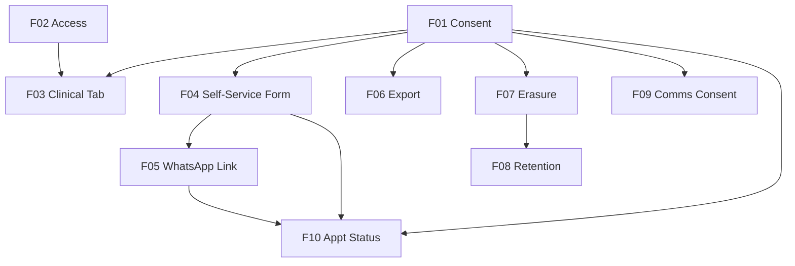

# Marcai — Privacy & GDPR Consent

## 1. Executive Summary

Marcai is a multi-tenant SaaS for health/aesthetic professionals where each clinic (tenant) is the data **controller** and Marcai is the **processor**. This product adds the privacy and consent layer that makes Marcai safe to sell to clinics that handle **special-category health data** (anamnesis: allergies, medical history, diabetes, hypertension, medication) under Article 9 GDPR.

The core value is twofold. First, **compliance built-in**: an auditable consent record (`ConsentLog`), need-to-know access to clinical data, data-subject rights (export and erasure), and configurable retention — so a clinic can defend itself in an audit. Second, a **differentiator**: the client fills the anamnesis form themselves, on their phone, via a tokenized link sent over WhatsApp, and gives explicit consent in the same flow — collection and consent happen at the same moment, with proof.

At a high level: a clinic sends a self-service form link to a client over WhatsApp; the client fills the anamnesis and ticks an explicit, non-pre-checked consent; the submission writes the health data to the client's record and an immutable `ConsentLog` entry. Inside the panel, clinical data lives behind a need-to-know gate (admin/manager/therapist see it; receptionist does not), surfaced as a gated "Clinical" tab that shows a sensitivity badge, the consent status, and logs who read it. Data-subject requests (export, erasure) and retention-based anonymization are handled by a dedicated `gdpr` module, with fiscal records preserved as legally required.

## 2. Problem and Opportunity

### The Problem

**No consent mechanism for special-category data**
- Anamnesis fields already exist on the client record but are sub-used and collected ad-hoc, with no proof of consent tied to the data.
- Health data is Article 9 (high-risk); without explicit, versioned, revocable consent the clinic is exposed.
- Manual transcription by staff introduces errors and weakens the legal basis.

**Sensitive data is visible to everyone in the tenant**
- Any staff member can currently see clinical fields — there is no need-to-know restriction for special-category data.
- No indication on the record that a section is clinical/sensitive, and no record of who accessed it.

**Data-subject rights are not operationalized**
- No way to export a client's data (portability) or to honor erasure ("right to be forgotten") within the 1-month legal deadline.
- Naive deletion would destroy fiscal records that have a legal retention obligation.

**Indefinite retention**
- Personal data is kept forever; GDPR requires keeping it only while necessary (sector norm: ~24 months of inactivity).

### The Opportunity

- **Self-service consent at the point of collection** turns the weakest link (consent proof) into a strength and into a sellable feature: the client fills the form and consents in one act, over WhatsApp.
- **Need-to-know access + sensitivity badge + read audit** makes special-category handling defensible and visible.
- **A dedicated `gdpr` module** gives the clinic the tools to honor export and erasure, with fiscal data preserved.
- **Configurable retention with automatic anonymization** keeps data only as long as needed without manual effort.

## 3. Target Audience

**Clinic Owner / Admin**
- Runs the clinic; needs full visibility of clinical data and confidence the system is compliant.
- Wants the consent/anamnesis collected without chasing clients on paper.
- Responds (as controller) to data-subject requests using the tools Marcai provides.

**Therapist (Aesthetician)**
- Needs the clinical/anamnesis data of clients to perform treatments safely (contraindications).
- Sees clinical data; does not manage privacy settings.

**Receptionist**
- Handles bookings and contact info; must **not** see clinical/anamnesis data (need-to-know).

**The Client (data subject)**
- Not a panel user. Receives a form link over WhatsApp, fills the anamnesis on their phone, and gives explicit consent. Can later have their data exported or erased on request.

## 4. Objectives

**Capture defensible consent for health data**
- Metric: 100% of anamnesis submissions produce an immutable `ConsentLog` entry with timestamp, policy version and explicit (non-pre-checked) consent.

**Restrict clinical data to need-to-know**
- Metric: 0 clinical-field reads by `recepcionista` role (enforced server-side); 100% of clinical-tab opens recorded in the read audit.

**Operationalize data-subject rights**
- Metric: a client's data can be exported (portability) and erasure requested in ≤2 actions from the record; erasure anonymizes PII while retaining 100% of fiscal records.

**Minimize retention**
- Metric: clients inactive beyond the tenant's configured period (default 24 months) are anonymized automatically by a weekly job.

## 5. User Stories

### F01. Consent Logging Foundation
- As the system, I want to store every consent grant/withdrawal as an immutable log entry so that the clinic has proof of who consented to what and when.
- As a clinic admin, I want to record a consent (e.g., marketing or WhatsApp opt-in) for a client so that communications have a legal basis.
- As a clinic admin, I want to see a client's consent history so that I can verify their current state.

### F02. Need-to-Know Clinical Access Control
- As the system, I want clinical/anamnesis fields to be readable only by admin/manager/therapist roles so that special-category data is restricted to need-to-know.
- As the system, I want every read of a client's clinical data recorded so that access leaves a trail.
- As a receptionist, I want to use the client record (name, contact, bookings) without seeing clinical data so that I do my job without accessing sensitive data.

### F03. Clinical Tab in Client Record
- As a therapist, I want a "Clinical" tab on the client record that shows the anamnesis behind a sensitivity badge so that I know the data is sensitive and restricted.
- As a clinic admin, I want to see the consent status (pending / given on DD-MM-YYYY / withdrawn) on the record so that I know whether I can use the clinical data.

### F04. Self-Service Anamnesis & Consent Form
- As a client, I want to fill my anamnesis on my phone via a link so that I don't have to do it on paper at the clinic.
- As a client, I want to give explicit consent (a non-pre-checked checkbox) on the same screen so that I control how my health data is used.
- As the system, I want a form submission to write the anamnesis to the client record and an immutable consent entry so that collection and consent are captured together.

### F05. WhatsApp Form Link Delivery
- As a clinic admin, I want to send the anamnesis form link to a client over WhatsApp so that they fill it before their appointment.
- As the system, I want the sent link to carry a single-purpose token scoped to that client so that only the right person fills the right form.

### F06. Data Subject Export (Portability)
- As a clinic admin, I want to export all of a client's personal data (including consent history) as a file so that I can honor a portability request.

### F07. Data Subject Erasure & Anonymization
- As a clinic admin, I want to request erasure of a client so that I honor the right to be forgotten.
- As the system, I want erasure to anonymize personal and clinical data while preserving fiscal records so that I comply with both GDPR and tax-retention law.

### F08. Automated Retention Anonymization
- As the system, I want a weekly job to anonymize clients inactive beyond the tenant's configured retention period so that data is kept only as long as necessary.
- As the system, I want the same weekly job to anonymize clients whose erasure was requested and whose grace period has elapsed so that "right to be forgotten" requests are completed automatically.

### F09. Communications Consent Capture
- As a clinic admin, I want to capture a client's opt-in for WhatsApp/marketing communications (a non-pre-checked checkbox at booking or first contact) so that business-initiated messages have a legal basis.
- As a clinic admin, I want to toggle a client's communications opt-out on their record so that I honor a withdrawal request immediately.

### F10. Privacy Status & Note on Appointment
- As clinic staff, I want each appointment to show whether the client's anamnesis form / consent is filled or pending (with an alert when missing), so that I know at a glance before the visit.
- As a clinic admin, when I close a lead and schedule treatment, I want to add a free-text observation about the client and send the consent form link, so that the agreed procedures are noted and consent is requested at the right moment.
- As a receptionist, I want to see the form/consent status and the note on an appointment without seeing any clinical detail, so that need-to-know is preserved.

## 6. Functionalities

### F01. Consent Logging Foundation

**Provides:**
- Consent records — client reference, consent type, policy version, action (granted/withdrawn), source, timestamp (used by F03, F06, F07)
- Active policy version (used by F04)

**Capabilities:**
- New `ConsentLog` model in the **tenant database** (DB-per-tenant via `registry.js`), **append-only** — no update/delete routes. Fields: `clienteId`, `tipo` (`dados_saude` | `marketing` | `politica_privacidade` | `whatsapp_optin`), `versao` (policy version string), `accao` (`granted` | `withdrawn`), `origem` (`formulario` | `booking` | `whatsapp` | `painel`), `timestamp`, `ip` (optional), `registadoPor` (user id, optional).
- New module `src/modules/gdpr/` (controller + routes + Zod schemas), mounted via the `apiResources` array in `src/app.js` (dual-mount `/api` + `/api/v1`), behind `authenticate`, tenant-scoped.
- `POST /gdpr/consent` — records a grant/withdrawal as a new immutable entry (the log is additive; each call appends exactly one entry).
- `GET /gdpr/consent?clienteId=` — paginated consent history (max 100), sorted by timestamp desc.
- Policy version is a named constant/config; the current version is stamped on every entry.

**Experience:**
- A consent action returns the created entry; history lists entries with type, action, version and date. Cross-tenant access returns 404.

**Error Handling:**
- Invalid `clienteId` (bad ObjectId) → 400 "ID inválido".
- Missing required field (tipo/accao) → 400 with the field.
- Client not found in tenant → 404.

### F02. Need-to-Know Clinical Access Control

**Provides:**
- Clinical access decision (whether the current user may read clinical fields) and clinical read-audit entries (used by F03)

**Capabilities:**
- Clinical/anamnesis fields on `Cliente` (allergies, medical history, diabetes, hypertension, medication, surgical history, etc.) are classified as **clinical**. Per `features/features-rgpd/RECONCILIATION.md` R2 (authoritative): base reads `GET /clientes` and `GET /clientes/:id` strip these fields for **all** roles; the single clinical-read endpoint is `GET /clientes/:id/clinico`, which returns them only to `admin`/`gerente`/`terapeuta` (+`superadmin`) — `recepcionista` → 403 — and writes the read audit.
- A reusable guard/projection (`clinicalFields.js`) enforces this server-side (not UI-only); receptionist requests never include clinical fields.
- **Consent withdrawal has effect (R4):** when the client's `dados_saude` consent state is `withdrawn`, the `/clinico` endpoint omits the clinical fields for every role (consent state only) and panel writes to anamnese fields are blocked, until a new F04 submission re-grants or F07 erases. `pendente` (legacy data, never formally granted) does not block.
- **Data minimization to the AI:** clinical/anamnesis fields are also excluded from the internal AI data path (`clienteInternalRoutes` consumed by the `ia-service`). The AI never receives anamnesis/clinical fields — they are never sent to OpenAI/Google. Only non-clinical context the AI needs (name, booking state) is exposed.
- New `AcessoClinicoLog` model (tenant DB, append-only): records `clienteId`, `userId`, `timestamp` whenever clinical data is read (clinical tab open / detail with clinical fields). Retention of these access logs is bounded (e.g., pruned/archived after 12 months) to avoid unbounded growth.

**Experience:**
- A therapist opening a client sees the clinical fields and the read is logged. A receptionist opening the same client sees the base record without clinical fields. Cross-tenant access returns 404.

**Error Handling:**
- For a non-permitted role, clinical fields are simply omitted from the response; the base record is still returned (no separate error, no leakage of clinical content).

### F03. Clinical Tab in Client Record

**Consumes:**
- Consent records — current consent status and date (from F01)
- Clinical access decision (from F02)

**Capabilities:**
- A "Clinical" tab on the client record page (frontend), visible only when `useAuth().user.role` is admin/gerente/terapeuta. The tab is gated: it renders the anamnesis only for permitted roles; for others it is not shown.
- Sensitivity badge "🔒 Dados clínicos sensíveis" on the tab.
- Consent status indicator: **Pendente** / **Dado a DD-MM-AAAA** / **Retirado**, derived from F01.
- Opening the tab triggers the F02 read-audit.

**Experience:**
- Permitted user opens the Clinical tab → badge + consent status + anamnesis fields; the open is recorded. Receptionist never sees the tab. Follows the design system (indigo/purple, slate, glassmorphism); loading and empty states present.

### F04. Self-Service Anamnesis & Consent Form

**Consumes:**
- Active policy version (from F01)

**Provides:**
- Form access token + submission status (used by F05)

**Core Scope:**
- Token issuance for a specific client; public form render by token; submit writes anamnesis + `ConsentLog (dados_saude + politica_privacidade, granted, origem: formulario)`.

**Full Scope additions:**
- Pre-fill of known fields; multi-step UX; localized confirmation screen.
- Communications opt-in on the same form *(2026-07-07)*: optional, non-pre-checked, granular `whatsapp_optin`/`marketing` checkboxes below the required health consent — each writes its own `ConsentLog` entry (`origem: formulario`). Highest-conversion capture point for the F09 types; F09's booking/panel points remain.

**Capabilities:**
- `POST /gdpr/clientes/:id/ficha-token` (authenticated, clinic side) issues a token scoped to `{ tenantId, clienteId }`, valid for **14 days OR until a successful submission** (whichever comes first). Regenerating issues a new token and invalidates the previous one.
- `GET /ficha/:token` (public, no auth) resolves the token and renders the form; expired/invalid/already-submitted token → friendly error, no enumeration. The render includes the **clinic name** (the tenant is the controller — consent is given to the clinic, not to Marcai) and the **policy text/link** for the stamped version; the form displays both before the consent checkbox, plus a **"Destinado a maiores de 18 anos"** declaration (minors are out of scope, §7).
- `POST /ficha/:token` (public) validates and writes the anamnesis to the client and a `ConsentLog` entry. Consent checkbox is **not pre-checked** and is required to submit; the submitted policy version is stamped.
- Public endpoints are rate-limited; token is the only identifier in the URL (no other PII).

**Experience:**
- Client opens the link on their phone, fills the anamnesis, ticks consent, submits → confirmation screen. The clinic sees the record updated and consent status "Dado".

**Error Handling:**
- Expired/invalid token → 410/404 friendly message, no data leak.
- Submit without consent checked → 400, form not lost.
- Token already submitted → message to request a new link (the clinic regenerates).
- Validation error on a field → inline message, submission preserved.

### F05. WhatsApp Form Link Delivery

**Consumes:**
- Form access token (from F04)

**Capabilities:**
- An action (panel button and/or AI/messaging integration) sends the `/ficha/:token` link to the client's WhatsApp via the existing Evolution client.
- Records a `ConsentLog (whatsapp_optin)`-relevant context where applicable; the message uses the clinic's existing WhatsApp connection.

**Experience:**
- Admin clicks "Enviar ficha por WhatsApp" on the client record → link delivered; status reflects "ficha enviada".

**Error Handling:**
- WhatsApp send failure → error surfaced; token remains valid for retry (idempotent).
- No active WhatsApp connection for tenant → clear message to connect first.

### F06. Data Subject Export (Portability)

**Consumes:**
- Consent records (from F01)

**Capabilities:**
- `GET /gdpr/clientes/:id/export` (authenticated, **admin only** — the export bundles clinical data) gathers the client's personal data across the tenant DB — `Cliente` (incl. anamnesis), `Agendamento`, `CompraPacote`, `Transacao`, `Pagamento`, `HistoricoAtendimento`, `Conversa`/`Mensagem`, and `ConsentLog` — and returns a single JSON document (CSV optional).
- Tenant-scoped; clinical fields included (this is the controller exporting their own client's data).

**Experience:**
- Admin requests export → downloadable JSON with all of the client's data and consent history.

**Error Handling:**
- Invalid id → 400; client not in tenant → 404.

### F07. Data Subject Erasure & Anonymization

**Consumes:**
- Consent records (from F01)

**Provides:**
- Anonymization service (used by F08)

**Capabilities:**
- `POST /gdpr/clientes/:id/apagar` (authenticated, admin) marks `pendingDeletion = true`, `deletionRequestedAt = now`, and writes a `ConsentLog (withdrawn)` entry. New `Cliente` fields: `anonimizado`, `pendingDeletion`, `deletionRequestedAt`.
- A reusable `anonimizarCliente(models, tenantId, clienteId)` service replaces PII and clinical fields (nome, telefone, email, dataNascimento, anamnese) with anonymized tokens/empty, sets `anonimizado = true`, and **preserves financial records** (`Transacao`/`Pagamento`) de-identified — fiscal retention overrides erasure.
- **Erasure covers the same universe as the export (RECONCILIATION R5, 2026-07-07):** the service also hard-deletes the client's `Conversa`/`Mensagem` (WhatsApp content is PII and may contain health data), anonymizes matching `Lead` docs, and scrubs `HistoricoAtendimento` free-text/clinical fields (skeleton kept for stats). `LidCapture` self-expires (7-day TTL). R2 archive (ADR-026) and backup aging are handled organizationally in `docs/operacoes/rgpd-conformidade.md`.
- **Two paths, no orphaned requests:** (a) on explicit admin confirmation the service runs **immediately** (so erasure works without F08); (b) otherwise the request waits a configurable grace period (default 30 days) and is then processed by the F08 scheduled job. `pendingDeletion`/`deletionRequestedAt` drive path (b).

**Experience:**
- Admin requests erasure → record marked; after grace/confirmation the client's PII and clinical data are anonymized while fiscal totals remain.

**Error Handling:**
- Invalid id → 400; client not in tenant → 404.
- Attempt to hard-delete fiscal data → blocked; only anonymization of PII is performed.

### F08. Automated Retention Anonymization

**Consumes:**
- Anonymization service (from F07)

**Capabilities:**
- A weekly **BullMQ** repeatable job iterates tenants and anonymizes, reusing F07's `anonimizarCliente`, two sets of clients: **(a)** those inactive (no appointment/transaction) beyond the tenant's configured retention period (default **24 months**); **(b)** those with `pendingDeletion = true` whose grace period (from `deletionRequestedAt`) has elapsed — completing erasure requests automatically.
- Retention period configurable per tenant; aggregated statistics and fiscal records are preserved.
- The job logs how many records were anonymized per tenant, split by reason (retention vs erasure-grace); no silent caps.

**Experience:**
- Runs unattended; surfaces a summary in logs/observability.

**Error Handling:**
- Per-tenant failure is isolated and logged; the job continues for other tenants and retries on next run.

### F09. Communications Consent Capture

**Consumes:**
- Active policy version (from F01)

**Capabilities:**
- Captures **communications** consent — `whatsapp_optin` and `marketing` — separate from clinical consent (F04). Capture points: a **non-pre-checked** checkbox at booking / first contact, and an opt-out toggle on the client record.
- Each grant/withdrawal writes a `ConsentLog` entry via F01 (`origem: booking | painel`), stamped with the active policy version. Granular: WhatsApp opt-in and marketing are independent.
- The current communications-consent state of a client is derived from the latest `ConsentLog` entry per type and shown on the record.

**Experience:**
- At booking, the client/clinic ticks the opt-in (off by default). On the record, an admin can toggle opt-out, which is recorded immediately. Note: transactional/service messages (e.g., appointment reminders, the anamnesis form link) are not marketing and are not gated by this opt-in.

**Error Handling:**
- Invalid `clienteId` → 400; unknown client → 404.
- Recording a withdrawal for a client with no prior opt-in is still accepted (additive log) and reflected as opted-out.

### F10. Privacy Status & Note on Appointment

**Consumes:**
- Consent records — current health-consent status (from F01)
- Anamnesis form status — filled / pending (from F04)
- Form link send action (from F05)

**Capabilities:**
- On each appointment (agenda card / list and appointment detail) shows a **non-clinical** status badge: anamnesis form **✓ preenchida** / **⏳ pendente** (+ an alert "ficha por preencher" when missing) and the health-consent status, plus the client's short note. **No clinical content** is shown here — clinical detail stays in the gated tab (F03).
- At the **lead-closing / treatment-scheduling** moment and on the client record: a free-text **observation** (reuses the existing `Cliente.observacoes` field) and a **"Enviar ficha de consentimento"** action (invokes F05).
- The status reflects the same data the gated tab and consent log expose, but reduced to a yes/no/pending indicator safe for any staff role (including `recepcionista`).

**Experience:**
- Staff opens the agenda → each appointment shows the form/consent badge + note; a pending form shows an alert. When closing a lead, staff fill the observation and click "Enviar ficha de consentimento". Receptionist sees the badge and note but never clinical detail.

## 7. Out of Scope

**Legal documents (handled organizationally, not as code)**
- DPA text, privacy policy text, sub-processor list publication, and the DPIA document — tracked in `docs/operacoes/rgpd-conformidade.md` and reviewed by a PT data-protection lawyer.

**WhatsApp official API migration**
- Moving from Evolution/Baileys to the official WhatsApp Business API (covered by ADR-025) — this PRD uses the existing channel.

**Per-client therapist assignment**
- Restricting clinical access to the specific assigned therapist (vs role-based) is a future enhancement; this version uses role-based need-to-know.

**Lead anamnesis**
- The self-service form targets clients only; leads are out of scope until they become clients.

**Client-facing self-service portal**
- Clients have no login/account; they only use the tokenized form link. A full client portal is out of scope.

**Automatic re-consent on policy change**
- The policy version is recorded with every consent entry, but automatically prompting clients to re-consent when the privacy-policy version changes (re-consent campaigns) is out of scope for this version.

**Minors / parental consent** *(2026-07-07)*
- No age verification or parental-consent path. The form carries a "Destinado a maiores de 18 anos" declaration (F04); a date-of-birth gate and a parental-consent flow are future work, wording to be confirmed by the PT data-protection lawyer.

**Automatic form send & pending reminders** *(2026-07-07)*
- The form link send is **manual by design**: the right moment is the lead→client conversion / treatment scheduling (the F10 flow), a human decision. Auto-sending the ficha when a lead converts + a reminder if still pending near the appointment (the Fresha/Phorest/Zenoti pattern, via the existing BullMQ pipeline) is registered as roadmap in ADR-031 — not in this version.

**Per-tenant policy text** *(2026-07-07)*
- One reviewed policy template serves all tenants (clinic name interpolated — F04). A per-tenant custom policy text editor is future work.

## 8. Dependency Graph

**Part 1: Dependency Table**

| # | Feature | Priority | Dependencies |
|---|---------|----------|--------------|
| F01 | Consent Logging Foundation | 1 | None |
| F02 | Need-to-Know Clinical Access Control | 1 | None |
| F03 | Clinical Tab in Client Record | 2 | F01, F02 |
| F04 | Self-Service Anamnesis & Consent Form | 2 | F01 |
| F05 | WhatsApp Form Link Delivery | 2 | F04 |
| F06 | Data Subject Export (Portability) | 1 | F01 |
| F07 | Data Subject Erasure & Anonymization | 1 | F01 |
| F08 | Automated Retention Anonymization | 3 | F07 |
| F09 | Communications Consent Capture | 1 | F01 |
| F10 | Privacy Status & Note on Appointment | 2 | F01, F04, F05 |

**Part 2: Foundation Features**

These features set up shared project infrastructure. In a greenfield project they must be implemented sequentially before or alongside any feature that depends on them:
- **F01 Consent Logging Foundation** — the `gdpr` module scaffolding (router dual-mount, schemas), the `ConsentLog` model and policy versioning that F03, F04, F06 and F07 build on.

**Part 3: Execution Waves**

Features within the same wave can be built in parallel. A wave starts only after every feature in earlier waves is complete.

**Note:** When the "Foundation Features" part is present, foundation features cannot run in parallel in a greenfield project even if they appear together in a wave — they share scaffolding files and must be implemented sequentially until the base is in place.

- **Wave 1**: F01, F02
- **Wave 2**: F06, F07, F09, F03, F04
- **Wave 3**: F05, F08
- **Wave 4**: F10

**Part 4: Priority Legend**

### Priority levels
- **1** = Essential — product does not work without it
- **2** = Important — significant value addition
- **3** = Desirable — incremental improvement

**Part 5: Mermaid Diagram**

## 9. Acceptance Criteria

### F01. Consent Logging Foundation
- Recording a consent creates an immutable `ConsentLog` entry with client reference, type, policy version, action, source and timestamp.
- The module exposes no route that updates or deletes a consent entry.
- Consent history is paginated (max 100), sorted by timestamp desc, and scoped to the tenant; cross-tenant access returns 404.
- Invalid `clienteId` returns 400; unknown client returns 404.

### F02. Need-to-Know Clinical Access Control *(aligned with RECONCILIATION R2/R4, 2026-07-07)*
- Base reads (`GET /clientes`, `GET /clientes/:id`) never include clinical/anamnesis fields for **any** role (verified server-side, not just hidden in UI).
- `GET /clientes/:id/clinico` returns clinical fields to `admin`/`gerente`/`terapeuta` (+`superadmin`) and produces exactly one `AcessoClinicoLog` entry; `recepcionista` → 403.
- With `dados_saude` consent `withdrawn`, `/clinico` returns only the consent state (no clinical fields, any role) and anamnese writes are blocked (R4).
- The internal AI data path — both `clienteInternalRoutes` and the `ia-service` `mongo_reader` projection (R1) — never returns clinical/anamnesis fields.
- The read audit cannot be updated or deleted through any route.

### F03. Clinical Tab in Client Record
- The Clinical tab renders for admin/gerente/terapeuta only; receptionist never sees it.
- The tab shows the sensitivity badge and the consent status (Pendente / Dado a DD-MM-AAAA / Retirado) consistent with F01.
- Opening the tab records a read-audit entry (F02).

### F04. Self-Service Anamnesis & Consent Form
- Issuing a token returns a token scoped to `{tenantId, clienteId}` valid for 14 days or until a successful submission; regenerating invalidates the previous token.
- The public form renders only for a valid token; expired/invalid/already-submitted tokens show a friendly error with no data leak.
- The render includes the clinic name and the policy text/link for the stamped version, displayed before the consent checkbox, plus the "maiores de 18 anos" declaration *(2026-07-07)*.
- Submitting without the (non-pre-checked) consent checkbox returns 400 and preserves the form.
- A successful submit writes the anamnesis to the client and a `ConsentLog (dados_saude + politica_privacidade, granted, origem: formulario)` with the stamped policy version.

### F05. WhatsApp Form Link Delivery
- Sending delivers the `/ficha/:token` link to the client's WhatsApp via the tenant's existing connection.
- A send failure surfaces an error and leaves the token valid for retry; no active connection shows a clear message.

### F06. Data Subject Export (Portability)
- Export returns a single document containing the client's `Cliente` (incl. anamnesis), bookings, packages, transactions, payments, history, conversations/messages and consent history.
- Export is tenant-scoped; invalid id → 400; unknown client → 404.

### F07. Data Subject Erasure & Anonymization
- Requesting erasure sets `pendingDeletion`/`deletionRequestedAt` and writes a `ConsentLog (withdrawn)` entry.
- On explicit admin confirmation, anonymization runs immediately (without depending on F08).
- Anonymization replaces PII and clinical fields and sets `anonimizado = true`, while `Transacao`/`Pagamento` records are preserved (de-identified).
- Anonymization also deletes the client's `Conversa`/`Mensagem` docs, anonymizes matching `Lead` docs, and scrubs `HistoricoAtendimento` free-text/clinical fields, keeping the skeleton (R5, 2026-07-07).
- A hard-delete of fiscal data is never performed.

### F08. Automated Retention Anonymization
- The weekly job anonymizes clients inactive beyond the tenant's configured period (default 24 months) using F07's service.
- The same job anonymizes clients with `pendingDeletion = true` whose grace period has elapsed.
- Fiscal records and aggregated statistics are preserved; the count anonymized per tenant is logged, split by reason (retention vs erasure-grace).
- A failure for one tenant does not stop processing of others.

### F09. Communications Consent Capture
- Capturing an opt-in writes a `ConsentLog` entry of type `whatsapp_optin` or `marketing` with the active policy version; the checkbox is not pre-checked.
- The client record reflects the current communications-consent state from the latest entry per type.
- An opt-out toggle records a `withdrawn` entry immediately and is reflected as opted-out.
- Invalid `clienteId` → 400; unknown client → 404.

### F10. Privacy Status & Note on Appointment
- Each appointment shows a non-clinical badge for the anamnesis form (✓ preenchida / ⏳ pendente) and the health-consent status, plus the client's note; a missing form shows an alert.
- The appointment view exposes **no clinical content** to any role (including `recepcionista`); clinical detail remains only in the gated tab (F03).
- At lead-closing / the client record, staff can save an observation (persisted to `Cliente.observacoes`) and trigger the F05 send action.

### Cross-Feature Integration
- F03 shows the exact consent status produced by F01 and is gated by the access decision from F02; opening it produces the F02 read audit.
- F04 stamps the active policy version provided by F01 and, on submit, creates the F01 `ConsentLog` entry.
- F05 sends the token produced by F04; the link resolves to the F04 form.
- F06 includes the F01 consent history in the exported document.
- F07 writes an F01 withdrawal entry and exposes the anonymization service that F08 consumes.
- F08 anonymizes via F07's service, preserving fiscal records.
- F09 stamps the active policy version provided by F01 on every communications-consent entry it creates.
- F10 reflects the health-consent status from F01 and the anamnesis-form status from F04, and triggers the F05 send action — without exposing any clinical content.
