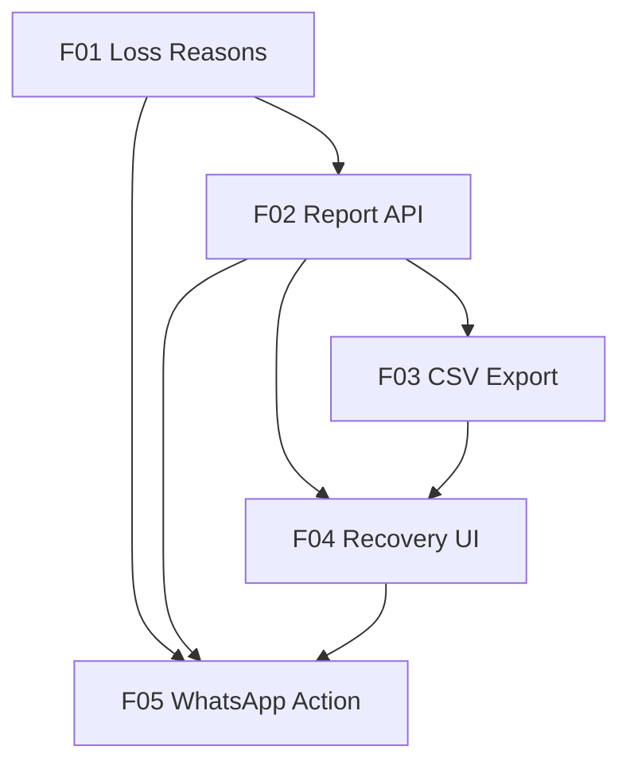

# Marcai — Lead Recovery ("Abandoned Cart")

> Design reference: `docs/superpowers/specs/2026-07-22-recuperacao-leads-design.md` (approved brainstorm). Planning entry: `docs/planejamento/CHECKLIST-PENDENCIAS.md` §7.1.

## 1. Executive Summary

Lead Recovery turns the leads a clinic silently loses into an actionable follow-up list. Today every unknown WhatsApp number becomes a `Lead` (noise included), loss reasons are free text that accepts "sem motivo", and leads who simply stop replying are never marked at all — they rot invisibly in the funnel. The clinic owner has no way to know how many real leads arrived, why they didn't convert, or who is worth calling back.

The feature is built for the clinic owner and her staff. It standardizes loss reasons into 8 fixed codes (including "not a potential client", which finally separates real leads from noise), automatically surfaces leads that went cold (no interaction for 14+ days, derived at read time — no discipline required), and presents everything on a recovery page: real-lead counts, a loss-reason breakdown, a filterable list with a one-click WhatsApp button per lead, and a safe CSV export (UTF-8 BOM, injection-sanitized) capped at 5,000 rows.

Every contact attempt is recorded (who, when, outcome), which both prevents calling the same person every week (30-day cool-off) and makes the recovery effort measurable. Mass automated dispatch is deliberately excluded: the WhatsApp channel runs on Baileys (unofficial), where bulk sending is the fastest path to a banned number (ADR-025), and business-initiated messaging requires registered opt-in (GDPR F09, not yet implemented).

## 2. Problem and Opportunity

### The Problem

**Lead counts are blind**
- Every unknown number that messages the clinic becomes a `Lead` — wrong numbers, suppliers, spam included (confirmed in `webhookController.js` → `processInbound`)
- The owner cannot answer "how many real leads arrived this month?"
- Conversion rate is uncomputable because the denominator is polluted

**Loss reasons cannot be analyzed**
- `Lead.perdido.motivo` is free text; the Kanban falls back to the literal string "sem motivo" when nothing is typed
- No grouping, no filtering, no counting — the question "why don't I close?" has no answer
- Existing lost leads carry inconsistent text that can never feed a report

**Cold leads are invisible**
- A lead who stops replying mid-conversation is never marked lost by anyone
- These leads sit in `novo`/`em_conversa`/`qualificado` indefinitely — the classic abandoned cart, and the most valuable recovery segment
- Today there is zero visibility: no list, no count, no alert

**No recovery workflow exists**
- Even with a manual list, the owner would have to retype each number into WhatsApp
- Nothing records that a lead was already contacted — risk of calling the same person weekly
- Recovery results (did they come back?) are unmeasurable, so the effort can't prove its value

### The Opportunity

| Problem | Solution |
|---|---|
| Blind counts | `nao_e_lead` reason code excludes noise; report shows contacts → real leads → converted with a true conversion rate |
| Unanalyzable reasons | 8 fixed reason codes + optional note; modal requires a choice; legacy data backfilled |
| Invisible cold leads | Derived rule (no interaction > 14 days in an active stage) — self-maintaining, no manual marking, lead exits the list the moment they reply |
| No workflow | Recovery page with per-lead `wa.me` deep link (pre-filled editable message), contact tracking with outcome, 30-day cool-off, safe CSV export |

The differentiator: recovery becomes a 2-click routine inside the product the clinic already uses, instead of a spreadsheet chore — while staying compliant (no mass dispatch, `nao_e_lead` never exported).

## 3. Target Audience

**Clinic Owner (e.g., Laura)**
- Runs the business solo or with a small team; revenue depends directly on filling the calendar
- Wants to know why leads don't close and to win back the ones that went quiet
- Works from the phone between sessions; WhatsApp is her main tool — tolerance for multi-step flows is near zero

**Reception / Staff (with `verLeads` permission)**
- Operates the Kanban daily; is the one who drags leads to "Perdido"
- Needs the loss modal to be fast: tap a reason, optionally type a note, done
- May execute the recovery call list on the owner's behalf

**Behavioral Profile**
- Mobile-first, WhatsApp-centric, time-fragmented between appointments
- Will not maintain data hygiene for its own sake — any rule that depends on discipline (like manually marking cold leads) fails; derived automation is mandatory

## 4. Objectives

**Reveal** the true lead funnel
- Metric: 100% of leads marked lost after release carry one of the 8 standardized reason codes (fallback "sem motivo" no longer accepted)
- Metric: contacts marked `nao_e_lead` appear in 0 report rows and 0 CSV rows

**Surface** cold leads with zero manual effort
- Metric: a lead crossing the 14-day inactivity threshold appears in the recovery list on the next report load (derived at read time, no job latency)
- Metric: a cold lead that replies exits the list on the next report load

**Enable** recovery outreach inside the product
- Metric: from the recovery page, reaching the lead's WhatsApp chat takes ≤ 2 clicks
- Metric: ≥ 30% of recoverable leads receive a recorded contact attempt within 30 days of feature adoption

**Measure** recovery results
- Metric: 100% of contact attempts store who contacted, when, and an outcome from the 5-value enum
- Metric: a contacted lead does not reappear in the list for 30 days; recovery outcomes (`respondeu`/`reagendou`) are countable per period

**Export** safely
- Metric: CSV opens in Portuguese Excel with correct accents (UTF-8 BOM present)
- Metric: 0 formula-executable cells — every field starting with `=`, `+`, `-`, `@`, TAB or CR is prefixed with `'`
- Metric: exports above 5,000 rows return the `X-Export-Truncated: true` header and the UI shows a warning — never silent truncation

## 5. User Stories

### F01. Standardized Loss Reasons Foundation
- As a receptionist, I want to pick the loss reason from fixed buttons when I drag a lead to "Perdido" so that the report can group losses without me typing anything
- As a receptionist, I want to add an optional free-text note (mandatory only for "Outro") so that specific context is not lost
- As an owner, I want wrong numbers and suppliers marked as "Não era cliente potencial" so that they stop polluting my lead counts
- As the system, I want to backfill legacy lost leads (free text → `outro` + preserved note; "sem motivo" → `outro` + empty note) so that historical data doesn't break the report
- As the system, I want to reject a move to "perdido" without a valid reason code so that unclassified losses can no longer be created

### F02. Recovery Report API
- As an owner, I want a summary of contacts received → real leads → discarded noise → converted → lost → cold, with a conversion rate, so that I finally see my true funnel
- As an owner, I want leads with no interaction for more than 14 days in an active stage to be listed automatically as "cold" so that abandoned conversations stop being invisible
- As an owner, I want a loss-reason breakdown so that I know why I don't close
- As an owner, I want to filter by period, group (lost/cold), reason and origin so that I can slice the list before acting on it
- As the system, I want leads contacted in the last 30 days and leads marked `nao_e_lead` excluded so that the list only contains people worth calling now

### F03. Recovery CSV Export
- As an owner, I want to download the filtered list as CSV (name, phone, reason, dates) so that I can work it outside the system if I prefer
- As an owner, I want the CSV to open correctly in Excel with readable accents so that I don't need technical help
- As the system, I want every exported cell sanitized against formula injection so that a malicious WhatsApp display name cannot execute code in a spreadsheet
- As the system, I want exports capped at 5,000 rows with an explicit truncation signal so that oversized exports fail loudly, not silently

### F04. Recovery Page UI
- As an owner, I want a "Recuperação" page reachable from the sidebar so that the recovery routine has a home inside the product
- As an owner, I want the summary numbers and the reason breakdown at the top so that I read the diagnosis before scrolling the list
- As an owner, I want the lead list showing name, phone, stalled stage, reason and days stalled so that I can prioritize whom to call first
- As an owner, I want an "Exportar CSV" button that respects my active filters so that the download matches what I see

### F05. WhatsApp Action & Contact Tracking
- As an owner, I want a "Chamar no WhatsApp" button per lead that opens the chat with a suggested editable message so that I never retype numbers
- As an owner, I want to mark a lead as contacted and record the outcome so that my team doesn't call the same person twice
- As an owner, I want contacted leads to leave the list for 30 days so that the list always shows only pending work
- As the system, I want phone numbers normalized to E.164 (prefix 351 for 9-digit numbers starting with 9) and the button disabled with a tooltip when normalization fails so that broken links never open

## 6. Functionalities

### F01. Standardized Loss Reasons Foundation

**Provides:**
- Loss reason code (one of 8), free-text note (≤ 200 chars), loss timestamp (used by F02)
- Recovery contact record structure — `contactadoEm`, `contactadoPor`, `resultado` (used by F02, F05)

**Capabilities:**
- New enum `LEAD_MOTIVOS_PERDA` in `pipelineConstants.js` with exactly 8 codes: `preco`, `horario`, `concorrencia`, `pesquisando`, `localizacao`, `sem_resposta`, `nao_e_lead`, `outro`
- `Lead` model gains `perdido.motivoCodigo` (enum, no Mongoose `required` — legacy docs must stay valid) and `recuperacao { contactadoEm, contactadoPor, resultado }` with `resultado` in `pendente | sem_resposta | respondeu | reagendou | recusou`
- Existing `perdido.motivo` becomes the free-text note (max 200 chars, unchanged limit)
- Validation lives in `transitionStage()` (service, not schema): moving to `perdido` requires a valid `motivoCodigo`; `outro` additionally requires a non-empty note; the `'sem motivo'` fallback is removed
- Two new indexes: `{ tenantId: 1, createdAt: -1 }` and `{ tenantId: 1, 'perdido.motivoCodigo': 1 }`
- Backfill script in `scripts/migrations/`, idempotent, `--dry-run` by default, runs per tenant DB: legacy lost leads with text → `motivoCodigo: 'outro'` + text preserved as note; text `'sem motivo'` → `motivoCodigo: 'outro'` + note cleared to `null`; reports counts before writing

**Experience:**
- Kanban "Perdido" modal shows the 8 reasons as tappable buttons (single-select), an optional note field below, and a disabled confirm button until a reason is selected
- Selecting "Outro" makes the note field required with inline validation message
- Existing drag-and-drop flow is otherwise unchanged

**Error Handling:**
- `PATCH /leads/:id/stage` to `perdido` without `motivoCodigo` → 400 `{ success: false, error: 'Motivo é obrigatório ao marcar como "perdido"' }`
- `motivoCodigo: 'outro'` without note → 400 with a specific message naming the note requirement
- Backfill run against a tenant DB that is unreachable → abort that tenant, log, continue with the next (never partial-write a tenant)
- Backfill re-run → no-op on already-migrated documents (idempotency)
- ⚠️ Local `.env` points to the production cluster — the script must print the target cluster and require an explicit `--apply` flag to write

### F02. Recovery Report API

**Consumes:**
- Loss reason code, loss timestamp, recovery contact date (`contactadoEm`) — from F01

**Provides:**
- Summary aggregates: contacts received, real leads, discarded (`nao_e_lead`), converted, lost, cold, conversion rate, per-reason totals (used by F04)
- Recoverable lead rows: name, phone digits, origin, stalled stage, reason code + note, first/last contact dates, days stalled, interest, qualification score, contacted flag (used by F03, F04, F05)

**Capabilities:**
- `GET /api/v1/leads/recuperacao` — query params `de`, `ate`, `grupo` (`perdidos` | `esfriados` | `todos`, default `todos`), `motivoCodigo`, `origem`, `page`, `limit` (max 100, default 20)
- Cold rule: lead in `novo` | `em_conversa` | `qualificado` with `ultimaInteracao` older than 14 days — **derived at read time, never persisted**; threshold is a per-tenant constant (14 default), date math via Luxon in `Europe/Lisbon`
- Cold leads report reason `sem_resposta` with the stalled stage attached ("Parou de responder em Qualificado")
- Always excluded: stage `convertido`; `motivoCodigo: 'nao_e_lead'`; leads with `recuperacao.contactadoEm` within the last 30 days
- `resumo` computed via aggregation over the period filter; `leads` paginated with explicit sort (days stalled desc)
- Response follows the fixed API contract `{ success: true, data: { resumo, leads }, pagination }`
- Route declared **before** `GET /leads/:id` (Express would otherwise read `recuperacao` as an id); guarded by `requirePermission('verLeads')`; every query includes `{ tenantId: req.user.tenantId }`
- Report/CSV logic lives in `recuperacaoService.js` (pure: filters in → summary + rows out), not in the controller

### F03. Recovery CSV Export

**Consumes:**
- Recoverable lead rows and the same filter semantics — from F02 (shared `recuperacaoService.js`)

**Provides:**
- Downloadable CSV file honoring active filters (used by F04's export button)

**Capabilities:**
- `GET /api/v1/leads/recuperacao/export.csv` — same filters as F02, no pagination, hard cap 5,000 rows
- 12 columns: Nome · Telefone · Origem · Etapa onde parou · Motivo · Nota · 1º contacto · Último contacto · Dias parado · Interesse · Score · Já contactado
- File starts with UTF-8 BOM; separator `;`; double quotes escaped — matching Portuguese Excel expectations
- Injection sanitization: any field starting with `=`, `+`, `-`, `@`, TAB or CR is prefixed with `'` (lead names come from WhatsApp and are attacker-controlled)
- Headers: `Content-Type: text/csv; charset=utf-8`, `Content-Disposition: attachment; filename="recuperacao-leads-YYYY-MM-DD.csv"`
- Declared exception to the API contract: success returns raw CSV; **errors still return the standard JSON envelope**
- CSV serialization isolated in `csvExport.js` (pure, unit-testable); export events logged (who, when, filters) as a GDPR processing record

**Error Handling:**
- Result exceeds 5,000 rows → first 5,000 exported + `X-Export-Truncated: true` header (F04 surfaces a warning toast) — never silent
- Empty result → valid CSV with header row only (not an error)
- Invalid filter (e.g., malformed date) → 400 JSON `{ success: false, error: ... }`, never a broken CSV
- Missing `verLeads` permission → 403 JSON

### F04. Recovery Page UI

**Consumes:**
- Summary aggregates and recoverable lead rows — from F02
- CSV download endpoint honoring active filters — from F03

**Capabilities:**
- New page `laura-saas-frontend/src/pages/RecuperacaoLeads.tsx`, route `/leads/recuperacao` registered as a protected route in `App.tsx`
- Menu entry added in **`Sidebar.jsx`** (`menuGroupsAll`, Leads group, gated by `verLeads`) — `Navbar.jsx` is dead code and must not be touched
- Summary strip: contacts received → real leads → discarded → converted → lost → cold → conversion rate (7 tiles)
- Reason breakdown as simple horizontal bars — no new chart library
- Filters: period (`de`/`ate`), group, reason, origin — all mapped 1:1 to F02 query params
- List columns: name, phone, stalled stage, reason (+note on expand), days stalled; sorted by days stalled desc; paginated
- "Exportar CSV" button builds the F03 URL from the active filters; shows the truncation warning when `X-Export-Truncated` is present

**Experience:**
- Design system: indigo-500 / purple-500 / slate-900, glass cards, dark/light via `ThemeContext` — same treatment as `LeadsKanban.tsx` siblings
- Loading state (spinner + message), empty state ("Nenhum lead para recuperar neste período 🎉"), error state with retry
- All calls via `api.js`; no direct `fetch`; errors surfaced via toast + inline message
- Mobile: strip wraps to 2 columns; list rows collapse to cards

### F05. WhatsApp Action & Contact Tracking

**Consumes:**
- Recovery contact record structure (`resultado` enum values) — from F01
- Lead rows (name, phone digits, stalled stage) — from F02

**Capabilities:**
- Per-row "Chamar no WhatsApp" button → `https://wa.me/<E164>?text=<suggested message>`; message is a frontend default, editable in a small popover before opening; template-per-tenant is registered debt, not in scope
- Phone normalization: digits-only value with 9 digits starting with `9` → prefix `351`; already has country code → use as-is; otherwise → button disabled with tooltip "Número sem indicativo — verificar na ficha"
- `PATCH /api/v1/leads/:id/recuperacao` — body `{ resultado }` validated against the 5-value enum; server sets `contactadoEm: now` (Luxon, `Europe/Lisbon`) and `contactadoPor: req.user._id`; guarded by `requirePermission('verLeads')`, tenant-scoped, ObjectId validated
- Marking as contacted removes the lead from the recovery list for 30 days (enforced by F02's exclusion rule reading `contactadoEm`)
- Outcome editable while the lead is in cool-off (e.g., `pendente` → `reagendou`) via the same PATCH

**Experience:**
- Clicking the WhatsApp button opens the chat in a new tab and offers inline "Marcar como contactado?" on return focus
- Marking contacted asks for the outcome (5 options, default `pendente`), shows optimistic removal from the list with an undo toast (5 s)

**Error Handling:**
- PATCH with invalid `resultado` → 400 JSON naming the allowed values
- PATCH on a lead of another tenant → 404 (never 403 — do not reveal existence)
- PATCH on a non-existent/invalid ObjectId → 400 (`ID inválido`) or 404
- Optimistic UI rollback + error toast if the PATCH fails after the list removal

## 7. Out of Scope

**Messaging**
- Mass/automated dispatch of recovery messages — Baileys ban risk (ADR-025) and requires registered opt-in (GDPR F09)
- Per-tenant recovery message template editor (registered debt; frontend default only)

**Intelligence**
- AI-inferred loss reasons from cold leads' conversations (phase 2 — this feature creates the dataset that makes it possible)
- Cohort analysis, funnel dashboards beyond the summary strip

**Configuration**
- UI for the cold-threshold (starts as a per-tenant constant, 14 days)
- Unifying the legacy `Transacoes.jsx` client-side export with `csvExport.js` (registered debt)

**Data lifecycle**
- Long-term retention/anonymization of old lost leads — owned by GDPR F08 (retention job)
- Consent/opt-out filtering — arrives with GDPR F09 and will then filter this list

## 8. Dependency Graph

### Part 1: Dependency Table

| # | Feature | Priority | Dependencies |
|---|---------|----------|--------------|
| F01 | Standardized Loss Reasons Foundation | 1 | None |
| F02 | Recovery Report API | 1 | F01 |
| F03 | Recovery CSV Export | 1 | F02 |
| F04 | Recovery Page UI | 1 | F02, F03 |
| F05 | WhatsApp Action & Contact Tracking | 2 | F01, F02, F04 |

### Part 3: Execution Waves

Features within the same wave can be built in parallel. A wave starts only after every feature in earlier waves is complete.

- **Wave 1**: F01
- **Wave 2**: F02
- **Wave 3**: F03
- **Wave 4**: F04
- **Wave 5**: F05

### Part 4: Priority levels

- **1** = Essential — product does not work without it
- **2** = Important — significant value addition
- **3** = Desirable — incremental improvement

### Part 5: Mermaid Diagram

## 9. Acceptance Criteria

### F01. Standardized Loss Reasons Foundation
- Dragging a lead to "Perdido" with no reason selected keeps the confirm button disabled; no request is sent
- Selecting "Outro" without a note shows an inline validation error and blocks confirmation
- `PATCH /leads/:id/stage` to `perdido` without `motivoCodigo` returns 400 with the standard error envelope
- `PATCH` with `motivoCodigo: 'preco'` persists `perdido.motivoCodigo`, `perdido.em`, and the optional note in `perdido.motivo`
- A pre-existing lost lead (no `motivoCodigo`) still loads and saves without validation errors (schema not `required`)
- Backfill dry-run prints per-tenant counts and writes nothing; `--apply` sets `outro` on legacy lost leads, preserves free text as note, clears `'sem motivo'` to `null`; second run changes 0 documents
- Both new indexes exist after model load

### F02. Recovery Report API
- Tenant B's token never returns tenant A's leads in `resumo` or `leads` (isolation — empty set, never 403)
- A lead with `ultimaInteracao` 13 days ago is not cold; at 14 days it is (boundary fixed by Luxon in `Europe/Lisbon`)
- A cold lead that receives a new interaction disappears from the list on the next request
- Leads with `motivoCodigo: 'nao_e_lead'` appear in `resumo.descartados` and in no list row; they are excluded from `leadsReais` and from `taxaConversao`
- A lead with `recuperacao.contactadoEm` 10 days ago is absent; at 40 days it reappears
- `grupo=perdidos` returns only marked-lost leads; `grupo=esfriados` only derived-cold; `porMotivo` totals equal the sum of listed lost leads per code
- `limit=500` is clamped to 100; response carries the standard `pagination` object
- Request without `verLeads` → 403 JSON

### F03. Recovery CSV Export
- Response body starts with the UTF-8 BOM; separator is `;`; accented names render correctly when opened in Portuguese Excel
- A lead named `=HYPERLINK("http://x")` exports as `'=HYPERLINK("http://x")` (and same for `+`, `-`, `@`, TAB, CR prefixes)
- 5,001 matching rows → 5,000 data rows + `X-Export-Truncated: true`; 4,999 rows → no truncation header
- Filename follows `recuperacao-leads-YYYY-MM-DD.csv` with today's date in `Europe/Lisbon`
- Same filters produce the same row set as F02 (modulo pagination/cap); `nao_e_lead` rows never appear
- Malformed `de` date → 400 JSON envelope, not a CSV body; missing permission → 403 JSON
- Tenant isolation holds: tenant B's export of tenant A's filters yields only tenant B's rows
- Each export writes a log entry with user id, timestamp and applied filters

### F04. Recovery Page UI
- `/leads/recuperacao` renders for a user with `verLeads`; the sidebar shows the entry only for users with `verLeads`
- Summary strip shows the 7 tiles with values matching the F02 `resumo` for the active filters
- Changing any filter refetches and updates strip, breakdown and list consistently
- Loading, empty and error states render; no frozen screen during fetch
- "Exportar CSV" downloads a file honoring the active filters; when the truncation header is present a warning toast appears
- Page follows the design system (indigo/purple/slate, glass cards) in dark and light themes; mobile at 375 px shows the strip in 2 columns and rows as cards

### F05. WhatsApp Action & Contact Tracking
- A lead with phone `912345678` gets a button linking to `https://wa.me/351912345678?text=...`; a lead with `5511987654321` links as-is; a 7-digit phone renders a disabled button with tooltip
- The suggested message is editable before opening; the edited text is URL-encoded into the link
- "Marcar como contactado" sends the PATCH, records `contactadoEm`/`contactadoPor` server-side, and removes the row optimistically with a 5 s undo
- PATCH with `resultado: 'foo'` → 400 naming allowed values; PATCH on another tenant's lead → 404; invalid ObjectId → 400
- A contacted lead is absent from the list and the CSV until the 30-day window elapses
- Updating the outcome of a lead in cool-off (e.g., to `reagendou`) succeeds via the same PATCH

### Cross-Feature Integration
- **F02 ← F01:** marking a lead lost with `motivoCodigo: 'preco'` in the Kanban makes it appear in the next F02 response under `porMotivo[codigo=preco]` with its note intact
- **F02 ← F01 (contact date):** a `recuperacao.contactadoEm` written through F05's PATCH is read by F02 and excludes the lead for 30 days
- **F03 ← F02:** for identical filters, the CSV row set equals the F02 list row set (up to the 5,000 cap), including the cold-lead derivation and all exclusions
- **F04 ← F02:** the numbers rendered in the strip and breakdown are byte-equal to the `resumo` returned by F02 for the same filters
- **F04 ← F03:** the export button downloads a CSV whose rows match the list currently displayed (same filters)
- **F05 ← F02:** the phone used to build the `wa.me` link is the digits-only value returned in the F02 row, normalized per the E.164 rule
