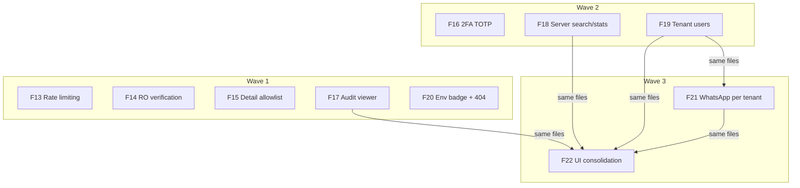

# Marcai Super-Admin Panel — Hardening & Operations (Phase 2)

**Status:** Planned — specs ready for implementation
**Date:** 2026-07-07
**Origin:** full audit of the shipped panel (`docs/operacoes/auditoria-superadmin-2026-07-07.md`)
**Predecessor:** `docs/produto/PRD-painel-superadmin.md` (F01–F11, shipped in PRs #34–#43)
**ADR:** ADR-024 — this PRD implements its pending Phase 4 (per-tenant WhatsApp) and Phase 5 (hardening), plus audit findings.

## 1. Executive Summary

The super-admin panel (F01–F11) shipped with a strong structural foundation — `requireSuperadmin` (404, audited denials), transactional audited mutations (`adminMutation`), a physically read-only cross-tenant connection (`getTenantDBAdmin`), and a parametric sweep test — but **ADR-024's Phase 5 hardening was never implemented**, and the audit found functional and UX gaps.

This phase closes them as ten features, F13–F22 (F12 is taken by an unrelated feature). Priorities: the panel is the highest-blast-radius surface in the system (a stolen super-admin token compromises **every** tenant), so security features come first.

## 2. Guiding constraints for implementers (READ FIRST)

Any model implementing these features MUST:

1. **Read before coding:** `CLAUDE.md`, `.claude/rules/express-routes.md`, `.claude/rules/express-middlewares.md`, `.claude/rules/testing.md`, and the playbook `.claude/skills/marcai-superadmin-route` (referenced by `src/modules/admin/adminRoutes.js:20`). Each spec lists its own mandatory reading.
2. **Actual dependency versions override CLAUDE.md's tech-stack table:** the manifest has **Express ^5**, **Mongoose ^9**, **express-rate-limit ^8** (v8 API uses `limit`, not `max`), **zod ^4**. Verify against `package.json` and use context7 for any API uncertainty.
3. **Never bypass the four gates.** New admin routes go in `src/modules/admin/adminRoutes.js` below the global `router.use(authenticate, requireSuperadmin)` + `router.use(auditMiddleware)`. Mutations go through `adminMutation('<action>', work)` — raw `router.post/put/patch/delete` fails ESLint (`eslint.config.js:131-145`).
4. **Response contract is fixed:** `{ success: true, data }` / `{ success: false, error }`. Cross-tenant miss → 404, never 403. Pagination capped at 100.
5. **Tests are mandatory per spec.** Jest + Supertest + `mongodb-memory-server` (transactional tests use `MongoMemoryReplSet` — see `tests/admin-mutation.test.js` for the harness). Never real MongoDB/Evolution/OpenAI/SMTP. The sweep test (`tests/admin-superadmin-sweep.test.js`) automatically covers new routes — do not weaken it.
6. **One feature per branch/PR**, named `F13-admin-rate-limiting` etc. Do not commit or push without the user asking (project rule).
7. **Frontend:** new files are `.tsx`/`.ts`; all HTTP via `apiHelpers` (`src/services/api.js`); interceptor already shows error toasts — do not double-toast; the console's visual identity ("Consola de Operador": flat cards, `rounded-[3px]`, IBM Plex Mono, `primary-*`/`dark-*` tokens, indigo→purple gradients) is deliberate — extend it, don't import product-page styles.
8. **`.env` local points at the PRODUCTION Atlas cluster.** Never run scripts against it during implementation; tests use memory-server only.

## 3. Features

### Security (P0)

- **F13 — Dedicated admin rate limiting.** `adminLimiter` mounted first on the admin router; closes ADR-024 Guard #4 (rate-limit half).
- **F14 — Read-only connection runtime verification.** Startup canary write through `MONGO_TENANT_RO_URI` that must FAIL; if it succeeds, Gate 4b is compromised → mark connection unusable (fail-closed), log + Sentry. Never fall back silently.
- **F15 — Tenant detail allowlist.** Replace the fragile secret-denylist in `obterTenant` with an explicit field allowlist; new schema fields are private by default.
- **F16 — Super-admin 2FA (TOTP).** otplib-based TOTP: setup/activate under `/admin/2fa/*`, two-step login challenge, `mfa` claim in the JWT, enforcement behind `SUPERADMIN_REQUIRE_2FA`. Mitigates the stolen-token blast radius.

### Functionality & UX (P1)

- **F17 — Complete audit viewer.** Expose `from`/`to` date filters (backend already supports them), show `before`/`after` + metadata in an expandable row (touch-accessible; hover tooltip removed), fix the duplicate error toast, add copy-ID affordances.
- **F18 — Server-side tenant search, filters & stats.** `?search/plano/status` on `GET /admin/tenants` + new `GET /admin/tenants/stats`; frontend switches to server pagination; removes the 100-tenant ceiling on search/KPIs.
- **F19 — Tenant users listing.** `GET /admin/tenants/:id/users` (control-plane read) + a Users card in the detail page showing the tenant's admin/owner.
- **F20 — Environment badge & 404 catch-all.** "PRODUÇÃO"/"DEV" badge in the console chrome; `/admin` index redirect; app-wide `*` route.
- **F21 — Per-tenant WhatsApp/Evolution management (ADR-024 Phase 4, ADR-021).** View instance state, create instance, fetch QR to connect, disconnect — from the tenant detail page.

### Code & design quality (P2)

- **F22 — Console UI consolidation.** Shared `Modal`/`PaginationFooter`/`Spinner`/form-field primitives; unify the card language (flat operator style everywhere); strengthen the colour guard test (positive assertions, not just the cream/rust denylist).

## 4. Registered debt (deliberately NOT in this phase)

| Item | Why deferred | Revisit when |
|---|---|---|
| Separate super-admin login URL/app | F16 (2FA) addresses the credential-theft risk at current scale; a separate surface is high effort | >1 operator, or SOC2-style requirements |
| DB-level audit immutability (WORM / hash-chain / insert-only Mongo role) | App-level discipline + tests suffice at current scale; needs Atlas role work | First external client audit, or >~5 tenants |
| Impersonation ("login as tenant") | High-risk capability; OWASP guidance: only after 2FA + strict audit are in place (F16 first) | Post-F16, if support workload justifies it |
| Plan tier rename `basico/elite` → `essencial/custom` set | Already flagged in the original PRD §1 note; needs data migration | Next time `adminSchemas.js` plan enums are touched |
| `CLAUDE.md` tech-stack table update (Express 5, Mongoose 9) | Docs-only; owner should confirm | Immediately, by the repo owner |

## 5. Dependency graph & execution waves

| # | Feature | Priority | Depends on | Backend | Frontend |
|---|---------|----------|------------|---------|----------|
| F13 | Admin rate limiting | 1 | — | ✅ | — |
| F14 | RO connection verification | 1 | — | ✅ | — |
| F15 | Tenant detail allowlist | 1 | — | ✅ | (types only) |
| F16 | Super-admin 2FA TOTP | 1 | — | ✅ | ✅ |
| F17 | Complete audit viewer | 2 | — | — | ✅ |
| F18 | Server-side search & stats | 2 | — | ✅ | ✅ |
| F19 | Tenant users listing | 2 | — | ✅ | ✅ |
| F20 | Env badge & 404 | 2 | — | — | ✅ |
| F21 | WhatsApp per tenant | 2 | F19* | ✅ | ✅ |
| F22 | Console UI consolidation | 3 | F17, F18, F19, F21* | — | ✅ |

\* F21's dependency on F19 and F22's on F17/F18/F19/F21 are **same-files sequencing** (they edit `TenantDetailPage.tsx` / the console components), not logical dependencies.

**Waves** (features within a wave can be built in parallel — they touch disjoint files):

- **Wave 1:** F13, F14, F15, F17, F20 — small, independent, immediate risk reduction.
- **Wave 2:** F16, F18, F19 — F16 touches auth (`authController`, `User`, `Login.jsx`); F18/F19 touch admin list/detail.
- **Wave 3:** F21, then F22 last (consolidates UI added by earlier waves).

## 6. Acceptance criteria (cross-feature)

- Every new `/admin` route inherits the four gates and appears automatically in the sweep test's coverage (no route-specific opt-outs).
- Every new mutation goes through `adminMutation` and produces exactly one atomic `AuditLog` entry; no secret material (TOTP secrets, WhatsApp tokens, QR payloads) ever appears in audit `before/after/metadata`.
- `npm test` (backend) and `npm run build` + `npm run lint` (frontend) pass after each feature.
- With all of Wave 1 + F16 merged and `SUPERADMIN_REQUIRE_2FA=true`: a valid super-admin password alone is no longer sufficient to reach any `/admin` route.
- After F18: a system with 250 tenants shows correct KPIs and finds any tenant by name — verified by a test seeding >100 tenants.
- Per-feature criteria live in each spec (`docs/produto/features/features-super_admin/F<nn>-*/spec.md`).

## 7. Progress tracking

`docs/produto/PRDProgress-superadmin-hardening.json` — update `status` (`todo`/`in-progress`/`done`) and `note` (PR #) as features land.
